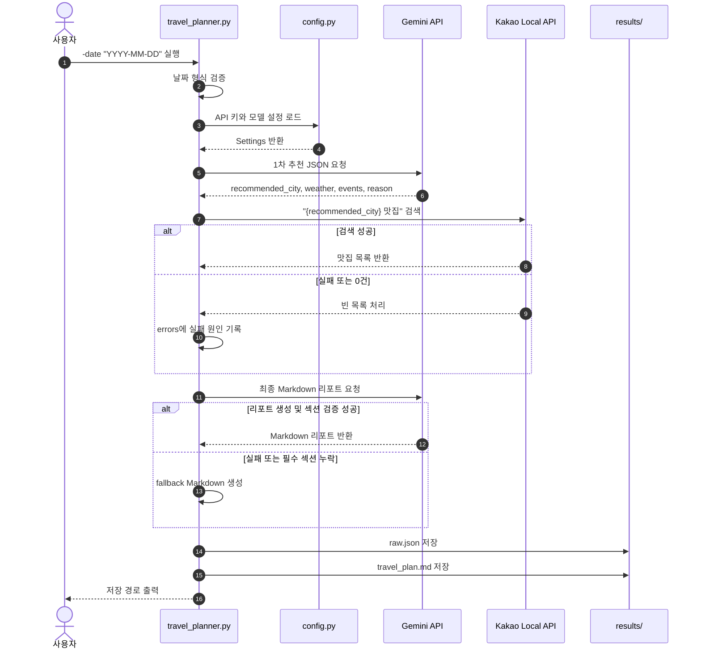

# 국내 여행 추천 CLI

Gemini API와 Kakao Local API를 조합해 국내 여행 추천 리포트를 생성하는 Python CLI 프로그램입니다.

사용자가 `-date "YYYY-MM-DD"`를 입력하면 Gemini가 여행지를 추천하고, Kakao Local이 해당 지역의 맛집을 검색합니다. 실행 결과는 `A1-2/results/` 폴더에 원본 JSON과 최종 Markdown 리포트로 저장됩니다.

## 실행 환경

- Python 3.10 이상
- 외부 패키지 없음
- Gemini API 키
- Kakao REST API 키

## API 키 설정

API 키는 코드에 직접 작성하지 않습니다. `A1-2/.env.example`을 참고해 `A1-2/.env` 파일을 만들거나, 터미널 환경변수로 설정합니다.

`.env` 예시:

```bash
GEMINI_API_KEY="YOUR_GEMINI_API_KEY"
KAKAO_REST_API_KEY="YOUR_KAKAO_REST_API_KEY"
GEMINI_MODEL="gemini-3.1-flash-lite"
```

`GEMINI_MODEL`은 선택값입니다. 사용할 수 있는 값은 아래와 같습니다.

- `gemini-3.1-flash-lite` (기본값)
- `gemini-2.5-flash-lite`

macOS/Linux 환경변수 예시:

```bash
export GEMINI_API_KEY="YOUR_GEMINI_API_KEY"
export KAKAO_REST_API_KEY="YOUR_KAKAO_REST_API_KEY"
export GEMINI_MODEL="gemini-3.1-flash-lite"
```

실제 키 값은 README, 결과 파일, 로그, Git 커밋에 포함하지 않습니다.

## 실행 방법

프로젝트 루트에서 아래 명령을 실행합니다.

```bash
python3 A1-2/travel_planner.py -date "2026-03-15"
```

`--date`도 같은 방식으로 사용할 수 있습니다.

```bash
python3 A1-2/travel_planner.py --date "2026-03-15"
```

## 실행 흐름

### 흐름 시퀀스 다이어그램



```text
[1/3] 1차 추천 생성 중(Gemini)...
  - recommended_city: 제주
[2/3] 맛집 검색 중(Kakao Local)...
  - 맛집 5곳 검색 완료
[3/3] 최종 리포트 생성 중(Gemini)...
  - 리포트 생성 완료

완료!
- 원본 데이터: A1-2/results/2026-03-15_raw.json
- 여행 리포트: A1-2/results/2026-03-15_travel_plan.md
```

## 결과 파일

실행 후 `A1-2/results/` 폴더에 아래 파일이 생성됩니다.

- `{date}_raw.json`: 1차 추천 JSON, 맛집 검색 결과, 오류 목록
- `{date}_travel_plan.md`: 최종 여행 리포트

원본 JSON 예시:

```json
{
  "date": "2026-03-15",
  "recommendation": {
    "recommended_city": "제주",
    "weather": "날씨 요약",
    "events": ["행사 후보"],
    "reason": "추천 근거"
  },
  "restaurants": [],
  "errors": []
}
```

## 오류 처리

- API 키가 없으면 즉시 종료하고 설정 방법을 안내합니다.
- 날짜 형식이 틀리면 사용법을 출력하고 종료합니다.
- Gemini 1차 추천 JSON 파싱 실패 시 최대 1회 재요청합니다.
- Kakao 장소 검색 실패 또는 0건은 프로그램을 중단하지 않고 `restaurants: []`로 저장합니다.
- Gemini 최종 리포트 생성이 실패하면 로컬 fallback Markdown을 저장합니다.

## 보안 주의

- `.env` 파일은 Git에 올리지 않습니다.
- API 키를 코드나 README에 직접 작성하지 않습니다.
- 실행 로그와 결과 파일에 API 키가 포함되지 않도록 합니다.
