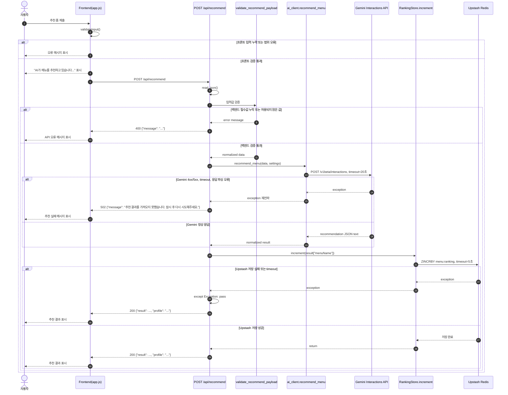
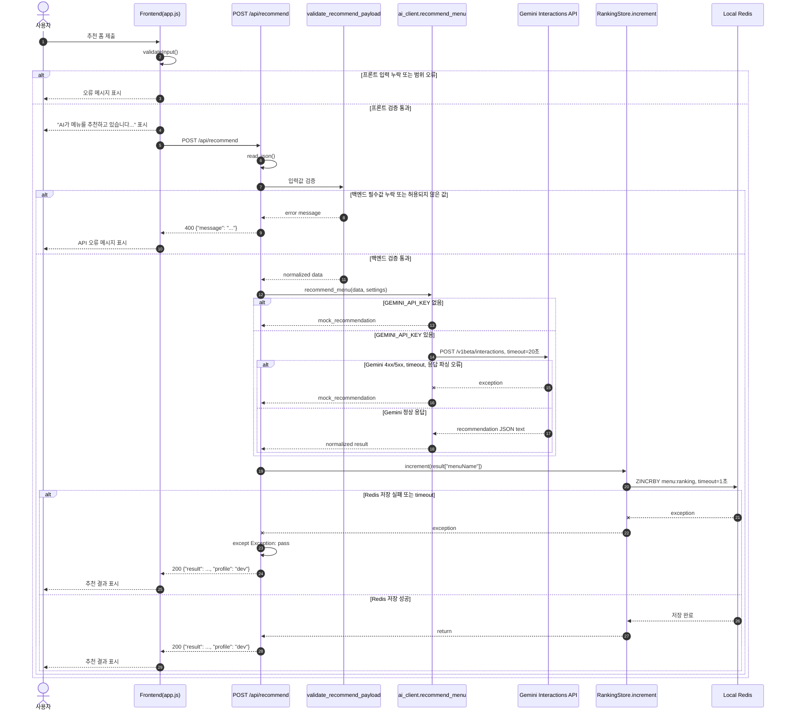

# AI 기능 장애 처리 흐름

이 문서는 메뉴 추천 AI 기능에서 입력 검증, Gemini 요청, Redis 랭킹 저장 중 장애가 발생했을 때 어떤 응답이 반환되는지 정리합니다.

## Prod 시퀀스

prod profile에서는 Gemini 장애를 실제 추천 실패로 보고 502를 반환합니다. Redis/Upstash 저장 실패는 추천 결과 자체를 실패시키지 않고 무시합니다.

## Dev 시퀀스

dev profile에서는 Gemini 키가 없거나 Gemini 호출이 실패해도 mock 추천으로 대체합니다. 로컬 Redis 저장 실패도 사용자에게 반환되는 추천 결과를 막지 않습니다.

## 반환 규칙

| 장애 상황 | 처리 위치 | 반환 |
| --- | --- | --- |
| 프론트 입력 누락, 예산/인원 범위 오류 | `frontend/js/app.js` | API를 호출하지 않고 화면에 오류 메시지를 표시 |
| 잘못된 JSON 또는 백엔드 필수값 누락 | `api/recommend.py`, `api/lib/validation.py` | `400 {"message": "필수 항목을 입력해주세요."}` 또는 검증 오류 메시지 |
| Gemini 4xx/5xx | `api/lib/ai_client.py` -> `api/recommend.py` | prod: `502 {"message": "추천 결과를 가져오지 못했습니다. 잠시 후 다시 시도해주세요."}` |
| Gemini timeout | `requests.post(..., timeout=20)` | prod: 502 추천 실패 메시지, dev: mock 추천 fallback |
| Gemini 응답 파싱 실패 또는 필수 필드 누락 | `extract_gemini_text`, `parse_json_object`, `normalize_recommendation` | prod: 502 추천 실패 메시지, dev: mock 추천 fallback |
| dev profile에서 Gemini 키 없음 | `recommend_menu` | `200 {"result": mock_recommendation, "profile": "dev"}` |
| Redis 랭킹 저장 실패 | `RankingStore.increment` 호출부 | 추천 결과는 유지하고 `200 {"result": ..., "profile": "..."}` 반환 |
| Redis/Upstash 랭킹 조회 실패 | `RankingStore.top10` | `/api/ranking`에서 샘플 랭킹을 포함한 `200` 응답 반환 |

## 구현상 의미

- 추천 결과 생성이 성공했다면 Redis 저장 실패 때문에 사용자 요청을 실패로 만들지 않습니다.
- prod profile에서 Gemini 장애는 실제 AI 추천 실패로 보고 502를 반환합니다.
- dev profile에서는 개발 편의를 위해 Gemini 키가 없거나 Gemini 호출이 실패해도 mock 추천으로 대체합니다.
- 프론트엔드는 API 응답을 기다리는 동안 로딩 메시지를 보여주고, 실패 응답을 받으면 `message` 값을 화면에 표시합니다.
- 현재 프론트엔드에는 별도의 `AbortController` 기반 클라이언트 timeout은 없고, 서버 쪽 외부 요청 timeout으로 지연을 제한합니다.
