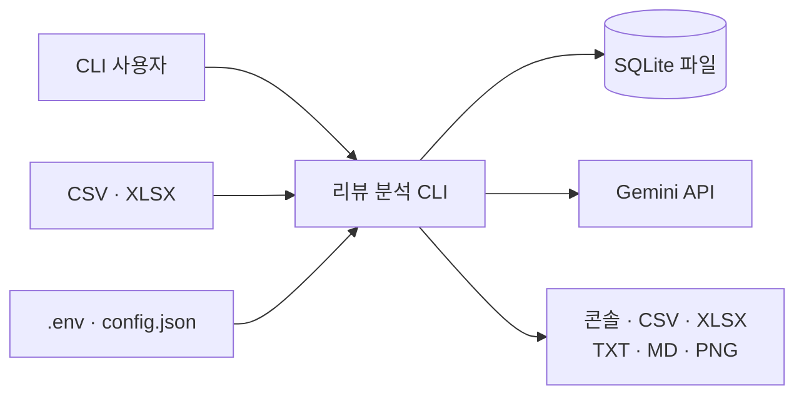
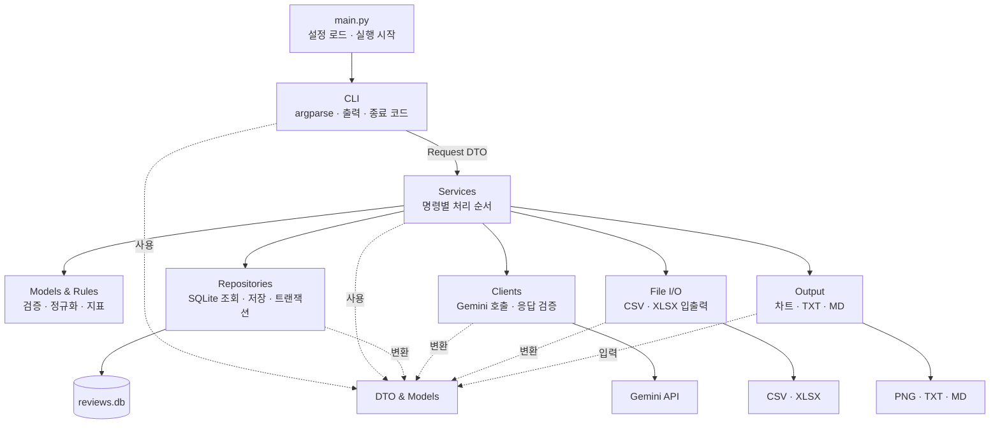

# 고객 리뷰 감정 분석 CLI 아키텍처

- 상태: 구현 전 목표 아키텍처
- 기준 설계: [`docs/superpowers/specs/2026-08-05-review-sentiment-cli-design.md`](docs/superpowers/specs/2026-08-05-review-sentiment-cli-design.md)
- 계층 간 데이터 계약: [`docs/layer-communication.md`](docs/layer-communication.md)

## 1. 목표

이 애플리케이션은 하나의 프로세스에서 실행되는 단순 레이어드 모놀리스다. 필수 요구사항을 구현하는 데 필요한 계층만 두고, 계층 사이의 결합은 추상 인터페이스의 수가 아니라 명확한 데이터 계약과 단방향 호출로 관리한다.

- CLI, 서비스, 외부 연동 코드의 책임을 구분한다.
- 계층 사이에는 이름이 있는 dataclass와 내부 모델만 전달한다.
- SQLite, Gemini, pandas, matplotlib의 객체를 소유 모듈 밖으로 노출하지 않는다.
- Repository, Client, 출력 모듈끼리 직접 호출하지 않는다.
- 필요한 경우 테스트에서 외부 연동 객체를 간단한 fake나 mock으로 바꿀 수 있게 한다.
- 동일 기능의 실제 구현이 하나뿐인 동안 별도의 추상 인터페이스 계층을 만들지 않는다.

계층은 서로 전혀 의존하지 않는 독립 프로그램이 아니다. 호출이 필요한 방향을 한쪽으로 제한하고, 전달 데이터의 모양을 고정하여 변경 영향을 줄이는 것이 목표다.

## 2. 시스템 컨텍스트



실시간 웹 서버나 별도 DB 서버는 없다. 모든 기능은 한 번 실행되고 종료되는 CLI 명령이며, 상태는 SQLite와 생성 파일에 영구 저장된다.

## 3. 전체 구조



실선은 주요 호출 흐름이고 점선은 공통 데이터 타입 사용을 나타낸다. 서비스는 필요한 구체 Repository, Client, 파일·출력 모듈을 직접 호출한다. 대신 각 모듈은 작은 공개 API와 dataclass 기반 입출력만 제공하며, 다른 외부 연동 모듈을 우회 호출하지 않는다.

## 4. 계층과 모듈 책임

### 4.1 CLI

사용자 입력을 서비스 호출로 바꾸고 결과를 사람이 읽을 수 있는 형식으로 표시한다.

- argparse 파서와 10개 서브커맨드
- 문자열 옵션의 기본 문법과 상호 배타 조건 검증
- `argparse.Namespace`를 Request DTO로 변환
- Result DTO를 콘솔 메시지로 변환
- 오류를 종료 코드 `0`, `1`, `2`로 매핑

CLI는 서비스 공개 함수와 DTO만 사용한다. SQL, Gemini SDK, pandas, matplotlib을 직접 호출하지 않는다.

### 4.2 Services

명령 하나를 완료하는 처리 순서를 조정한다.

- `import`, `add`, `clean`, `analyze`, `extract`
- `list`, `show`, `stats`, `dashboard`, `export`
- 대상 선택, 배치 분할, 재시도, 부분 성공 판정
- Repository, Client, 파일·출력 모듈 호출 순서 결정
- 파생 데이터 무효화와 stale 처리 요청

서비스는 외부 라이브러리의 반환 객체를 직접 다루지 않는다. 구체 모듈을 호출할 수 있지만 그 모듈의 내부 SQL, SDK 응답 형식, 렌더링 객체에는 의존하지 않는다.

### 4.3 Models와 Rules

프로젝트 전체가 공유하는 데이터 의미와 순수 계산을 담당한다.

- `RawReview`, `CleanReview`, `SentimentResult`, `InsightResult`
- 본문·제품명·날짜 정규화와 검증
- 중복 지문 계산
- 분석 완료율, 평균 신뢰도, 별점·감정 일치율 계산
- enum과 값 범위 검증

이 영역은 DB, 네트워크, 파일, CLI에 접근하지 않으며 Python 표준 라이브러리만 사용한다.

### 4.4 Repositories

SQLite 데이터 접근과 트랜잭션을 담당한다.

- 스키마 생성과 연결 관리
- raw, clean, 감정, 인사이트 조회·저장
- JOIN, 필터, 정렬, 페이지네이션
- `sqlite3.Row`를 내부 모델이나 Result DTO로 변환
- 여러 테이블을 함께 바꾸는 저장 동작의 commit/rollback

별도의 트랜잭션 조정 계층은 두지 않는다. 원자성이 필요한 동작을 하나의 공개 Repository 메서드로 제공하고 그 메서드 내부에서 SQLite 트랜잭션을 끝낸다.

### 4.5 Clients

외부 API별 호출과 응답 검증을 담당한다.

- Gemini 클라이언트 생성
- 감정 분석과 인사이트 추출 프롬프트
- 구조화 응답 파싱
- 리뷰 ID, 감정 enum, 신뢰도 범위 검증
- SDK 예외를 프로젝트 오류로 변환

Gemini SDK 응답과 원본 JSON은 Client 밖으로 반환하지 않는다. `SentimentResult`와 `InsightResult`로 변환한 뒤 서비스에 전달한다.

### 4.6 File I/O와 Output

파일 형식과 표현 기술을 담당한다.

- CSV/XLSX를 `RawReviewInput`으로 변환
- 조회 결과를 CSV/XLSX로 기록
- `DashboardData`로 PNG 차트 생성
- 같은 `DashboardData`로 TXT/MD 리포트 생성

pandas `DataFrame`과 matplotlib `Figure`는 해당 모듈 안에서만 사용한다. 출력 모듈은 DB나 Gemini를 다시 조회하지 않는다.

### 4.7 실행 시작점

`main.py`는 설정을 읽고 CLI 실행을 시작한다. `config.json`은 공통 설정에 사용하고, `.env`의 `GEMINI_API_KEY`는 `analyze`와 `extract`처럼 AI가 필요한 명령에서만 요구한다. 실행 시작점에는 업무 규칙을 넣지 않는다.

## 5. 허용 의존성과 금지 의존성

| 출발 모듈 | 허용 | 금지 |
| --- | --- | --- |
| Models·Rules·DTO | Python 표준 라이브러리와 같은 영역의 타입 | CLI, Services, Repositories, Clients, pandas, matplotlib, Gemini SDK |
| CLI | Services 공개 API, DTO, 설정 | Repository 직접 호출, SQL, Gemini SDK, pandas, matplotlib |
| Services | DTO, Models·Rules, 필요한 Repository·Client·File I/O·Output 공개 API | CLI, `sqlite3.Row`, Gemini SDK 응답, DataFrame, Figure |
| Repositories | DTO·Models, sqlite3 | CLI, Services, Clients, File I/O, Output |
| Clients | DTO·Models, 담당 SDK | CLI, Services, Repositories, File I/O, Output |
| File I/O·Output | DTO·Models, 담당 파일·렌더링 라이브러리 | CLI, Services, Repositories, Clients |
| `main.py` | 설정과 CLI 실행 시작 함수 | 업무 규칙, SQL, 데이터 변환 |

다음 호출이나 import는 구조 위반이다.

```text
cli -> repositories/clients/output
repositories -> services/clients/output
clients -> repositories/services/output
file_io/output -> repositories/clients/services
models/rules/dto -> 외부 라이브러리 또는 상위 모듈
```

Services가 구체 외부 연동 모듈을 아는 것은 허용한다. 다만 공개 함수의 입출력은 [`docs/layer-communication.md`](docs/layer-communication.md)에 정의된 내부 타입으로 제한한다. 이 규칙이 추상 인터페이스 없이 결합 범위를 통제한다.

## 6. 목표 디렉터리 구조

```text
review_analytics/
├── cli.py
├── config.py
├── dto.py
├── models.py
├── errors.py
├── rules/
│   ├── validation.py
│   ├── normalization.py
│   ├── duplicate_policy.py
│   └── metrics.py
├── services/
│   ├── ingestion.py
│   ├── cleaning.py
│   ├── sentiment.py
│   ├── extraction.py
│   ├── query.py
│   ├── reporting.py
│   └── exporting.py
├── repositories/
│   ├── database.py
│   ├── reviews.py
│   └── analyses.py
├── clients/
│   └── gemini.py
├── file_io/
│   ├── reader.py
│   └── exporter.py
├── output/
│   ├── charts.py
│   └── reports.py
└── logging_config.py
```

`main.py`는 저장소 루트의 실행 파일이고 `review_analytics.cli`를 호출한다. 구현이 작은 동안 관련 기능은 한 파일에 함께 둘 수 있으며, 파일을 나누기 위해 비어 있는 추상 계층을 추가하지 않는다.

## 7. 데이터 소유권

| 데이터 | 소유 모듈 | 다른 모듈에 전달하는 형태 |
| --- | --- | --- |
| CLI 옵션 | CLI | Request DTO로 즉시 변환 |
| `RawReview`, `CleanReview` | Models | 읽기 전용 내부 모델 |
| 감정 enum과 신뢰도 | Models | `SentimentResult` |
| SQL row와 connection | Repositories | 내부 모델 또는 Result DTO로 변환 |
| Gemini SDK 응답 | Clients | 검증된 `SentimentResult` 또는 `InsightResult` |
| pandas `DataFrame` | File I/O | `RawReviewInput` 반복자 또는 `ExportRow` 입력 |
| matplotlib `Figure` | Output | 생성된 파일 경로만 반환 |

mutable dictionary는 외부 데이터를 처음 받는 모듈 안에서만 임시로 사용할 수 있다. 모듈 경계를 넘기기 전 필드를 검증하고 이름이 있는 타입으로 바꾼다.

## 8. 트랜잭션과 일관성

- 한 raw 행의 중복 확인, insert/upsert, 파생 데이터 무효화는 Repository의 한 트랜잭션에서 처리한다.
- 한 raw 행의 clean 저장 또는 거절 상태 갱신과 기존 파생 데이터 정리는 한 트랜잭션에서 처리한다.
- Gemini 호출 중에는 DB 쓰기 트랜잭션을 열지 않는다.
- 서비스는 대상을 읽고 트랜잭션을 닫은 뒤 Gemini를 호출하고, 성공 결과만 Repository 저장 메서드로 넘긴다.
- 분석은 성공한 배치만 저장하며 실패한 배치는 이전 성공 결과를 롤백하지 않는다.
- `dashboard`는 선택 범위와 일치하는 유효한 인사이트가 없으면 출력 파일을 만들지 않는다.

트랜잭션 세부 동작은 Repository 공개 메서드의 계약과 [`docs/layer-communication.md`](docs/layer-communication.md)에 기록한다.

## 9. 오류 경계

외부 기술의 예외는 해당 기술을 소유한 모듈에서 프로젝트 오류로 바꾼다.

```text
sqlite3.Error         -> PersistenceError
Gemini SDK exception  -> AIServiceError
CSV/XLSX parser error -> InputFileError
규칙 검증 실패         -> ValidationError
서비스 부분 성공       -> PartialFailureResult
대상 없음              -> NotFoundError
출력 실패              -> OutputWriteError
CLI                    -> 사용자 메시지 + 종료 코드
```

원래 예외는 소유 모듈에서 안전하게 로깅하되 API 키와 전체 리뷰 본문은 기록하지 않는다. CLI에는 사용자가 조치할 수 있는 메시지만 제공한다.

## 10. 테스트 경계

- Models·Rules: 외부 의존성 없는 순수 단위 테스트
- Services: Repository와 Client 호출을 fake 또는 mock으로 대체해 처리 순서와 실패 흐름 테스트
- Repositories: 임시 SQLite로 스키마, 쿼리, 트랜잭션 테스트
- Clients: 실제 네트워크 없이 가짜 Gemini SDK 응답으로 파싱·검증 테스트
- File I/O·Output: 임시 파일로 읽기, 내보내기, 렌더링 테스트
- CLI: 서비스 호출을 대체해 옵션 파싱, 출력, 종료 코드 테스트
- 종단 테스트: 임시 SQLite와 가짜 Gemini 응답으로 전체 명령 흐름 실행

fake가 공통 추상 클래스를 상속할 필요는 없다. 서비스가 사용하는 메서드 이름과 내부 데이터 타입만 맞추며, 실제 모듈 통합 테스트로 SQL과 SDK 경계를 별도로 검증한다.

## 11. 변경 규칙

- 새 외부 기술은 해당 Client, Repository, File I/O 또는 Output 모듈에만 추가한다.
- 동일 역할의 실제 구현이 두 개 이상 필요해질 때만 공통 인터페이스 도입을 다시 검토한다.
- 새 서브커맨드는 CLI에서 Request DTO로 변환하고 하나의 Service 공개 함수에 연결한다.
- 계층 간 새 데이터가 필요하면 먼저 [`docs/layer-communication.md`](docs/layer-communication.md)의 필드와 검증 책임을 갱신한다.
- 계층 또는 의존성 방향이 바뀌면 이 문서와 구조 검증을 함께 갱신한다.
- 중복 처리 변경은 [`docs/policies/duplicate-review-policy.md`](docs/policies/duplicate-review-policy.md)를 따른다.
