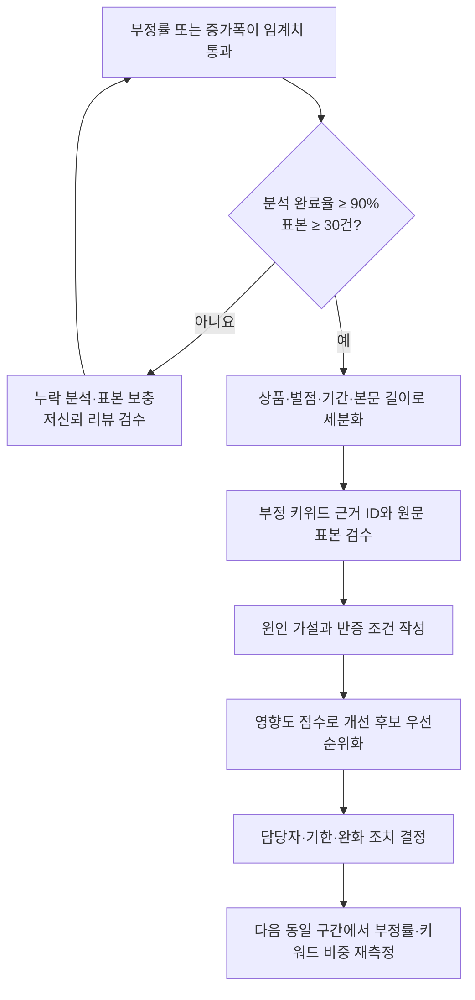

# 감정 지표 운영 의사결정 정책

- 상태: 초기 운영 기준
- 적용 대상: `stats`, `extract`, `dashboard` 결과를 사람이 검토해 알림과 조치를 결정하는 과정
- 관련 구현: `review_analytics/rules/metrics.py`, `review_analytics/clients/gemini.py`, `review_analytics/services/reporting.py`

현재 CLI는 감정 지표와 근거를 생성하지만 알림 발송, 이슈 생성, 담당자 배정, 자동 조치를 수행하지 않는다. 이 문서는 출력 결과를 운영자가 일관되게 해석하기 위한 기준이며, 자동화 기능의 구현 명세가 아니다. 임계치는 실제 운영 데이터로 분기별 재보정한다.

## 1. 기본 지표와 비교 범위

관찰 구간 안에서 감정 분석이 완료된 리뷰만 분모로 사용한다.

```text
부정률 = 부정으로 분류된 리뷰 수 / 감정 분석 완료 리뷰 수
증가폭(pp) = 현재 부정률(%) - 기준선 부정률(%)
```

- 기본 관찰 구간: 최근 7일
- 기본 기준선: 직전 4개의 동일 길이 구간 부정률의 중앙값
- 기본 세분화: 전체와 `product_name`별 결과를 각각 계산
- 최소 표본: 관찰 구간의 분석 완료 리뷰 30건
- 분석 완료율 확인: 완료율이 90% 미만이면 경보보다 미분석 데이터 보충을 먼저 수행
- 기준선이 없으면 절대 부정률만 적용하고 증가폭 조건은 사용하지 않음
- 표본이 30건 미만이면 자동 단계 판정을 보류하고 `표본 부족`으로 기록. 안전·법적 문제를 암시하는 리뷰는 건수와 관계없이 사람이 즉시 검토

기준선에 평균 대신 중앙값을 쓰는 이유는 일회성 캠페인이나 장애로 생긴 극단값이 다음 판단을 과도하게 끌어올리는 것을 줄이기 위해서다. 계절성이나 요일 효과가 큰 서비스는 동일 요일 또는 전년 동기 기준선을 함께 비교한다.

## 2. 임계치와 알림 단계

최소 표본을 충족한 뒤 `관심` 이상은 절대 부정률 또는 증가폭 중 하나라도 만족하면 해당 단계로 판정하며, 여러 단계가 동시에 성립하면 가장 높은 단계를 선택한다. `정상`은 예외적으로 절대 부정률과 증가폭이 **모두** 기준 미만일 때만 판정한다. 기준선이 없어 증가폭을 계산하지 못하면 절대 부정률만으로 판정한다.

| 단계 | 절대 부정률 | 또는 기준선 대비 증가폭 | 알림과 초기 조치 |
| --- | ---: | ---: | --- |
| 정상 | 25% 미만 | 10%p 미만이며 두 조건 모두 충족 | 정기 대시보드 확인 |
| 관심 | 25% 이상 | 10%p 이상 | 1영업일 안에 부정 리뷰 10건 이상 표본 검수 |
| 경고 | 40% 이상 | 15%p 이상 | 4시간 안에 상품·별점·기간을 세분화하고 담당 팀에 원인 조사 요청 |
| 심각 | 60% 이상 | 25%p 이상 | 즉시 운영 책임자에게 전달하고 고객 영향 완화 조치를 사람이 승인 |

임계치 통과는 원인의 증거가 아니라 조사 시작 신호다. 모델 신뢰도가 낮거나 분석 완료율이 부족하면 감정 재검수와 누락 분석을 먼저 수행한다. 결제 중복, 안전 위험, 개인정보 노출처럼 심각도 5에 해당하는 내용은 부정률 임계치와 별도로 즉시 검토한다.

## 3. 의사결정 흐름



### 사례

최근 7일 배송 상품군의 분석 완료 리뷰가 120건이고 부정 리뷰가 54건이면 부정률은 45%다. 직전 4개 주간 중앙값이 24%라면 증가폭은 21%p이므로 `경고` 단계다.

1. 분석 완료율과 중복 리뷰 여부를 확인한다.
2. 상품별로 나눠 특정 SKU에 집중되는지 본다.
3. 부정 키워드 `배송 지연`의 근거 리뷰 ID를 열어 실제 배송 문제인지 검수한다.
4. 주문량 증가와 특정 물류사 구간이 동시에 나타났다는 가설을 세운다.
5. 물류사·출고일 데이터를 결합해 가설을 검증한다.
6. 원인이 확인되면 배송 예상일 안내, 지연 주문 선제 알림 같은 조치를 담당자와 기한에 연결한다.
7. 다음 7일의 부정률과 `배송 지연` 비중이 낮아졌는지 확인한다.

## 4. 부정 키워드 영향도와 개선 우선순위

현재 Gemini 응답은 `negative_keywords`와 `recommendations`를 별도 배열로 반환한다. 따라서 시스템이 둘의 일대일 관계나 우선순위를 자동 보장하지 않는다. 운영자는 근거 리뷰를 확인한 뒤 아래 기준으로 연결 관계와 점수를 기록한다.

### 4.1 입력 점수

모든 항목을 0~100으로 환산한다.

| 요소 | 계산 또는 판정 | 가중치 |
| --- | --- | ---: |
| 빈도 | `키워드의 고유 근거 리뷰 수 / 전체 부정 리뷰 수 × 100` | 40% |
| 심각도 | 1~5등급을 `0, 25, 50, 75, 100`으로 환산 | 30% |
| 증가도 | 기준선 대비 키워드 비중 증가폭을 `min(max(증가폭, 0) / 20%p × 100, 100)`으로 환산 | 20% |
| 신뢰도 | 근거 리뷰의 평균 감정 신뢰도 × 100. 값이 없으면 중립값 50 | 10% |

```text
우선순위 점수 = 빈도×0.40 + 심각도×0.30 + 증가도×0.20 + 신뢰도×0.10
```

### 키워드 증가도의 재현 조건

Gemini 키워드는 자유 문자열이므로 원문 문자열을 그대로 기간 간 비교하지 않는다. 증가도를 사용하려면 다음 절차를 모두 충족해야 한다.

1. 현재 구간과 직전 4개 동일 길이 구간에 같은 `product_name`·감정·기간 외 필터, 같은 모델, 같은 인사이트 프롬프트 버전을 사용해 각각 `extract`를 실행한다.
2. 각 실행의 `scope_json`, 모델, 프롬프트 버전, 생성일, 부정 리뷰 수, 키워드와 고유 근거 ID 수를 운영 기록에 보존한다. 현재 CLI는 여러 기간의 인사이트를 자동 비교하지 않으므로 이 비교표는 외부 운영 문서나 분석 스크립트에서 만든다.
3. 키워드는 Unicode NFKC, 앞뒤·연속 공백 정리, 영문 대소문자 통일 후 버전이 있는 동의어 사전에 매핑한다. 예를 들어 `늦은 배송`과 `배송 지연`을 `배송 지연`으로 합치는 결정과 근거 리뷰를 사람이 승인한다.
4. 하나의 리뷰가 같은 정규 키워드의 여러 표현에 포함돼도 고유 근거 ID 한 건으로 센다.

```text
구간 키워드 비중 = 정규 키워드의 고유 근거 리뷰 수 / 해당 구간 전체 부정 리뷰 수
기준선 키워드 비중 = 직전 4개 구간 비중의 중앙값
키워드 증가폭 = 현재 구간 비중 - 기준선 키워드 비중
```

동의어 사전 버전, 비교 가능한 과거 스냅샷, 구간별 부정 리뷰 수 중 하나라도 없으면 증가도는 `계산 불가`다. 이때 증가도 항목을 0점으로 간주하지 않고 제외한 뒤 나머지 가중치를 합계 100%가 되도록 재정규화한다. 예를 들어 증가도만 없으면 빈도·심각도·신뢰도의 원래 가중치 `40:30:10`을 `50%:37.5%:12.5%`로 적용한다.

심각도 등급은 다음 기준으로 판정한다.

| 등급 | 기준 예시 |
| ---: | --- |
| 1 | 표현 선호, 경미한 불편 |
| 2 | 우회 가능한 기능 불편, 단발성 지연 |
| 3 | 핵심 기능 저하, 반복 문의·교환 발생 |
| 4 | 사용 불가, 환불·대량 이탈 가능성 |
| 5 | 안전, 법적 의무, 개인정보, 결제 중복 등 즉시 대응 사안 |

### 4.2 우선순위 등급과 권고 연결

| 등급 | 점수 | 운영 기준 |
| --- | ---: | --- |
| P0 | 80 이상 또는 심각도 5 | 즉시 책임자 검토와 완화 조치 결정 |
| P1 | 60 이상 80 미만 | 현재 계획 주기에 담당자와 완료일 지정 |
| P2 | 40 이상 60 미만 | 다음 개선 후보로 등록하고 추이 관찰 |
| P3 | 40 미만 | 근거를 보존하고 정기 재평가 |

권고를 키워드에 연결할 때는 `키워드`, `근거 리뷰 ID`, `연결한 권고`, `연결 이유`, `우선순위 점수`, `담당자`, `검증일`을 함께 기록한다. 하나의 권고가 여러 키워드를 해결할 수 있고, 근거가 불충분한 권고는 실행 목록에 넣지 않는다. AI가 생성한 권고는 후보이며 사람이 실행 가능성, 비용, 고객 영향, 규정 준수를 검토한 뒤 승인한다.

## 5. 부정률 급증 원인 분석 지표

| 지표 | 확인할 질문 | 현재 데이터 가용성 |
| --- | --- | --- |
| 상품명 | 특정 상품에 집중되는가? | `product_name`으로 가능 |
| 상품 변형·SKU·원상품 | 특정 옵션이나 원상품 계열의 문제인가? | 현재 없음. 입력 스키마 확장 필요 |
| 리뷰 소스·채널 | 앱, 마켓, 고객센터 중 특정 소스 문제인가? | 현재 없음. 수집 단계에서 출처 필드 필요 |
| 별점 | 1~2점 증가와 부정 감정이 함께 움직이는가? | `rating`으로 가능 |
| 리뷰 일자 | 배포·프로모션·장애 시점과 겹치는가? | `review_date`로 가능 |
| 본문 길이 | 짧은 일괄 리뷰 또는 장문의 상세 불만이 늘었는가? | `review_text` 길이로 추가 계산 가능 |
| 감정 신뢰도 | 급증이 저신뢰 분류에 치우쳤는가? | `confidence`로 가능 |
| 키워드 근거 수 | 소수 중복 표현이 급증을 만든 것은 아닌가? | 근거 리뷰 ID 중복 제거 후 가능 |
| 중복·캠페인 | 동일 문구 또는 이벤트 유입이 분포를 왜곡했는가? | 중복 정책과 유입 메타데이터를 함께 확인 |
| 운영 이벤트 | 가격 변경, 배포, 재고, 물류 장애와 시점이 일치하는가? | 외부 운영 로그 결합 필요 |

현재 없는 필드를 문서만으로 분석 가능한 것처럼 취급하지 않는다. 리뷰 소스·SKU가 필요한 조사는 먼저 수집 계약과 저장 스키마 변경을 승인받아야 한다.

## 6. 원인 가설 템플릿

급증 건마다 다음 항목을 채운다.

| 항목 | 작성 기준 |
| --- | --- |
| 관찰 | 기간, 모집단, 현재 부정률, 기준선, 증가폭, 표본 수 |
| 세분화 결과 | 상품·별점·기간·길이·소스별 차이와 각 표본 수 |
| 가설 | “특정 조건 X 때문에 결과 Y가 증가했다”처럼 검증 가능한 한 문장 |
| 근거 | 부정 키워드, 고유 리뷰 ID, 운영 이벤트, 정량 차이 |
| 대안 가설 | 데이터 누락, 모델 오분류, 중복 유입 등 경쟁 설명 |
| 반증 조건 | 어떤 결과가 나오면 이 가설을 기각할지 명시 |
| 추가 데이터 | 현재 스키마에 없지만 검증에 필요한 필드 |
| 조치 | 담당자, 기한, 고객 영향 완화, 되돌리기 조건 |
| 사후 검증 | 다음 동일 구간에서 비교할 부정률·키워드 비중·표본 수 |

가설은 원인 확정이 아니다. 세분화 결과의 표본 수를 항상 함께 적고, 조치 전후 비교에서 다른 캠페인이나 계절성 같은 교란 요인을 기록한다.
