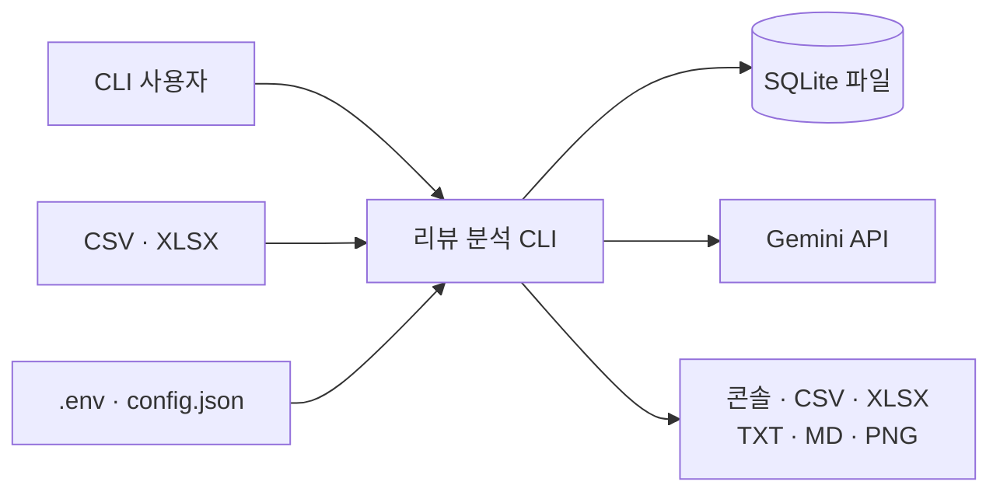
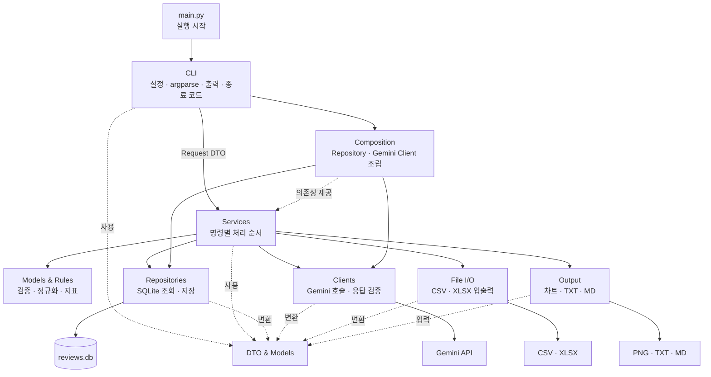

# 아키텍처 개요

- 상태: 현재 구현 아키텍처
- 기준 설계 기록: [`../superpowers/specs/2026-08-05-review-sentiment-cli-design.md`](../superpowers/specs/2026-08-05-review-sentiment-cli-design.md)
- 문서 지도: [`../README.md`](../README.md)

## 1. 목표

이 애플리케이션은 하나의 프로세스에서 실행되는 단순 레이어드 모놀리스다. 필수 요구사항을 구현하는 데 필요한 계층만 두고, 명확한 데이터 계약과 단방향 호출로 변경 영향을 제한한다.

- CLI, 서비스, 외부 연동 코드의 책임을 구분한다.
- 계층 사이에는 이름이 있는 dataclass와 내부 모델만 전달한다.
- SQLite, Gemini, pandas, matplotlib의 객체를 소유 모듈 밖으로 노출하지 않는다.
- Repository, Client, File I/O, Output은 서로 직접 호출하지 않는다.
- 실제 구현이 하나뿐인 역할에는 별도 추상 인터페이스를 만들지 않는다.
- 테스트에서는 외부 연동을 간단한 fake나 mock으로 대체할 수 있게 한다.

계층은 서로 전혀 의존하지 않는 독립 프로그램이 아니다. 호출 방향을 한쪽으로 제한하고 전달 데이터의 모양을 고정하는 것이 목표다.

## 2. 시스템 컨텍스트

실시간 웹 서버나 별도 DB 서버는 없다. 각 CLI 명령은 한 번 실행되고 종료되며 상태는 SQLite와 생성 파일에 영구 저장된다.

## 3. 전체 구조

실선은 주요 호출·구성 흐름이고 점선은 데이터 타입 사용 또는 의존성 제공을 나타낸다. Composition은 도움말 파싱 뒤 기본 Repository를 조립하고 첫 AI 호출 시 Client를 만든다. Services는 필요한 구체 모듈의 작은 공개 API를 호출하며, 외부 연동 모듈은 결과 데이터를 반환할 뿐 상위 모듈을 호출하지 않는다.

## 4. 상세 문서

| 문서 | 책임 |
| --- | --- |
| [`modules.md`](modules.md) | 모듈 책임, 허용 의존성, 목표 패키지 구조 |
| [`data-communication.md`](data-communication.md) | DTO, 내부 모델, 모듈 간 송수신 데이터와 대표 흐름 |
| [`runtime-boundaries.md`](runtime-boundaries.md) | 데이터 소유권, 트랜잭션, 오류, 테스트 경계 |
| [`../data-flow.md`](../data-flow.md) | 사용자 관점의 전체 처리 흐름과 명령별 예시 |
| [`../policies/logging.md`](../policies/logging.md) | 로그 레벨, 이벤트, 출력, 민감정보 정책 |

## 5. 변경 원칙

- 계층이나 호출 방향 변경은 이 문서와 `modules.md`를 함께 갱신한다.
- DTO나 모듈 간 전달 데이터 변경은 `data-communication.md`를 갱신한다.
- 트랜잭션·오류·테스트 경계 변경은 `runtime-boundaries.md`를 갱신한다.
- 명령 동작 변경은 [`../policies/cli-commands.md`](../policies/cli-commands.md)와 [`../data-flow.md`](../data-flow.md)를 함께 갱신한다.
- 설계 기록만 수정하고 현재 기준 문서를 남겨두지 않는다.
