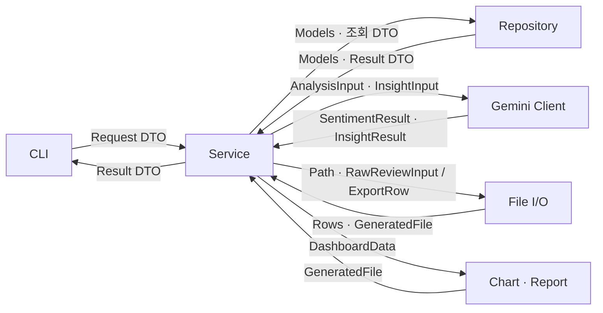
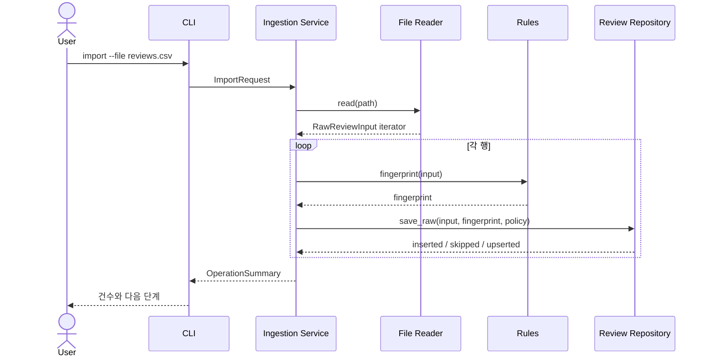
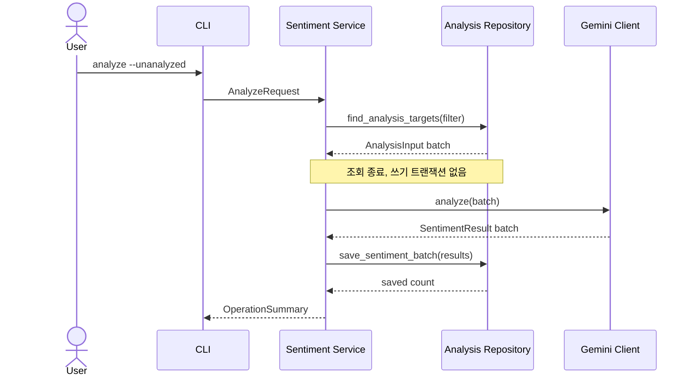
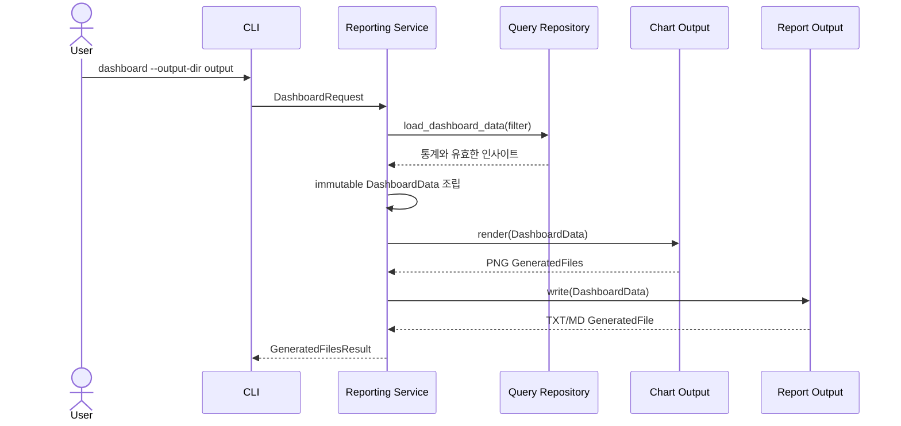

# 모듈 간 데이터 통신 계약

- 상태: 현재 구현 계약
- 아키텍처 개요: [`README.md`](README.md)
- 모듈 구조: [`modules.md`](modules.md)
- CLI 명령 정책: [`../policies/cli-commands.md`](../policies/cli-commands.md)
- 사용자 관점 흐름: [`../data-flow.md`](../data-flow.md)

## 1. 목적

이 문서는 CLI, Services, Models·Rules, Repositories, Clients, File I/O, Output이 어떤 데이터를 주고받는지 정의한다. 별도 추상 인터페이스 없이도 모듈을 독립적으로 이해하고 테스트할 수 있도록 공개 함수의 입력, 출력, 검증 책임을 고정한다.

## 2. 핵심 규칙

1. 모듈 경계에는 이름이 있는 Request DTO, Result DTO, 내부 모델을 사용한다.
2. `argparse.Namespace`, `sqlite3.Row`, Gemini SDK 응답, pandas `DataFrame`, matplotlib `Figure`는 해당 객체를 만든 모듈 밖으로 반환하지 않는다.
3. CLI는 문자열 옵션을 Request DTO로 바꾼 뒤 Service에 전달한다.
4. Service는 구체 Repository, Client, File I/O, Output의 공개 함수만 호출한다.
5. 외부 데이터는 소유 모듈에서 파싱·검증하여 내부 타입으로 변환한다.
6. Repository, Client, File I/O, Output은 서로 직접 호출하지 않는다.
7. mutable dictionary는 외부 응답을 받는 모듈 내부에서만 임시로 사용한다.
8. 반환값에 비밀정보, DB 연결, cursor, 열린 파일 핸들, SDK 클라이언트를 넣지 않는다.
9. 같은 필터 DTO는 모든 명령에서 같은 의미로 해석한다.

## 3. 호출과 데이터 변환

호출과 소스 의존성은 `CLI → Service → 외부 연동 모듈` 방향이다. 역방향 모듈은 상위 모듈을 import하지 않고 결과 데이터만 반환한다.

## 4. 공통 통신 타입

### 4.1 Request DTO

CLI가 만들고 Service 공개 함수가 받는 frozen dataclass다.

| DTO | 주요 필드 |
| --- | --- |
| `ImportRequest` | `file_path`, `duplicate_policy` |
| `CleanRequest` | `target_mode`, `review_id` |
| `AnalyzeRequest` | `target_mode`, `review_id`, `limit`, `force` |
| `ExtractRequest` | `filter`, `limit` |
| `ReviewListRequest` | `filter`, `page`, `size`, `sort_by`, `order` |
| `ReviewDetailRequest` | `review_id` |
| `StatsRequest` | `filter` |
| `DashboardRequest` | `filter`, `top_n`, `output_dir`, `report_format` |
| `ExportRequest` | `filter`, `format`, `output_path` |

CLI는 날짜, enum, 숫자 범위의 기본 문법을 검증한다. 파일 존재 여부, 대상 ID 존재 여부, 데이터 상태처럼 실행이 필요한 검증은 Service와 소유 모듈이 담당한다.

### 4.2 공통 조회 타입

| 타입 | 주요 필드와 규칙 |
| --- | --- |
| `ReviewFilter` | `sentiment`, `rating`, `rating_min`, `date_from`, `date_to`, `product` |
| `SortField` | 허용된 정렬 필드 enum |
| `SortOrder` | `asc`, `desc` enum |
| `PageRequest` | 1부터 시작하는 `page`, 제한된 `size` |

`ReviewFilter`는 list, stats, extract, dashboard, export에서 재사용한다. 정렬 문자열은 `SortField`로 바꾸고 SQL 열 이름이나 SQL 조각을 직접 전달하지 않는다.

### 4.3 내부 모델

| 타입 | 책임 |
| --- | --- |
| `RawReviewInput` | 외부 파일에서 받은 원본 한 행 |
| `RawReview` | 내부 ID, 원본, 출처, 정제 상태를 가진 저장 데이터 |
| `CleanReview` | 검증·정규화된 리뷰 |
| `Sentiment` | `positive`, `negative`, `neutral` enum |
| `AnalysisStatus` | 감정 결과 존재 여부에서 파생한 `unanalyzed`, `analyzed` enum |
| `AnalysisInput` | Gemini 감정 분석에 필요한 리뷰 ID와 본문 |
| `SentimentResult` | 리뷰 ID, 감정, 0.0~1.0 신뢰도, 모델 정보 |
| `InsightInput` | 필터 범위와 근거 검증에 필요한 리뷰 목록 |
| `KeywordEvidence` | 키워드와 근거 리뷰 ID |
| `InsightResult` | 긍정·부정 키워드, 요약, 개선 제안 |
| `StoredInsight` | exact-scope 조회에서 복원한 인사이트 결과, 범위, 건수, 생성 시각 |
| `QualityMetrics` | 완료율, 평균 신뢰도, 별점·감정 일치율 |

내부 모델은 SQLite 열 이름이나 Gemini 응답 JSON 같은 외부 표현을 알지 못한다.

### 4.4 Result DTO

| DTO | 용도 |
| --- | --- |
| `OperationSummary` | 처리·성공·스킵·실행 실패 건수, 안전한 메시지, 정제의 정상 거절 건수 `rejected` |
| `RawSaveResult` | raw ID와 `inserted`, `skipped`, `upserted` 저장 결과 |
| `ReviewSummary` | clean 요약, `analysis_status`, nullable `sentiment`·`confidence` |
| `ReviewListResult` | 전체 건수, 현재 페이지, 전체 페이지, `ReviewSummary` 목록 |
| `ReviewDetailResult` | raw, nullable clean, `CleanStatus`, 거절 사유, `analysis_status`, nullable 감정·신뢰도·모델·분석 시각 |
| `StatsResult` | 감정·별점 집계와 `QualityMetrics` |
| `DashboardData` | `stats`, 차트 원천 `ExportRow`, 긍정·부정 TOP N `KeywordEvidence`, 요약, 제안, 적용 `filter`, 생성 시각, 고정 차트 경로를 가진 immutable Output 스냅샷 |
| `ExportRow` | 외부 내보내기에 필요한 평탄화된 한 행 |
| `StatsRow` | 통계 계산에 필요한 raw ID, nullable 별점·감정·신뢰도 |
| `GeneratedFile` | 파일 역할, 경로, 기록 건수 또는 크기 |
| `GeneratedFilesResult` | 생성된 파일 목록과 성공·실패 요약 |
| `PartialFailureResult` | `successful_result`와 `(review_id, reason_code)` 실패 목록의 안전한 요약 |

CLI는 Result DTO만 보고 출력한다. SQL JOIN 방식이나 Gemini 응답 구조를 추측하지 않는다.

`clean`의 규칙 검증 거절은 `rejected`에, 저장 같은 실행 오류는 `failed`에 집계한다. 따라서 CLI는 정상적인 정제 거절과 부분 실행 실패의 종료 코드를 구분할 수 있다. 다른 명령은 `rejected=0`을 사용한다.

감정 결과가 없을 때 내부 DTO의 감정·신뢰도·모델·분석 시각은 `None`이고 `analysis_status`는 `unanalyzed`다. CLI가 이를 `미분석`과 `N/A`로 변환한다. 표시 문자열을 Repository나 DTO에 저장하지 않는다.

## 5. 모듈별 송수신 계약

### 5.1 CLI → Services

| 항목 | 규칙 |
| --- | --- |
| 송신 | Request DTO |
| 수신 | Result DTO 또는 프로젝트 오류 |
| CLI 책임 | 옵션 이름, 기본 문법, 상호 배타 옵션 검증 |
| Service 책임 | 대상 존재 여부, 업무 규칙, 실행 순서, 부분 성공 판정 |
| 금지 | Namespace 전달, Repository 직접 호출, SQL 문자열 전달 |

각 서브커맨드는 하나의 Service 공개 함수와 대응한다. Service는 콘솔에 직접 출력하지 않는다.

### 5.2 Services → Models·Rules

| 항목 | 규칙 |
| --- | --- |
| 송신 | 원시 필드 또는 내부 모델 |
| 수신 | 검증된 내부 모델, 계산 값, `ValidationError` |
| Service 책임 | 여러 계산의 순서와 저장 여부 결정 |
| Rules 책임 | 정규화, 검증, 지문, 품질 지표 계산 |
| 금지 | Rules에서 DB, API, 파일, 로그 접근 |

Rules 함수는 같은 입력에 같은 결과를 반환하며 외부 상태를 변경하지 않는다.

### 5.3 Services → Repositories

| 항목 | 규칙 |
| --- | --- |
| 송신 | 내부 모델, ID, `ReviewFilter`, 페이지·정렬 요청 |
| 수신 | 내부 모델, Result DTO, 전체 건수, 저장 결과 |
| Service 책임 | 어떤 데이터를 언제 읽고 저장할지 결정 |
| Repository 책임 | SQL, JOIN, row mapping, UNIQUE/FK 제약, 트랜잭션 |
| 금지 | connection, cursor, `sqlite3.Row` 반환 |

raw 저장은 `RawSaveResult`, 통계 원천 조회는 `StatsRow`, 유효 인사이트 조회는
`StoredInsight`로 반환한다. 이 타입들은 SQLite 객체나 JSON mutable dictionary를 포함하지 않는다.

페이지 결과는 `items`, `total_items`, `page`, `size`를 포함한다. 정렬 필드는 enum을 Repository 내부 허용 목록의 열 이름으로 매핑한다.

목록과 무필터 통계는 clean 리뷰를 기준으로 감정 결과를 선택적으로 결합하여 미분석 리뷰를 보존한다. 감정 필터가 있으면 감정 결과가 일치하는 분석 완료 리뷰만 반환한다. 감정·신뢰도 정렬에서는 nullable 값의 위치를 DB 기본 동작에 맡기지 않고 미분석 리뷰를 항상 마지막에 두며, `id`를 최종 정렬 기준으로 사용한다.

### 5.4 Services → Gemini Client

| 항목 | 규칙 |
| --- | --- |
| 송신 | `AnalysisInput` 묶음 또는 `InsightInput` |
| 수신 | 검증된 `SentimentResult` 묶음 또는 `InsightResult` |
| Service 책임 | 대상 선택, 배치 분할, 재시도 횟수 적용, 저장 |
| Client 책임 | 프롬프트, SDK 호출, 구조화 응답 파싱, SDK 예외 번역 |
| 금지 | SDK response 객체나 원본 JSON 반환 |

Client는 요청 리뷰 ID와 응답 ID, 감정 enum, 신뢰도 범위를 검증한다. 리뷰 본문은 명령이 아니라 JSON 분석 데이터로만 전달하며 시스템 지시에 포함하지 않는다.

Client는 호출 목적에 따라 서로 다른 시스템 지시를 선택한다. `analyze`는 각 리뷰를 `positive`, `negative`, `neutral` 중 하나와 `0.0..1.0` 신뢰도로 분류하고 요청 `review_id`마다 정확히 한 결과를 반환하도록 지시한다. `extract`는 긍정·부정 키워드와 근거 리뷰 ID, 전체 요약, 실행 가능한 개선 제안을 추출하도록 지시한다. `merge_insights`는 부분 인사이트의 근거 ID를 유지하면서 키워드를 중복 제거하고 요약과 제안을 하나로 통합하도록 지시한다. 세 지시 모두 입력 텍스트를 신뢰할 수 없는 데이터로 취급한다.

### 5.5 Services → File I/O

| 동작 | 송신 | 수신 |
| --- | --- | --- |
| import | 파일 `Path` | `RawReviewInput` 반복자 |
| export | `ExportRow` 반복자, 형식, 출력 `Path` | `GeneratedFile` |

File I/O는 입력 확장자·필수 열·파싱 오류와 출력 형식·확장자 일치를 검증한다. pandas를 사용하더라도 `DataFrame`을 반환하지 않는다.

### 5.6 Services → Output

| 동작 | 송신 | 수신 |
| --- | --- | --- |
| 차트 | 하나의 `DashboardData`, 출력 디렉터리 | PNG `GeneratedFile` 목록 |
| 리포트 | 같은 `DashboardData`, 형식, 출력 경로 | TXT/MD `GeneratedFile` |

Output은 전달받은 스냅샷만 표현한다. DB를 다시 조회하거나 Gemini를 호출하지 않는다.

## 6. 대표 통신 흐름

### 6.1 import

File Reader가 pandas를 사용하더라도 `RawReviewInput`으로 변환된 뒤에만 Service로 넘어간다.

### 6.2 analyze

Gemini 호출 동안 DB 쓰기 트랜잭션은 열려 있지 않다.

### 6.3 dashboard

정상 경로에서 Chart와 Report는 통계·차트 원천 행·TOP N·차트 경로가 함께 고정된 같은 `DashboardData` 인스턴스를 사용한다. 차트가 부분 또는 전체 실패하면 Service는 통계·원천 행·TOP N·AI 결과는 그대로 두고 `chart_paths`만 실제 성공한 출력으로 교체한 새 frozen DTO를 Report에 전달한다. 따라서 부분 성공 리포트가 생성되지 않은 차트를 생성된 경로로 표시하지 않는다. 유효한 인사이트가 없거나 exact scope JSON과 현재 리뷰 건수가 저장된 인사이트와 다르면 Service는 Output을 호출하지 않는다.

## 7. 데이터 계약 변경 절차

1. 새 데이터가 어느 모듈에서 생성되고 검증되는지 결정한다.
2. 기존 DTO나 내부 모델로 표현 가능한지 확인한다.
3. 불가능하면 `dto.py` 또는 `models.py`에 이름이 있는 타입과 필드를 추가한다.
4. 이 문서의 송신·수신 타입과 검증 책임을 갱신한다.
5. Service fake/mock 테스트와 실제 외부 연동 모듈 테스트를 함께 수정한다.
6. 사용자 동작이 바뀌면 [`../data-flow.md`](../data-flow.md)를 수정한다.
7. 런타임 원자성이나 오류가 바뀌면 [`runtime-boundaries.md`](runtime-boundaries.md)를 수정한다.
