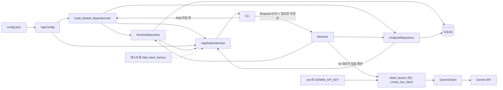

# 모듈 구조와 의존성

- 상태: 현재 구현 구조
- 아키텍처 개요: [`README.md`](README.md)
- 데이터 통신: [`data-communication.md`](data-communication.md)

## 패키지별 책임 요약

| 패키지·모듈 | 단일 책임 | 주 입력 | 주 출력 | 직접 의존 가능 대상 |
| --- | --- | --- | --- | --- |
| `main.py` | 프로세스 시작 | 명령줄 인자 | CLI 종료 코드 | `review_analytics.cli` |
| `cli.py` | 입력 파싱, Service 호출, 사용자 출력 | `argparse.Namespace`, `AppDependencies` | Request DTO, 콘솔 메시지, 종료 코드 | Services, DTO·Models·Rules, Config, Composition, Logging Config, Errors |
| `composition.py` | 런타임 인프라 생성과 주입 | `AppConfig`, 환경 변수 | `AppDependencies`, 지연 Gemini Client | Config, Errors, Repositories, Client 생성 함수 |
| `config.py` | 설정 로드·검증과 경로 해석 | `config.json` | `AppConfig` | Models, Errors, 표준 라이브러리 |
| `dto.py` | 계층 간 불변 요청·결과 계약 | 검증된 내부 값 | Request/Result DTO | Models |
| `models.py` | 도메인 값·enum·불변 모델 | 검증된 필드 | 도메인 모델 | 표준 라이브러리 |
| `rules/` | 외부 상태 없는 검증·정규화·지표 계산 | 원시 값 또는 내부 모델 | 판정값, 정규화 값, `QualityMetrics` | Models, 표준 라이브러리 |
| `services/` | 명령별 유스케이스 순서 조정 | Request DTO와 주입된 협력 객체 | Result DTO·내부 모델 | DTO·Models·Rules, Errors, Repositories, File I/O·Output 공개 API, 다른 Service의 공개 API, 주입된 Client |
| `repositories/` | SQLite 영속화와 트랜잭션 | 내부 모델·필터·저장 요청 | 내부 모델·Result DTO | DTO·Models, Errors, 같은 패키지의 Database, `sqlite3` |
| `clients/` | Gemini 요청·응답 경계 | `AnalysisInput`, `InsightInput` | 검증된 `SentimentResult`, `InsightResult` | Models, Errors, Google GenAI SDK |
| `file_io/` | CSV/XLSX 읽기·내보내기 | 파일 경로, 내부 행 | `RawReviewInput` 또는 생성 파일 정보 | DTO·Models, Errors, pandas·openpyxl |
| `output/` | 리포트와 차트 렌더링 | `DashboardData` | PNG·TXT·MD 생성 파일 정보 | DTO·Models, Errors, matplotlib |
| `logging_config.py` | 공통 로그 핸들러 구성 | `AppConfig`의 로그 설정 | 구성된 Python logging | Config, Errors, 표준 라이브러리 |

이 표의 “직접 의존 가능 대상”은 현재 구현에서 허용하는 import와 런타임 호출의 범주를 모두 열거한다. `Errors`는 `review_analytics.errors`, 같은 패키지는 해당 패키지의 내부 모듈을 뜻한다. Client는 Service에 객체로 주입되므로 Service가 Client 구현 모듈을 직접 import한다는 의미가 아니다. 전달 값의 상세 계약은 [`data-communication.md`](data-communication.md), 데이터 소유권과 트랜잭션은 [`runtime-boundaries.md`](runtime-boundaries.md)를 따른다.

## 1. CLI

사용자 입력을 Service 호출로 바꾸고 결과를 사람이 읽을 수 있는 형식으로 표시한다.

- argparse 파서와 9개 서브커맨드
- 문자열 옵션의 기본 문법과 상호 배타 조건 검증
- `argparse.Namespace`를 Request DTO로 변환
- Result DTO를 콘솔 메시지로 변환
- 오류를 종료 코드 `0`, `1`, `2`로 매핑

CLI는 Service 공개 함수, DTO·Models·순수 Rules, 설정, Composition 공개 함수만 사용한다. SQL, Repository·Client 구현, pandas, matplotlib을 직접 호출하지 않는다.

## 2. Services

명령 하나를 완료하는 처리 순서를 조정한다.

- `import`, `clean`, `analyze`, `extract`
- `list`, `show`, `stats`, `dashboard`, `export`
- 대상 선택, 배치 분할, 재시도, 부분 성공 판정
- Repository, Client, File I/O, Output 호출 순서 결정
- 파생 데이터 무효화와 stale 처리 요청

Services는 외부 라이브러리의 반환 객체를 직접 다루지 않는다. 구체 모듈을 호출할 수 있지만 내부 SQL, SDK 응답 형식, 렌더링 객체에는 의존하지 않는다.

## 3. Models와 Rules

프로젝트 전체가 공유하는 데이터 의미와 순수 계산을 담당한다.

- `RawReview`, `CleanReview`, `SentimentResult`, `InsightResult`
- 본문·제품명·날짜 정규화와 검증
- 중복 지문 계산
- 분석 완료율, 평균 신뢰도, 별점·감정 일치율 계산
- enum과 값 범위 검증

Models와 Rules는 DB, 네트워크, 파일, CLI에 접근하지 않으며 Python 표준 라이브러리만 사용한다.

## 4. Repositories

SQLite 데이터 접근과 짧은 쓰기 트랜잭션을 담당한다.

- 스키마 생성과 연결 관리
- raw, clean, 감정, 인사이트 조회·저장
- JOIN, 필터, 정렬, 페이지네이션
- `sqlite3.Row`를 내부 모델이나 Result DTO로 변환
- 여러 테이블을 함께 바꾸는 저장 동작의 commit/rollback

원자성이 필요한 동작은 하나의 공개 Repository 메서드로 제공한다. 별도 트랜잭션 조정 계층은 두지 않는다.

## 5. Clients

외부 API 호출과 응답 검증을 담당한다.

- Gemini 클라이언트 생성
- 감정 분석과 인사이트 추출 프롬프트
- 구조화 응답 파싱
- 리뷰 ID, 감정 enum, 신뢰도 범위 검증
- SDK 예외를 프로젝트 오류로 변환

Gemini SDK 응답과 원본 JSON은 Client 밖으로 반환하지 않는다.

## 6. File I/O와 Output

파일 형식과 표현 기술을 담당한다.

- CSV/XLSX를 `RawReviewInput`으로 변환
- 조회 결과를 CSV/XLSX로 기록
- `DashboardData`로 PNG 차트 생성
- 같은 `DashboardData`로 TXT/MD 리포트 생성

pandas `DataFrame`과 matplotlib `Figure`는 해당 모듈 안에서만 사용한다. Output은 DB나 Gemini를 다시 조회하지 않는다.

## 7. 실행 시작점과 로깅 설정

`main.py`는 CLI 실행을 시작한다. `composition.py`는 도움말 파싱 뒤 기본 Repository를 조립하고, 실제 첫 AI 호출 시에만 `.env`의 `GEMINI_API_KEY`와 Gemini Client를 구성한다. CLI는 주입된 의존성을 Service에 전달할 뿐 Repository나 Client 구현을 직접 import하지 않는다. `logging_config.py`는 애플리케이션 시작 시 공통 핸들러와 포맷을 한 번 설정하며 세부 기준은 [`../policies/logging.md`](../policies/logging.md)를 따른다.

### `AppDependencies` 조립과 전달

`AppDependencies`는 애플리케이션 수준의 불변 의존성 묶음이다. 필드는 다음 의미를 가진다.

| 필드 | 생성 책임 | 소비 책임 | 수명과 제약 |
| --- | --- | --- | --- |
| `config: AppConfig` | CLI가 시작 시 설정을 로드 | CLI와 각 Service | 한 명령 실행 동안 공유하는 불변 설정 |
| `review_repository` | `build_default_dependencies()` | import·clean·query·report·export Service | 동일 SQLite 경로를 사용하며 Repository 공개 API로만 접근 |
| `analysis_repository` | `build_default_dependencies()` | analyze·extract·query·report Service | 감정·인사이트 저장과 조회를 담당 |
| `client_factory` | 테스트에서 fake factory를 주입하거나 실제 호출 시 `create_live_client`를 사용 | analyze·extract Service | AI 처리 대상이 있을 때만 Client를 만들며 `None`이면 실제 factory를 선택 |



조립 순서는 다음과 같다.

1. CLI는 도움말을 먼저 처리해 단순 도움말 요청에서 DB나 API 설정을 요구하지 않는다.
2. 실제 명령 실행 시 `build_default_dependencies(config)`가 DB 디렉터리와 스키마를 준비하고 두 Repository를 만든다.
3. CLI는 명령에 필요한 Request DTO와 Repository를 해당 Service에 전달한다.
4. `analyze` 또는 `extract`에 실제 처리 대상이 있을 때만 factory가 `.env`를 읽고 `GeminiClient`를 만든다.
5. Service는 Client 사용을 마치면 닫되, Gemini 호출 동안 SQLite 쓰기 트랜잭션을 열어 두지 않는다.

Composition은 의존성을 만들기만 하며 업무 규칙을 판단하지 않는다. `AppDependencies`의 Repository 타입이 현재 `object`인 것은 단일 구현을 간단히 주입하기 위한 선택이며, 실제 구현이 여러 개로 늘어날 때만 Protocol 또는 추상 인터페이스 도입을 검토한다.

## 8. 허용 의존성과 금지 의존성

| 출발 모듈 | 허용 | 금지 |
| --- | --- | --- |
| Models·Rules·DTO | Python 표준 라이브러리와 같은 영역의 타입 | CLI, Services, Repositories, Clients, pandas, matplotlib, Gemini SDK |
| CLI | Services 공개 API, DTO·Models·순수 Rules, 설정, Composition | Repository·Client·Output 구현 직접 import, SQL, Gemini SDK, pandas, matplotlib |
| Composition | 설정, Repository·Client 구현 | 업무 규칙, SQL row 처리, 사용자 출력 |
| Services | DTO, Models·Rules, 필요한 Repository·Client·File I/O·Output 공개 API | CLI, `sqlite3.Row`, Gemini SDK 응답, DataFrame, Figure |
| Repositories | DTO·Models, sqlite3 | CLI, Services, Clients, File I/O, Output |
| Clients | DTO·Models, 담당 SDK | CLI, Services, Repositories, File I/O, Output |
| File I/O·Output | DTO·Models, 담당 파일·렌더링 라이브러리 | CLI, Services, Repositories, Clients |
| `main.py` | 설정과 CLI 실행 시작 함수 | 업무 규칙, SQL, 데이터 변환 |

다음 호출이나 import는 구조 위반이다.

```text
cli -> repositories/clients/output
repositories -> services/clients/output
clients -> repositories/services/output
file_io/output -> repositories/clients/services
models/rules/dto -> 외부 라이브러리 또는 상위 모듈
```

Services가 구체 외부 연동 모듈을 아는 것은 허용한다. 공개 함수의 입출력을 내부 타입으로 제한하여 별도 추상 인터페이스 없이 결합 범위를 통제한다.

## 9. 목표 디렉터리 구조

```text
review_analytics/
├── cli.py
├── composition.py
├── config.py
├── dto.py
├── models.py
├── errors.py
├── rules/
│   ├── validation.py
│   ├── normalization.py
│   ├── duplicate_policy.py
│   └── metrics.py
├── services/
│   ├── ingestion.py
│   ├── cleaning.py
│   ├── sentiment.py
│   ├── extraction.py
│   ├── query.py
│   ├── reporting.py
│   └── exporting.py
├── repositories/
│   ├── database.py
│   ├── reviews.py
│   └── analyses.py
├── clients/
│   └── gemini.py
├── file_io/
│   ├── reader.py
│   └── exporter.py
├── output/
│   ├── charts.py
│   └── reports.py
└── logging_config.py
```

`main.py`는 저장소 루트의 실행 파일이고 `review_analytics.cli`를 호출한다. 구현이 작은 동안 관련 기능은 한 파일에 함께 둘 수 있으며 파일을 나누기 위해 비어 있는 추상 계층을 추가하지 않는다.

## 10. 구조 변경 규칙

- 새 외부 기술은 해당 Client, Repository, File I/O 또는 Output에만 추가한다.
- 동일 역할의 실제 구현이 두 개 이상 필요해질 때만 공통 인터페이스 도입을 검토한다.
- 새 서브커맨드는 Request DTO와 Service 공개 함수 하나에 연결한다.
- 모듈 간 새 데이터가 필요하면 [`data-communication.md`](data-communication.md)를 먼저 갱신한다.
