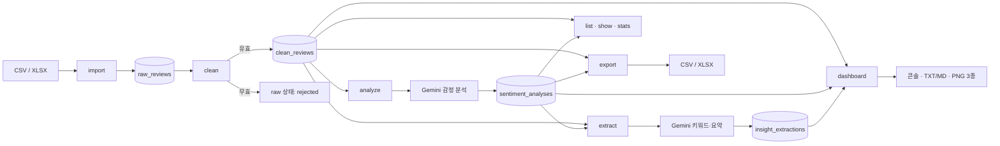
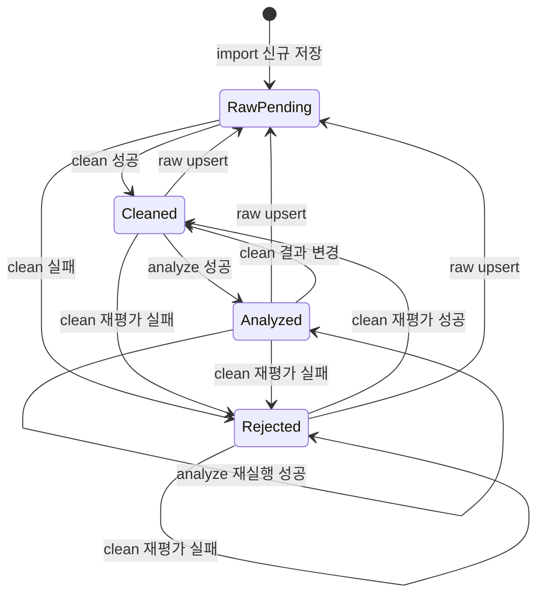

# 데이터 처리 흐름

- 상태: 현재 구현 동작
- 대상: CLI 사용자, 기능 개발자, 테스트 작성자
- 명령 정책: [`policies/cli-commands.md`](policies/cli-commands.md)
- 관련 문서: [`architecture/README.md`](architecture/README.md), [`architecture/data-communication.md`](architecture/data-communication.md), [`policies/raw-clean-data.md`](policies/raw-clean-data.md), [`glossary/README.md`](glossary/README.md)

## 1. 전체 흐름

리뷰는 raw 수집, clean 정제, 감정 분석, 인사이트 추출 단계를 거친다. 조회·통계·리포트·내보내기는 이 결과를 읽어 사용한다.



### 1.1 단계별 저장 결과

| 단계 | 입력 | 새로 저장하거나 변경하는 데이터 | 다음 단계 |
| --- | --- | --- | --- |
| `import` | CSV/XLSX 파일 행 | `raw_reviews` | `clean` |
| `clean` | raw 리뷰 | `clean_reviews`, raw 정제 상태 | `analyze` |
| `analyze` | clean 리뷰 | `sentiment_analyses` | `extract` 또는 조회 |
| `extract` | 필터된 clean·감정 결과 | `insight_extractions` | `dashboard` |
| `list`, `show`, `stats` | 저장 데이터 | DB 변경 없음 | 콘솔 결과 |
| `dashboard` | clean·감정·인사이트 | DB 변경 없음, 출력 파일 생성 | 리포트 검토 |
| `export` | clean·감정 결과 | DB 변경 없음, 출력 파일 생성 | 외부 활용 |

### 1.2 리뷰 상태 변화



raw는 원본 보존을 위한 상태이며 삭제하지 않는다. clean과 감정 결과는 파생 데이터이므로 raw upsert나 정제 규칙 변경 시 다시 만들 수 있다. 인사이트는 리뷰 한 건의 상태가 아니라 집계 결과이므로 위 상태도에 넣지 않으며, 근거 데이터가 바뀌면 별도로 stale 처리한다.

## 2. 권장 실행 순서

```bash
python main.py import --file data/sample_reviews.csv
python main.py clean --pending
python main.py analyze --unanalyzed
python main.py extract
python main.py stats
python main.py dashboard --report-format md --output-dir output
python main.py export --format xlsx --output output/reviews.xlsx
```

`list`, `show`, `stats`는 데이터가 준비된 어느 시점에도 사용할 수 있다. 단, 감정 필터와 감정 통계는 `analyze` 이후에 의미가 있다. `dashboard`는 같은 필터 범위의 유효한 `extract` 결과가 먼저 존재해야 한다.

### 2.1 조회 명령의 분석 상태 분류

`list`, `show`, `stats`는 감정 결과의 존재 여부를 다음 두 상태로 해석한다.

| 분석 상태 | 판정 기준 | CLI 표기 |
| --- | --- | --- |
| 미분석 | 조회 대상 리뷰에 연결된 감정 결과가 없음 | `미분석`; 개별 분석 필드는 `N/A` |
| 완료 | 검증된 감정 결과가 저장되어 있음 | 감정, 신뢰도, 모델, 분석 시각 |

`미분석`과 `N/A`는 사용자에게 상태를 설명하는 표시값이지 감정 enum이나 DB 저장값이 아니다. 일부 리뷰만 분석된 경우 각 리뷰는 위 기준으로 독립적으로 분류한다.

아래 출력은 형식과 의미를 설명하기 위한 예시이며 실제 건수와 ID는 입력 데이터에 따라 달라진다. 정확한 옵션, 기본값, 상호 배타 조건, 종료 코드는 [CLI 서브커맨드 정책](policies/cli-commands.md)을 따른다.

## 3. `import`: 파일 리뷰 수집

### 입력과 처리

```text
CSV/XLSX 파일
  → 확장자와 review_text 열 확인
  → 행별 원문 객체 생성
  → 중복 지문 계산
  → skip 또는 upsert 적용
  → raw_reviews 저장
```

- 필수 열: `review_text`
- 선택 열: `rating`, `review_date`, `product_name`
- `import`는 정제하지 않고 raw만 저장한다.
- 파일 자체가 잘못되면 아무 행도 저장하지 않는다.
- 개별 값의 품질 문제는 raw에 보존한 뒤 `clean`에서 판정한다.
- raw 보존 범위, 필드별 clean 변환, 거절 순서는 [Raw/Clean 데이터 분리와 보존 정책](policies/raw-clean-data.md)을 따른다.

### 실행 예시

```bash
python main.py import \
  --file data/sample_reviews.csv \
  --duplicate-policy skip
```

### 결과 예시

```text
[INFO] 파일 로드: data/sample_reviews.csv
[INFO] 감지 32건, raw 저장 30건, 중복 스킵 2건, 실패 0건
[INFO] 다음 단계: python main.py clean --pending
```

결과는 `raw_reviews`에 저장되며 새 행의 `clean_status`는 `pending`이다.

## 4. `clean`: 원본 검증과 정제

### 입력과 처리

```text
raw_reviews
  → 필수 본문 검증
  → Unicode NFKC와 공백 정규화
  → 별점 1~5 검증
  → 날짜를 YYYY-MM-DD로 변환
  → 최소 길이 검증
  ├─ 유효: clean_reviews 저장 + raw=cleaned
  └─ 무효: 기존 clean·감정 제거 + raw=rejected + 사유 기록
```

기본 대상은 `pending`이다. `--id`는 한 건, `--all`은 거절된 행을 포함해 전체를 다시 평가한다.
재정제 결과가 달라지거나 거절되면 모든 집계 인사이트를 stale 처리한다.

### 실행 예시

```bash
python main.py clean --pending
```

### 결과 예시

```text
[INFO] 정제 대상 30건
[INFO] clean 저장 28건, rejected 2건
[WARNING] ID=7: 별점 범위 오류 (6)
[WARNING] ID=19: 최소 본문 길이 미만
```

정제 실패는 원본 삭제를 의미하지 않는다. `show`에서 원문과 거절 사유를 확인할 수 있다.

## 5. `analyze`: 리뷰별 감정 분석

### 입력과 처리

```text
clean_reviews
  → 대상 선택 (--all / --id / --unanalyzed)
  → 기본 20건씩 배치
  → Gemini 구조화 출력 요청
  → 리뷰 ID·감정 enum·신뢰도 검증
  → 성공 결과를 sentiment_analyses 저장
```

- 감정: `positive`, `negative`, `neutral`
- 신뢰도: `0.0` 이상 `1.0` 이하
- 이미 분석된 리뷰는 기본 스킵한다.
- `.env`에 `GEMINI_API_KEY`가 있어야 한다.
- 실패 배치는 재시도 후 건너뛰고 성공 배치는 유지한다.

### 실행 예시

```bash
python main.py analyze --unanalyzed --limit 20
```

### 결과 예시

```text
[INFO] 분석 대상 20건, 배치 크기 20
[INFO] ID=1 positive (0.94)
[INFO] ID=2 negative (0.87)
[INFO] 분석 완료 20건, 스킵 0건, 실패 0건
```

일부 실패가 있으면 성공한 결과는 저장하고 종료 코드 `2`를 반환한다.

## 6. `extract`: 키워드·요약·개선 제안 추출

### 입력과 처리

```text
clean_reviews + sentiment_analyses
  → 기간·감정·제품 필터
  → 필요 시 입력 분할
  → Gemini 키워드·근거 ID·요약·제안 요청
  → 근거 ID 검증과 빈도 계산
  → insight_extractions 저장
```

필터를 주지 않으면 전체 clean 리뷰가 대상이다. 감정 필터를 사용하면 해당 감정 분석 결과가 있는 리뷰만 포함한다.

### 실행 예시

```bash
python main.py extract \
  --sentiment negative \
  --date-from 2026-07-01 \
  --date-to 2026-07-31
```

### 결과 예시

```text
[INFO] 추출 대상: 부정 리뷰 12건
[INFO] 인사이트 저장 완료: ID=4

[주요 부정 키워드]
1. 배송 지연 (근거 5건)
2. 포장 손상 (근거 3건)
3. 고객센터 응답 (근거 2건)

[개선 제안]
- 배송 단계별 알림을 강화한다.
- 출고 전 포장 검수 항목을 추가한다.
```

저장된 필터 범위는 `dashboard`가 정확히 같은 범위의 인사이트를 찾을 때 사용한다.

## 7. `list`: 필터·정렬·페이지 조회

### 입력과 처리

```text
CLI 필터와 페이지 정보
  → ReviewListRequest 검증
  → clean_reviews를 기준으로 감정 결과를 선택적으로 결합
  → 안정된 정렬과 LIMIT/OFFSET 적용
  → ReviewListResult 반환
```

감정 필터가 없으면 미분석 리뷰도 목록에 포함한다. `--sentiment`를 사용하면 해당 감정으로 분석된 리뷰만 남는다. 감정이나 신뢰도로 정렬할 때 미분석 리뷰는 정렬 방향과 관계없이 마지막에 둔다.

### 감정 분석 전 예시

```bash
python main.py list --page 1 --size 5
```

```text
=== 리뷰 목록: 1/6 페이지, 총 28건 ===
[1] ★★★★★ | 2026-07-02 | 사용하기 편하고 만족스러워요 | 미분석
[2] ★★☆☆☆ | 2026-07-03 | 배송이 너무 늦었어요 | 미분석
...
```

### 일부 감정 분석 후 예시

```bash
python main.py list --page 1 --size 5
```

```text
=== 리뷰 목록: 1/6 페이지, 총 28건 ===
[1] ★★★★★ | 2026-07-02 | 사용하기 편하고 만족스러워요 | positive (0.94)
[2] ★★☆☆☆ | 2026-07-03 | 배송이 너무 늦었어요 | 미분석
...
```

### 감정 필터 예시

```bash
python main.py list \
  --sentiment negative \
  --rating 2 \
  --page 1 \
  --size 5 \
  --sort-by review_date \
  --order desc
```

### 결과 예시

```text
=== 리뷰 목록: 1/2 페이지, 총 8건 ===
[12] ★★☆☆☆ | 2026-07-28 | 배송이 너무 늦었어요 | negative (0.91)
[7]  ★★☆☆☆ | 2026-07-21 | 포장이 찢어져 왔어요 | negative (0.88)
...
```

페이지네이션의 의미와 계산식은 [`glossary/pagination.md`](glossary/pagination.md)를 참고한다.

## 8. `show`: 리뷰 한 건 상세 조회

### 입력과 처리

```text
리뷰 ID
  → raw 원문 조회
  → 연결된 clean과 감정 결과 조회
  → 하나의 ReviewDetailResult로 조립
```

### 실행 예시

```bash
python main.py show 12
```

### 감정 분석 전 결과

```text
=== 리뷰 ID=12 ===
원문: 배송이   너무 늦었어요
정제문: 배송이 너무 늦었어요
별점: 2
작성일: 2026-07-28
제품: 텀블러
정제 상태: cleaned
분석 상태: 미분석
감정: N/A
신뢰도: N/A
분석 모델: N/A
분석 시각: N/A
```

### 감정 분석 후 결과

```text
=== 리뷰 ID=12 ===
원문: 배송이   너무 늦었어요
정제문: 배송이 너무 늦었어요
별점: 2
작성일: 2026-07-28
제품: 텀블러
정제 상태: cleaned
분석 상태: 완료
감정: negative
신뢰도: 0.91
분석 모델: gemini-3.1-flash-lite
분석 시각: 2026-08-06T14:20:00+09:00
```

정제 전 `pending`이면 정제문은 `N/A`, 분석 상태는 `미분석`, 나머지 분석 필드는 `N/A`다. 정제에 실패한 raw ID라면 `rejection_reason`을 추가하고 같은 방식으로 정제문과 분석 결과가 없음을 표시한다.

## 9. `stats`: 통계와 품질 지표 조회

### 입력과 처리

```text
기간·감정·제품 필터
  → 공통 ReviewFilter 생성
  → SQL 집계 + Rules 지표 계산
  → StatsResult 반환
```

### 실행 예시

```bash
python main.py stats --date-from 2026-07-01 --date-to 2026-07-31
```

### 감정 분석 전 결과

```text
=== 리뷰 분석 통계 ===
clean 리뷰: 28건
분석 완료: 0건 (0.0%)
긍정 0건 (N/A) | 중립 0건 (N/A) | 부정 0건 (N/A)
평균 별점: 3.68
평균 신뢰도: N/A
별점·감정 일치율: N/A
```

### 부분 분석 후 결과

```text
=== 리뷰 분석 통계 ===
clean 리뷰: 28건
분석 완료: 26건 (92.9%)
긍정 16건 (61.5%) | 중립 4건 (15.4%) | 부정 6건 (23.1%)
평균 별점: 3.68
평균 신뢰도: 0.86
별점·감정 일치율: 80.8%
```

감정 필터가 없으면 clean 리뷰 수와 평균 별점에는 미분석 리뷰도 포함한다. 감정별 건수·비율과 평균 신뢰도는 분석 완료 리뷰만 사용한다. 별점이 있는 분석 리뷰가 없으면 일치율은 `N/A`로 표시한다. 모든 clean 리뷰의 분석이 끝나면 분석 완료율은 `100.0%`가 된다.

`--sentiment`를 사용하면 해당 감정으로 분석된 리뷰만 통계 범위에 포함되므로 미분석 리뷰는 제외된다. 필터 결과에 clean 리뷰가 없으면 건수는 `0건`, 분모가 필요한 비율과 평균은 `N/A`로 표시한다.

## 10. `dashboard`: 종합 리포트와 차트 생성

### 입력과 처리

```text
ReviewFilter
  → clean·감정 통계 조회
  → 같은 범위의 최신 유효 insight 조회
  → 품질 지표와 TOP N 조립
  → matplotlib PNG 3종 생성
  → 콘솔 + TXT/MD 리포트 생성
```

유효한 인사이트가 없거나 stale이면 불완전한 리포트를 만들지 않고 실패한다. 안내된 필터로 `extract`를 먼저 실행해야 한다.

### 실행 예시

```bash
python main.py dashboard \
  --date-from 2026-07-01 \
  --date-to 2026-07-31 \
  --top 5 \
  --report-format md \
  --output-dir output/july
```

### 결과 예시

```text
[INFO] 리포트 생성: output/july/dashboard.md
[INFO] 차트 생성: output/july/sentiment_distribution.png
[INFO] 차트 생성: output/july/sentiment_trend.png
[INFO] 차트 생성: output/july/rating_sentiment_matrix.png
[INFO] 총 리뷰 28건, 분석 완료율 92.9%, 긍정 비율 61.5%
```

차트에 필요한 날짜나 별점이 없으면 해당 PNG 안에 “표시할 데이터 없음”을 기록한다.

## 11. `export`: 분석 결과 파일 내보내기

### 입력과 처리

```text
필터 + 출력 형식
  → clean_reviews + sentiment_analyses 조회
  → ExportRow DTO 변환
  → CSV 또는 XLSX writer
  → 파일 경로와 행 수 반환
```

### 실행 예시

```bash
python main.py export \
  --format xlsx \
  --output output/negative_reviews.xlsx \
  --sentiment negative \
  --rating-min 1
```

### 결과 예시

```text
[INFO] 내보내기 완료: output/negative_reviews.xlsx
[INFO] 필터 적용 결과 6건
```

CSV는 UTF-8 BOM으로 기록하고, XLSX는 스프레드시트에서 바로 열 수 있는 열 이름을 사용한다.

## 12. 읽기·쓰기 영향 요약

`R/W` 열은 각 저장 영역의 읽기와 쓰기 영향을 함께 나타낸다.

| 명령 | raw R/W | clean R/W | 감정 R/W | 인사이트 R/W | 파일 쓰기 | Gemini 호출 |
| --- | --- | --- | --- | --- | --- | --- |
| `import` | 중복 조회 / insert·upsert | - / upsert 시 삭제 | - / upsert 시 삭제 | - / upsert 시 stale | - | - |
| `clean` | 조회 / 상태 변경 | 기존값 조회 / 저장·삭제 | - / 결과 변경 시 삭제 | - / 결과 변경 시 stale | - | - |
| `analyze` | - | 대상 조회 / - | 기존값 조회 / 저장 | - | - | O |
| `extract` | - | 대상 조회 / - | 필터 시 조회 / - | - / 저장 | - | O |
| `list` | - | 조회 / - | 조회 / - | - | - | - |
| `show` | 조회 / - | 조회 / - | 조회 / - | - | - | - |
| `stats` | - | 조회 / - | 조회 / - | - | - | - |
| `dashboard` | - | 조회 / - | 조회 / - | 조회 / - | TXT/MD/PNG | - |
| `export` | - | 조회 / - | 조회 / - | - | CSV/XLSX | - |

`import`에서 stale 처리는 `upsert`로 기존 raw가 바뀐 경우에만 발생한다.

## 13. 실패 후 재개

- import 파일 오류: 파일을 수정한 뒤 같은 명령을 다시 실행한다.
- clean 개별 거절: raw 원인을 확인하고 올바른 값으로 upsert한 뒤 `clean --id`를 실행한다.
- analyze 일부 실패: `analyze --unanalyzed`를 다시 실행하면 성공 결과는 건너뛰고 실패 건만 재시도한다.
- extract 실패: 동일 필터로 다시 실행한다. 기존 유효 결과는 유지한다.
- dashboard stale 오류: 안내된 필터로 `extract`한 뒤 dashboard를 다시 실행한다.
- export 파일 오류: 출력 경로와 권한을 수정한 뒤 다시 실행한다. DB는 변경되지 않는다.
