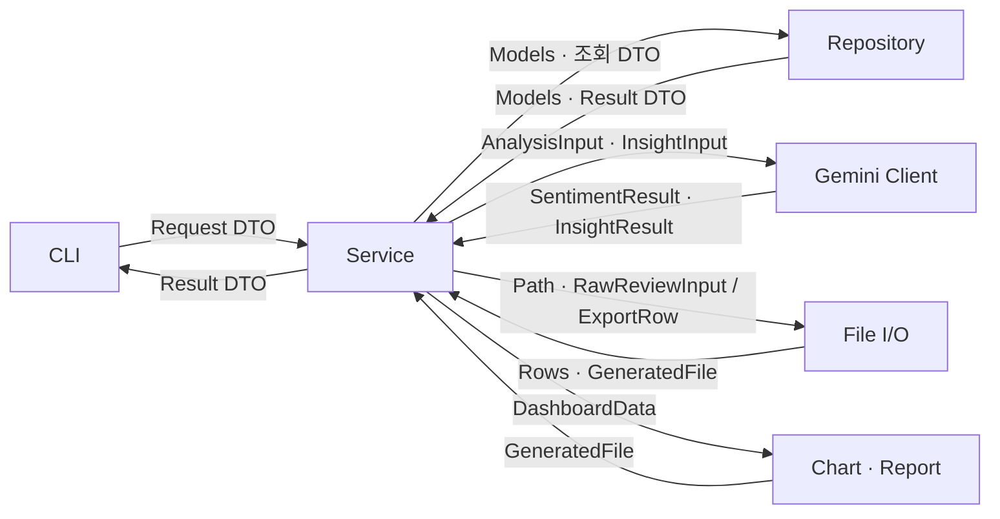
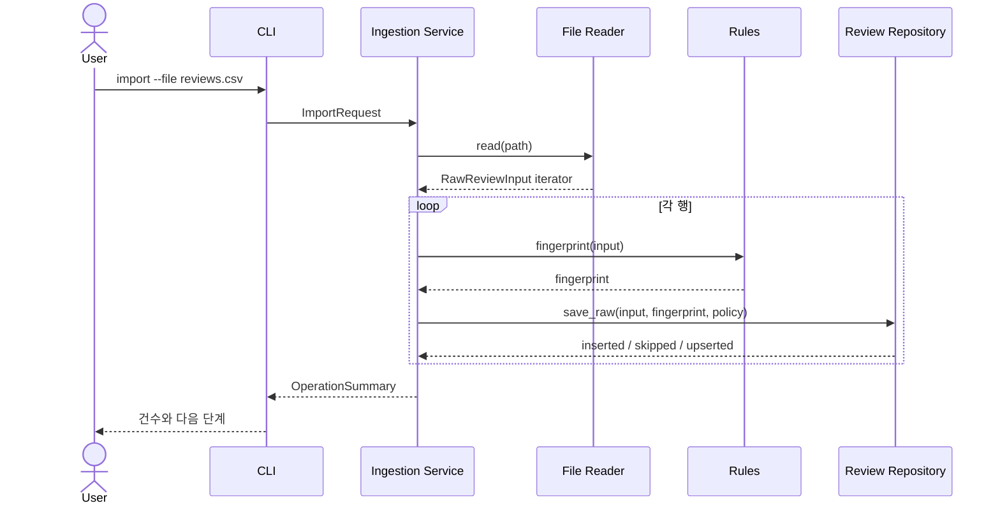
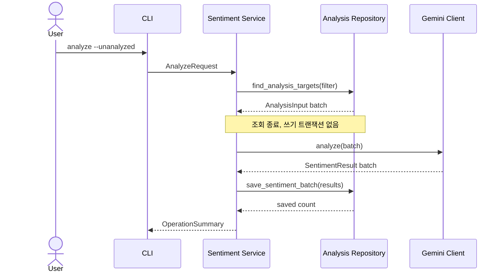
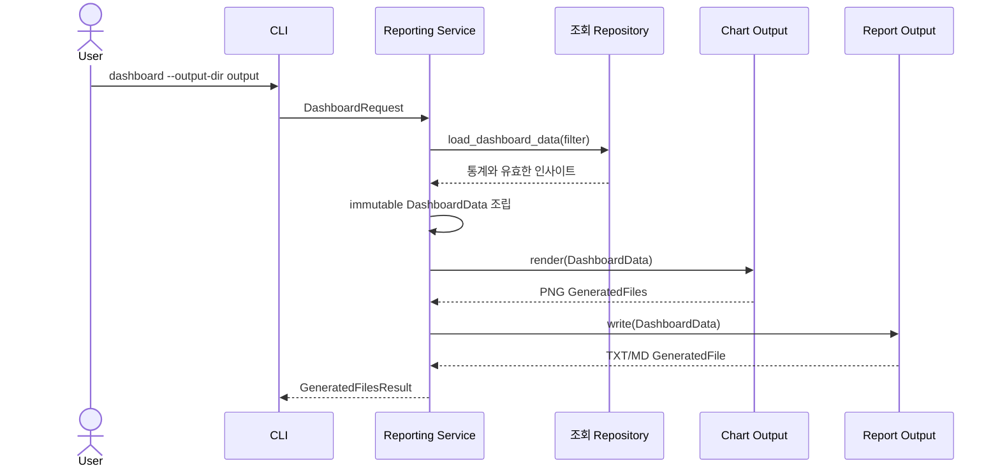

# 계층 간 데이터 통신 계약

- 상태: 구현 전 목표 계약
- 아키텍처: [`../ARCHITECTURE.md`](../ARCHITECTURE.md)
- 사용자 관점 흐름: [`data-flow.md`](data-flow.md)

## 1. 목적

이 문서는 CLI, Services, Models·Rules, Repositories, Clients, File I/O, Output이 어떤 데이터를 주고받는지 정의한다. 별도의 추상 인터페이스 계층을 두지 않고도 모듈 교체와 테스트가 가능하도록 공개 함수의 입력, 출력, 검증 책임과 오류·트랜잭션 경계를 고정한다.

## 2. 핵심 규칙

1. 모듈 경계에는 이름이 있는 Request DTO, Result DTO, 내부 모델을 사용한다.
2. `argparse.Namespace`, `sqlite3.Row`, Gemini SDK 응답, pandas `DataFrame`, matplotlib `Figure`는 해당 객체를 만든 모듈 밖으로 반환하지 않는다.
3. CLI는 문자열 옵션을 Request DTO로 바꾼 뒤 Service에 전달한다.
4. Service는 구체 Repository, Client, File I/O, Output의 공개 함수만 호출하고 내부 구현을 사용하지 않는다.
5. 외부 데이터는 소유 모듈에서 파싱·검증하여 내부 타입으로 변환한다.
6. Repository, Client, File I/O, Output 모듈은 서로 직접 호출하지 않는다.
7. mutable dictionary는 외부 응답을 받는 모듈 내부에서만 임시로 사용하고 즉시 이름이 있는 타입으로 변환한다.
8. 반환값에 비밀정보, DB 연결, cursor, 열린 파일 핸들, SDK 클라이언트를 넣지 않는다.
9. 같은 필터 DTO는 모든 명령에서 같은 의미로 해석한다.

## 3. 호출과 데이터 변환



호출과 소스 의존성은 모두 `CLI → Service → 외부 연동 모듈` 방향이다. 역방향 모듈은 상위 모듈을 import하지 않고, 결과 데이터만 반환한다.

## 4. 공통 통신 타입

### 4.1 Request DTO

CLI가 만들고 Service 공개 함수가 받는 요청이다. 생성 이후 값이 바뀌지 않는 frozen dataclass를 기본으로 한다.

| DTO | 주요 필드 |
| --- | --- |
| `ImportRequest` | `file_path`, `duplicate_policy` |
| `AddReviewRequest` | `text`, `rating`, `review_date`, `product_name`, `duplicate_policy` |
| `CleanRequest` | `target_mode`, `review_id` |
| `AnalyzeRequest` | `target_mode`, `review_id`, `limit`, `force` |
| `ExtractRequest` | `filter`, `limit` |
| `ReviewListRequest` | `filter`, `page`, `size`, `sort_by`, `order` |
| `ReviewDetailRequest` | `review_id` |
| `StatsRequest` | `filter` |
| `DashboardRequest` | `filter`, `top_n`, `output_dir`, `report_format` |
| `ExportRequest` | `filter`, `format`, `output_path` |

CLI는 날짜, enum, 숫자 범위의 기본 문법을 검증한다. 파일 존재 여부, 대상 ID 존재 여부, 데이터 상태처럼 실행이 필요한 검증은 Service와 소유 모듈이 담당한다.

### 4.2 공통 조회 타입

| 타입 | 주요 필드와 규칙 |
| --- | --- |
| `ReviewFilter` | `sentiment`, `rating`, `rating_min`, `date_from`, `date_to`, `product` |
| `SortField` | 허용된 정렬 필드 enum |
| `SortOrder` | `asc`, `desc` enum |
| `PageRequest` | 1부터 시작하는 `page`, 제한된 `size` |

`ReviewFilter`는 list, stats, extract, dashboard, export에서 재사용한다. 사용자가 입력한 정렬 문자열은 `SortField`로 바꾸고 SQL 열 이름이나 SQL 조각을 직접 전달하지 않는다.

### 4.3 내부 모델

| 타입 | 책임 |
| --- | --- |
| `RawReviewInput` | 외부 파일이나 CLI에서 받은 원본 한 행 |
| `RawReview` | 내부 ID, 원본, 출처, 정제 상태를 가진 저장 데이터 |
| `CleanReview` | 검증·정규화된 리뷰 |
| `Sentiment` | `positive`, `negative`, `neutral` enum |
| `AnalysisInput` | Gemini 감정 분석에 필요한 리뷰 ID와 본문 |
| `SentimentResult` | 리뷰 ID, 감정, 0.0~1.0 신뢰도, 모델 정보 |
| `InsightInput` | 필터 범위와 근거 검증에 필요한 리뷰 목록 |
| `KeywordEvidence` | 키워드와 근거 리뷰 ID |
| `InsightResult` | 긍정·부정 키워드, 요약, 개선 제안 |
| `QualityMetrics` | 완료율, 평균 신뢰도, 별점·감정 일치율 |

내부 모델은 SQLite 열 이름이나 Gemini 응답 JSON 같은 외부 표현을 알지 못한다.

### 4.4 Result DTO

Service가 CLI 또는 다른 출력 단계에 반환하는 읽기 전용 결과다.

| DTO | 용도 |
| --- | --- |
| `OperationSummary` | 처리·성공·스킵·실패 건수와 메시지 |
| `ReviewListResult` | 전체 건수, 현재 페이지, 전체 페이지, 리뷰 요약 목록 |
| `ReviewDetailResult` | raw, clean, 거절 사유, 감정 결과를 합친 상세 정보 |
| `StatsResult` | 감정·별점 집계와 `QualityMetrics` |
| `DashboardData` | 통계, TOP N, 요약, 제안, 적용 필터 |
| `ExportRow` | 외부 내보내기에 필요한 평탄화된 한 행 |
| `GeneratedFile` | 파일 역할, 경로, 기록 건수 또는 크기 |
| `GeneratedFilesResult` | 생성된 파일 목록과 성공·실패 요약 |
| `PartialFailureResult` | 성공 결과와 실패 ID·사유의 안전한 요약 |

CLI는 Result DTO만 보고 출력한다. SQL JOIN 방식이나 Gemini 응답 구조를 추측하지 않는다.

## 5. 모듈별 공개 데이터 계약

### 5.1 CLI → Services

| 항목 | 규칙 |
| --- | --- |
| 송신 | Request DTO |
| 수신 | Result DTO 또는 프로젝트 오류 |
| CLI 책임 | 옵션 이름, 기본 문법, 상호 배타 옵션 검증 |
| Service 책임 | 대상 존재 여부, 업무 규칙, 실행 순서, 부분 성공 판정 |
| 금지 | Namespace 전달, Repository 직접 호출, SQL 문자열 전달 |

각 서브커맨드는 하나의 Service 공개 함수와 대응한다. Service가 콘솔에 직접 출력하지 않으므로 출력 형식과 업무 처리를 별도로 테스트할 수 있다.

### 5.2 Services → Models·Rules

| 항목 | 규칙 |
| --- | --- |
| 송신 | 원시 필드 또는 내부 모델 |
| 수신 | 검증된 내부 모델, 계산 값, `ValidationError` |
| Service 책임 | 여러 계산의 순서와 저장 여부 결정 |
| Rules 책임 | 정규화, 검증, 지문, 품질 지표 계산 |
| 금지 | Rules에서 DB, API, 파일, 로그 접근 |

Rules 함수는 같은 입력에 같은 결과를 반환하며 외부 상태를 변경하지 않는다.

### 5.3 Services → Repositories

| 항목 | 규칙 |
| --- | --- |
| 송신 | 내부 모델, ID, `ReviewFilter`, 페이지·정렬 요청 |
| 수신 | 내부 모델, Result DTO, 전체 건수, 저장 결과 |
| Service 책임 | 어떤 데이터를 언제 읽고 저장할지 결정 |
| Repository 책임 | SQL, JOIN, row mapping, UNIQUE/FK 제약, 트랜잭션 |
| 금지 | connection, cursor, `sqlite3.Row` 반환 |

페이지 결과는 `items`, `total_items`, `page`, `size`를 포함한다. 정렬 필드는 enum을 Repository 내부 허용 목록의 열 이름으로 매핑한다.

원자성이 필요한 공개 저장 동작은 다음 의미를 보장한다.

| Repository 동작 | 한 트랜잭션에서 처리할 변경 |
| --- | --- |
| raw 저장 또는 upsert | 중복 확인, raw insert/update, 기존 clean·감정 무효화, 모든 집계 인사이트 stale 처리 |
| clean 저장 | clean upsert, raw 상태 갱신, 변경 시 감정 제거와 모든 집계 인사이트 stale 처리 |
| clean 거절 | 기존 clean·감정 제거, raw를 rejected로 변경, 모든 집계 인사이트 stale 처리 |
| 감정 배치 저장 | 검증된 성공 배치 전체 저장 또는 해당 배치 rollback |
| 인사이트 저장 | 범위와 결과, 모델·프롬프트 버전 저장 |

### 5.4 Services → Gemini Client

| 항목 | 규칙 |
| --- | --- |
| 송신 | `AnalysisInput` 묶음 또는 `InsightInput` |
| 수신 | 검증된 `SentimentResult` 묶음 또는 `InsightResult` |
| Service 책임 | 대상 선택, 배치 분할, 재시도 횟수 적용, 저장 |
| Client 책임 | 프롬프트, SDK 호출, 구조화 응답 파싱, SDK 예외 번역 |
| 금지 | SDK response 객체나 원본 JSON 반환 |

Client는 요청한 리뷰 ID와 응답 ID가 일치하는지, 감정 enum과 신뢰도 범위가 유효한지 확인한다. 리뷰 본문에 포함된 문장은 명령이 아니라 분석 데이터로 취급한다.

### 5.5 Services → File I/O

| 동작 | 송신 | 수신 |
| --- | --- | --- |
| import | 파일 `Path` | `RawReviewInput` 반복자 |
| export | `ExportRow` 반복자, 형식, 출력 `Path` | `GeneratedFile` |

File I/O는 확장자, 필수 열, 파일 파싱 오류를 검증한다. pandas를 사용하더라도 `DataFrame`을 반환하지 않는다.

### 5.6 Services → Output

| 동작 | 송신 | 수신 |
| --- | --- | --- |
| 차트 | 하나의 `DashboardData`, 출력 디렉터리 | PNG `GeneratedFile` 목록 |
| 리포트 | 같은 `DashboardData`, 형식, 출력 경로 | TXT/MD `GeneratedFile` |

Output은 전달받은 스냅샷만 표현한다. DB를 다시 조회하거나 Gemini를 호출하지 않으므로 콘솔, 리포트, 차트의 수치가 달라지지 않는다.

## 6. 대표 통신 흐름

### 6.1 import와 clean



File Reader가 pandas를 사용하더라도 pandas 객체는 `RawReviewInput`으로 변환된 뒤에만 Service로 넘어간다.

### 6.2 analyze



Gemini 호출 동안 DB 쓰기 트랜잭션은 열려 있지 않다. 응답 검증을 통과한 성공 배치만 별도의 짧은 트랜잭션으로 저장한다.

### 6.3 dashboard



Chart와 Report는 같은 `DashboardData`를 사용한다. 선택 범위와 일치하는 유효한 인사이트가 없으면 Service는 출력 모듈을 호출하지 않고 실패한다.

## 7. 오류 통신

| 발생 모듈 | 프로젝트 오류 또는 결과 | Service 판단 | CLI 결과 |
| --- | --- | --- | --- |
| Models·Rules | `ValidationError` | 행 거절 또는 명령 오류 | 사유와 건수 |
| File I/O | `InputFileError` | import 전체 실패 | 종료 코드 `1` |
| Repository | `PersistenceError` | 해당 저장 동작 rollback | 종료 코드 `1` |
| Gemini Client | `AIServiceError` | 재시도 후 배치 스킵 | 일부 성공이면 `2`, 전부 실패면 `1` |
| Output | `OutputWriteError` | 생성된 다른 파일과 함께 부분 실패 | 종료 코드 `2` |
| Service | `NotFoundError` | 사용자가 지정한 ID나 범위 없음 | 종료 코드 `1` |
| Service | `StaleInsightError` | dashboard 중단, extract 안내 | 종료 코드 `1` |

프로젝트 오류에는 안전한 사용자 메시지와 원인 코드가 포함된다. 원래 SDK 예외 객체, SQL 객체, 비밀정보는 CLI로 전달하지 않는다.

## 8. 트랜잭션 통신

Service는 연결이나 트랜잭션 객체를 받지 않는다. Repository의 공개 저장 메서드가 필요한 SQL 작업을 `with connection:` 또는 동등한 짧은 트랜잭션으로 묶는다.

```text
Service
  1. Repository에서 분석 대상 조회
  2. DB 쓰기 트랜잭션 없이 Gemini 호출
  3. 검증된 결과를 Repository 저장 메서드에 전달

Repository.save_sentiment_batch
  1. transaction 시작
  2. 성공 배치 저장
  3. 정상 종료 시 commit, 예외 시 rollback
```

외부 API 호출과 파일 생성은 SQLite 쓰기 트랜잭션 밖에서 실행한다. 여러 테이블 변경이 반드시 함께 성공해야 하면 이를 하나의 Repository 공개 메서드로 만들고 해당 메서드의 원자성 범위를 이 문서에 추가한다.

## 9. 테스트 기준

- CLI 테스트는 `argparse.Namespace`가 Service로 전달되지 않는지 확인한다.
- Service 테스트는 fake 또는 mock Repository·Client·출력 객체로 호출 순서와 입력 DTO를 확인한다.
- fake는 공통 추상 클래스를 상속하지 않아도 되며 Service가 사용하는 메서드와 데이터 모양만 맞춘다.
- Repository 테스트는 `sqlite3.Row`, connection, cursor가 반환값에 포함되지 않는지 확인한다.
- Gemini Client 테스트는 요청 ID 보존, enum, 신뢰도 범위, 잘못된 응답 거절을 확인한다.
- Chart와 Report 테스트는 저장소나 Gemini를 호출하지 않고 전달받은 `DashboardData`만 사용하는지 확인한다.
- 구조 검증은 Repository, Client, File I/O, Output 사이의 직접 import가 없는지 확인한다.

## 10. 데이터 계약 변경 절차

1. 새 데이터가 어느 모듈에서 생성되고 검증되는지 결정한다.
2. 기존 DTO나 내부 모델로 표현 가능한지 확인한다.
3. 불가능하면 `dto.py` 또는 `models.py`에 이름이 있는 타입과 필드를 추가한다.
4. 이 문서의 송신·수신 타입과 검증 책임을 갱신한다.
5. Service fake/mock 테스트와 실제 외부 연동 모듈 테스트를 함께 수정한다.
6. [`data-flow.md`](data-flow.md)의 사용자 동작이 바뀌면 해당 예시도 수정한다.
7. 호출 방향이나 디렉터리가 바뀌면 [`../ARCHITECTURE.md`](../ARCHITECTURE.md)를 함께 갱신한다.
