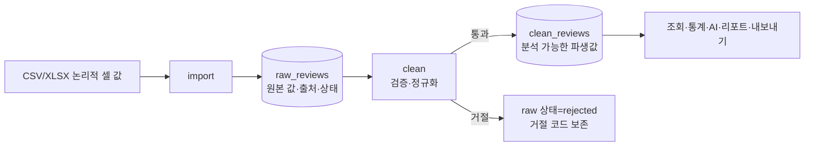

# Raw/Clean 데이터 분리와 보존 정책

- 상태: 현재 구현 계약
- 적용 범위: `import`, `clean`, 조회·분석·내보내기의 데이터 선택
- 구현 근거: `review_analytics/file_io/reader.py`, `rules/validation.py`, `rules/normalization.py`, `repositories/reviews.py`
- 저장 스키마: [`../architecture/storage-schema.md`](../architecture/storage-schema.md)
- 중복 처리: [`duplicate-review-policy.md`](duplicate-review-policy.md)

## 1. 분리 목적

raw와 clean은 같은 리뷰의 복사본이 아니라 서로 다른 책임을 가진 데이터 단계다.

- **Raw**는 외부 파일에서 읽은 논리적 셀 값과 출처를 보존한다. 값이 업무 규칙에 맞는지 판단하지 않으며, 오류 원인 추적과 정제 규칙 변경 후 재처리의 기준이 된다.
- **Clean**은 raw에 현재 정제 규칙을 적용해 검증·표준화한 파생 데이터다. 조회, 통계, Gemini 감정 분석, 인사이트, 대시보드, 내보내기의 기준이 된다.

분리하지 않고 원본을 제자리에서 수정하면 공백·날짜·별점 변환이 잘못됐을 때 입력을 복구할 수 없고, 정제 규칙을 바꿔도 같은 원본으로 결과를 재현하기 어렵다. 따라서 원본 계보와 분석 편의성을 동시에 확보하기 위해 `raw_reviews`와 `clean_reviews`를 일대일로 분리한다.



## 2. Raw의 보존 경계

“원본 보존”은 입력 파일의 바이트, XLSX 셀 서식, 수식 계산 결과까지 복제한다는 뜻이 아니다. 이 프로젝트는 파일 리더가 읽은 **논리적 셀 값**을 SQLite에 저장 가능한 문자열로 바꿔 보존한다.

- CSV는 UTF-8 BOM을 허용해 읽으며 셀 문자열을 그대로 받는다.
- XLSX는 `data_only=False`로 읽어 수식 셀은 계산 결과가 아니라 수식 표현을 읽는다.
- 필수 원본 값은 `None`이면 빈 문자열, 그 외에는 `str(value)`로 저장한다.
- 선택 원본 값은 `None`을 유지하고, 값이 있으면 `str(value)`로 저장한다.
- raw 저장 전 정규화 값은 중복 지문 계산에만 사용하며 raw 필드에 덮어쓰지 않는다.
- `source_type`, `source_ref`, `source_row`로 파일 형식, 파일명, 1부터 시작하는 원본 행 위치를 보존한다.

따라서 XLSX의 숫자 `2`는 raw에 `"2"`, 날짜 객체는 Python/openpyxl이 제공한 문자열 표현으로 저장될 수 있다. 글꼴, 색상, 표시 형식 같은 워크북 서식은 보존 범위가 아니다.

## 3. 필드별 보존·정제 기준

| 입력 의미 | Raw 필드와 보존값 | Clean 필드와 변환 규칙 | 거절 조건 |
| --- | --- | --- | --- |
| 리뷰 본문 | `review_text_raw`: 논리적 셀 값을 문자열로 보존. 빈 셀도 raw 저장 가능 | `review_text`: 문자열 변환 → Unicode NFKC → 앞뒤 공백 제거 → 탭·줄바꿈을 포함한 연속 공백을 한 칸으로 축약 | 정규화 후 빈 문자열이면 `MISSING_REVIEW_TEXT`; 설정된 최소 길이 미만이면 `REVIEW_TEXT_TOO_SHORT` |
| 별점 | `rating_raw`: 누락은 `NULL`, 그 외 입력 표현을 문자열로 보존 | `rating`: 빈 값은 `NULL`; 유한한 정수 표현만 허용하고 1~5의 `INTEGER`로 변환. `"2.0"`은 2로 허용 | 불리언, 숫자가 아닌 값, 무한대·NaN, 소수, 1 미만·5 초과는 `INVALID_RATING` |
| 작성일 | `review_date_raw`: 누락은 `NULL`, 그 외 입력 표현을 문자열로 보존 | `review_date`: 빈 값은 `NULL`; date/datetime, `YYYY-MM-DD`, ISO datetime, `YYYY/MM/DD`, `YYYY.MM.DD`를 `YYYY-MM-DD`로 변환 | 값이 있는데 지원 형식으로 해석할 수 없으면 `INVALID_REVIEW_DATE` |
| 제품명 | `product_name_raw`: 누락은 `NULL`, 그 외 입력 표현을 문자열로 보존 | `product_name`: 본문과 같은 NFKC·공백 정규화 후 빈 문자열이면 `NULL` | 별도 거절 조건 없음 |
| 입력 출처 | `source_type`, `source_ref`, `source_row`를 raw에 저장 | clean으로 복사하지 않고 `raw_review_id`로 원본을 역참조 | 지원하지 않는 파일 형식 또는 `review_text` 헤더 누락은 파일 전체 입력 오류 |
| 중복 식별 | `fingerprint`: 본문·제품명·작성일을 별도 정규화해 SHA-256 계산 | clean 필드가 아니며 분석에 사용하지 않음 | UNIQUE 제약과 `skip/upsert` 정책 적용 |
| 처리 상태 | `clean_status`, `rejection_reason`, 생성·갱신 시각 | `cleaning_version`, `cleaned_at`으로 파생 규칙과 생성 시점을 기록 | 정제 실패 시 clean 행을 만들지 않고 안정적인 거절 코드 저장 |

정제 검사는 `본문 존재 → 별점 → 날짜 → 최소 본문 길이` 순서로 실행한다. 한 리뷰가 여러 조건을 위반해도 현재 실행에서 가장 먼저 발견한 거절 코드 하나를 기록한다.

## 4. 저장과 보존 정책

### 신규 import

1. 파일 전체 구조와 필수 헤더를 먼저 검증한다.
2. 각 행을 `raw_reviews`에 `clean_status=pending`으로 저장한다.
3. `import`는 clean 행이나 감정 분석 결과를 만들지 않는다.
4. 내용이 불완전한 개별 행도 raw에는 보존하고 `clean`에서 거절 여부를 결정한다.

### clean 성공

- raw ID를 유지하고 `clean_reviews.raw_review_id`로 하나의 현재 clean 행을 연결한다.
- raw 원본 필드는 수정하지 않고 `clean_status=cleaned`, `rejection_reason=NULL`로 바꾼다.
- 기존 clean과 값 또는 `cleaning_version`이 달라지면 기존 감정 결과를 삭제하고 모든 인사이트를 stale 처리한다.

### clean 거절

- raw 행과 원본 필드는 삭제하지 않는다.
- 연결된 clean 행이 있으면 삭제하며 외래 키 연쇄로 감정 결과도 삭제한다.
- raw를 `clean_status=rejected`로 바꾸고 네 거절 코드 중 하나를 기록한다.
- 모든 집계 인사이트를 stale 처리한다.

### 중복 upsert와 재정제

- `skip`은 기존 raw·clean·분석을 변경하지 않는다.
- `upsert`는 raw ID와 최초 생성 시각을 유지하지만 raw 값과 출처를 **새 입력값으로 교체**한다. 이는 원본 불변 보존의 유일한 명시적 예외다.
- upsert는 상태를 `pending`으로 되돌리고 clean·감정 결과를 제거하며 인사이트를 stale 처리한다.
- `clean --all` 또는 `clean --id`로 rejected/cleaned raw도 현재 규칙으로 다시 평가할 수 있다.

## 5. 소비 단계의 기준

| 기능 | 사용하는 단계 | 이유 |
| --- | --- | --- |
| 오류 추적·원문 확인 | Raw | 실제 수집 표현과 출처, 거절 사유 확인 |
| `clean` 재실행 | Raw | 동일 원본에 새 정제 규칙 적용 |
| `list`, `stats`, 필터 조회 | Clean + 선택적 감정 결과 | 검증된 형식으로 안정적인 정렬·집계 수행 |
| `analyze`, `extract` | Clean | 잘못된 본문·날짜·별점을 AI 입력에서 제외 |
| `dashboard`, `export` | Clean + 감정·인사이트 | 분석 시점과 같은 정규화 데이터 사용 |
| `show` | Raw와 연결된 Clean·감정 | 원문과 파생 결과를 함께 감사 |

Raw는 분석 입력이 아니며 clean은 원본을 대체하지 않는다. 두 단계는 `raw_review_id`로 연결돼 원본에서 파생 결과까지 추적할 수 있어야 한다.

## 6. 예시

입력 CSV 행이 다음과 같다고 가정한다.

```text
review_text="  배송이\n\n너무 늦었어요  "
rating="2.0"
review_date="2026/8/5"
product_name=" 텀블러 "
```

Raw에는 입력 표현과 출처가 남는다.

```text
review_text_raw="  배송이\n\n너무 늦었어요  "
rating_raw="2.0"
review_date_raw="2026/8/5"
product_name_raw=" 텀블러 "
source_type="csv", source_ref="reviews.csv", source_row=2
clean_status="pending"
```

정제에 성공하면 별도 clean 행은 다음 값을 가진다.

```text
review_text="배송이 너무 늦었어요"
rating=2
review_date="2026-08-05"
product_name="텀블러"
cleaning_version="1"
```

raw 행은 그대로 남고 상태만 `cleaned`로 바뀐다. 이후 정제 규칙이 바뀌면 같은 raw 값으로 clean을 다시 생성하고 이전 감정·인사이트를 무효화할 수 있다.
