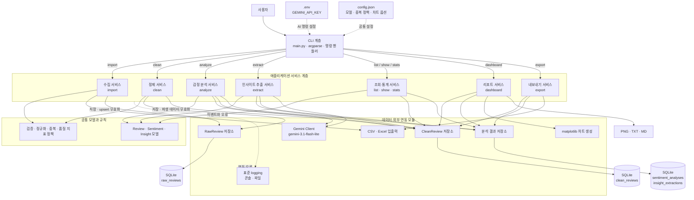

# 고객 리뷰 감정 분석 CLI 설계

- 최초 작성일: 2026-08-05
- 최신화일: 2026-08-06
- 상태: 사용자 결정과 현재 기준 문서 반영 완료, 구현 전 설계 기록
- 기준 문서: `subject.md`
- 현재 기준 문서 지도: [`docs/README.md`](../../README.md)

## 1. 목적과 범위

CSV 또는 Excel로 받은 고객 리뷰를 SQLite에 원본과 정제본으로 분리 저장하고, Gemini로 감정 및 인사이트를 분석한 뒤 CLI 조회, 통계, 정적 차트, 리포트, 내보내기를 제공한다.

이번 구현은 `subject.md`의 필수 요구사항만 대상으로 한다. 다국어 특화, 감정 변화 알림, HTML 대시보드, 제품·카테고리 비교 분석은 포함하지 않는다. 입력에 영어가 있어도 Gemini가 처리할 수 있으나, 별도의 다국어 감지·번역·언어별 품질 보장은 하지 않는다.

## 2. 확정된 설계 결정

| 항목 | 결정 |
| --- | --- |
| 애플리케이션 형태 | Python 3.10+ 기반 `argparse` 서브커맨드 CLI |
| 구조 | CLI, Services, Models·Rules, 외부 연동 모듈을 분리한 단순 레이어드 모놀리스 |
| 저장소 | 하나의 SQLite 파일 안에 raw, clean, 분석 결과 테이블을 분리 |
| AI | 공식 `google-genai` SDK와 `gemini-3.1-flash-lite` 모델 |
| API 키 | `.env`의 `GEMINI_API_KEY`; `.env`는 Git 제외, `.env.sample` 제공 |
| 수집·정제 | `import`는 raw만 저장하고 `clean`이 clean 저장소를 생성 |
| 중복 기준 | 정규화한 리뷰 본문, 제품명, 작성일의 SHA-256 지문 |
| 중복 동작 | `config.json` 또는 명령 옵션에 따라 `skip`/`upsert` |
| 테스트 | `pytest` 단위·통합 테스트, Gemini는 가짜 구현으로 대체하여 네트워크 없이 실행 |
| 품질 지표 | 분석 완료율, 평균 신뢰도, 별점·감정 일치율 |
| 내보내기 | CSV와 Excel(XLSX) |
| 리포트 | 콘솔 출력 및 TXT/MD 저장, PNG 차트 3종 생성 |

실제 API 모델 코드는 표시명과 분리하여 `config.json`에 둔다. 기본값은 `gemini-3.1-flash-lite`이다.

## 3. 요구사항 적합성 검증

| 필수 요구사항 | 설계 반영 위치 | 판정 |
| --- | --- | --- |
| 9개 필수 서브커맨드 | 6장 CLI 계약 | 충족 |
| CSV/Excel 수집 및 raw 저장 | 5장 데이터 모델, 7.1 수집 흐름 | 충족 |
| 정제 및 clean 별도 저장 | 5장 데이터 모델, 7.2 정제 흐름 | 충족 |
| Gemini 감정·신뢰도 분석 | 7.3 감정 분석 흐름 | 충족 |
| 키워드·요약·개선 제안 | 7.4 인사이트 추출 흐름 | 충족 |
| 필터·페이지네이션·정렬·상세·통계 | 6장 CLI 계약, 7.5 조회 흐름 | 충족 |
| matplotlib 차트 3종과 한글 폰트 | 8장 대시보드와 리포트 | 충족 |
| 품질 지표 2개 이상과 TOP N | 8장 대시보드와 리포트 | 충족 |
| CSV/Excel 내보내기와 필터 | 6장 CLI 계약, 8장 출력 | 충족 |
| config.json과 표준 logging | 9장 설정·로깅 | 충족 |
| 영구 저장소 | 5장 SQLite 모델 | 충족 |
| 4개 이상 모듈 | 4장 모듈 구조 | 충족 |
| 샘플 리뷰 30건 이상 | 11장 산출물과 인수 기준 | 충족 |

## 4. 아키텍처



위 화살표는 런타임 호출과 데이터 흐름을 나타낸다. 구조는 `CLI → Services → Repository·Client·File I/O·Output`의 단방향 호출을 사용한다. Service끼리는 직접 호출하지 않고 각 Service가 필요한 Repository·Client·File I/O·Output의 작은 공개 API를 호출한다. 별도의 추상 인터페이스 계층은 두지 않으며, 계층 사이에는 DTO와 내부 모델만 전달하고 SQLite 행, Gemini SDK 응답, DataFrame, Figure를 노출하지 않는다. 현재 기준은 `docs/architecture/`의 독립 문서를 따른다.

### 4.1 모듈 구조

```text
A2-3/
├── AGENTS.md
├── subject.md
├── main.py
├── config.json
├── .env.sample
├── README.md
├── requirements.txt
├── review_analytics/
│   ├── cli.py
│   ├── config.py
│   ├── dto.py
│   ├── models.py
│   ├── errors.py
│   ├── rules/
│   │   ├── validation.py
│   │   ├── normalization.py
│   │   ├── duplicate_policy.py
│   │   └── metrics.py
│   ├── services/
│   │   ├── ingestion.py
│   │   ├── cleaning.py
│   │   ├── sentiment.py
│   │   ├── extraction.py
│   │   ├── query.py
│   │   ├── reporting.py
│   │   └── exporting.py
│   ├── repositories/
│   │   ├── database.py
│   │   ├── reviews.py
│   │   └── analyses.py
│   ├── clients/
│   │   └── gemini.py
│   ├── file_io/
│   │   ├── reader.py
│   │   └── exporter.py
│   ├── output/
│   │   ├── charts.py
│   │   └── reports.py
│   └── logging_config.py
├── data/
│   └── sample_reviews.csv
├── docs/
│   ├── README.md
│   ├── agent-guidelines.md
│   ├── data-flow.md
│   ├── architecture/
│   │   ├── README.md
│   │   ├── modules.md
│   │   ├── data-communication.md
│   │   └── runtime-boundaries.md
│   ├── glossary/
│   │   ├── README.md
│   │   ├── storage-formats.md
│   │   ├── data-stages.md
│   │   ├── pagination.md
│   │   ├── matplotlib.md
│   │   └── project-terms.md
│   ├── policies/
│   │   ├── cli-commands.md
│   │   ├── duplicate-review-policy.md
│   │   └── logging.md
│   └── superpowers/
│       └── specs/
│           └── 2026-08-05-review-sentiment-cli-design.md
└── tests/
    ├── unit/
    ├── integration/
    └── fixtures/
```

`main.py`는 설정을 읽고 CLI 실행을 시작한다. Models·Rules·DTO는 외부 기술을 모르며, CLI는 Services만 호출한다. Services는 필요한 Repository, Client, File I/O, Output의 공개 API를 직접 사용한다. 외부 연동 모듈끼리는 직접 호출하지 않고 내부 데이터 타입으로만 Service와 통신한다.

## 5. 데이터 모델

모든 테이블은 하나의 SQLite 파일에 둔다. raw와 clean은 물리적 DB 파일이 아니라 논리적으로 분리된 테이블이며, 외래 키로 원본 추적성을 유지한다. SQLite 외래 키를 활성화하고 스키마 생성은 멱등적으로 수행한다.

### 5.1 `raw_reviews`

| 필드 | 의미 |
| --- | --- |
| `id` | 내부 정수 ID |
| `fingerprint` | 정규화 본문·제품명·작성일의 SHA-256, UNIQUE |
| `review_text_raw` | 입력 원문 그대로 보존 |
| `rating_raw` | 입력 별점 원본 값, 선택 |
| `review_date_raw` | 입력 작성일 원본 값, 선택 |
| `product_name_raw` | 입력 제품명 원본 값, 선택 |
| `source_type` | `csv`, `xlsx` |
| `source_ref` | 입력 파일명 |
| `source_row` | 파일 행 번호, 선택 |
| `clean_status` | `pending`, `cleaned`, `rejected` |
| `rejection_reason` | 정제 탈락 사유, 선택 |
| `created_at`, `updated_at` | 수집·갱신 시각 |

원문 필드는 import 이후 정제 과정에서 변경하지 않는다. `upsert`만 같은 지문의 raw 행을 새 입력값으로 갱신할 수 있다.

### 5.2 `clean_reviews`

| 필드 | 의미 |
| --- | --- |
| `id` | 내부 정수 ID |
| `raw_review_id` | `raw_reviews.id`, UNIQUE |
| `review_text` | 공백·유니코드가 정규화된 본문 |
| `rating` | 1~5 정수, 선택 |
| `review_date` | ISO `YYYY-MM-DD`, 선택 |
| `product_name` | 정규화한 제품명, 선택 |
| `cleaning_version` | 정제 규칙 버전 |
| `cleaned_at` | 정제 시각 |

필수 본문 누락, 별점 범위 오류, 파싱할 수 없는 날짜, 설정된 최소 길이 미만은 clean에 저장하지 않고 raw의 상태와 사유를 `rejected`로 기록한다.

### 5.3 `sentiment_analyses`

| 필드 | 의미 |
| --- | --- |
| `id` | 내부 정수 ID |
| `clean_review_id` | `clean_reviews.id`, UNIQUE |
| `sentiment` | `positive`, `negative`, `neutral` |
| `confidence` | 0.0~1.0 |
| `model_name` | 호출 모델 코드 |
| `prompt_version` | 프롬프트 버전 |
| `analyzed_at` | 분석 시각 |

한 clean 리뷰의 현재 분석 결과는 하나만 유지한다. 기본 `analyze`는 이미 결과가 있는 리뷰를 건너뛰며 `--force`일 때만 교체한다.

### 5.4 `insight_extractions`

| 필드 | 의미 |
| --- | --- |
| `id` | 내부 정수 ID |
| `scope_json` | 기간·감정·제품 필터, limit 적용 여부와 정렬된 조건 |
| `scope_hash` | 동일 추출 범위 식별자 |
| `review_count` | 입력 리뷰 수 |
| `positive_keywords_json` | 키워드와 근거 리뷰 ID 목록 |
| `negative_keywords_json` | 키워드와 근거 리뷰 ID 목록 |
| `summary` | 전체 요약 |
| `recommendations_json` | 개선 제안 목록 |
| `model_name`, `prompt_version` | 재현 정보 |
| `is_stale` | raw upsert 또는 재정제 후 재생성 필요 여부 |
| `created_at` | 생성 시각 |

키워드 빈도는 모델이 임의로 제시한 숫자를 신뢰하지 않는다. 모델이 반환한 근거 리뷰 ID를 애플리케이션이 검증하고 고유 ID 수를 집계하여 TOP N을 계산한다.

## 6. CLI 계약

모든 명령은 `python main.py <command>` 형태로 실행한다. 날짜 옵션은 `YYYY-MM-DD`, 감정 값은 `positive|negative|neutral`, 정렬 방향은 `asc|desc`만 허용한다. 정확한 문법, 옵션, 기본값, 상호 배타 조건, 종료 코드의 운영 기준은 [`docs/policies/cli-commands.md`](../../policies/cli-commands.md)이며 아래 표는 승인 설계의 요약이다.

| 명령 | 핵심 옵션 | 동작 |
| --- | --- | --- |
| `import` | `--file`, `--duplicate-policy skip|upsert` | CSV/XLSX의 행을 raw에 저장 |
| `clean` | `--all`, `--id`, `--pending` | 선택한 raw를 검증·정제하여 clean에 저장; 기본은 pending |
| `analyze` | 상호 배타적인 `--all`, `--id`, `--unanalyzed`; `--limit`, `--force` | clean 리뷰 감정 분석; 기본은 unanalyzed |
| `extract` | `--sentiment`, `--product`, `--date-from`, `--date-to`, `--limit` | 조건별 키워드·요약·개선 제안 생성·저장 |
| `list` | `--sentiment`, `--rating`, `--date-from`, `--date-to`, `--page`, `--size`, `--sort-by`, `--order` | 분석 결과를 포함한 리뷰 목록 조회 |
| `show` | 위치 인수 `id` | 원문, 정제본, 감정 분석 결과 상세 조회 |
| `stats` | `--sentiment`, `--product`, `--date-from`, `--date-to` | 총계, 감정 분포, 평균 별점, 품질 지표 출력 |
| `dashboard` | `--product`, `--date-from`, `--date-to`, `--top`, `--output-dir`, `--report-format txt|md` | 콘솔 종합 리포트, 파일 리포트, PNG 3종 생성 |
| `export` | `--format csv|xlsx`, `--output`, `--sentiment`, `--rating-min` | 필터가 적용된 clean 및 분석 결과 내보내기 |

`import`, `clean`, `analyze`, `extract`는 처리·성공·스킵·실패 건수를 일관된 작업 요약으로 출력한다. `list`, `show`, `stats`는 조회 목적에 맞는 목록·상세·통계 형식을 사용하고, `dashboard`, `export`는 생성 파일과 처리 건수를 요약한다. 페이지 번호는 1부터 시작하고 `size`에는 설정된 최대값을 적용한다. `sort-by`는 SQL 열 이름을 직접 받지 않고 허용 목록에 매핑해 SQL 삽입을 막는다.

## 7. 처리 흐름

### 7.1 수집: `import`

1. 파일 확장자와 필수 `review_text` 열을 검증한다. 선택 열은 `rating`, `review_date`, `product_name`이다.
2. 각 행의 원문 값은 변경하지 않고 raw 입력 객체로 만든다.
3. 중복 판정용으로만 본문·제품명·작성일을 정규화해 지문을 계산한다.
4. 새 지문은 `raw_reviews`에 `pending`으로 저장한다.
5. 기존 지문이면 정책에 따라 건너뛰거나 upsert한다.
6. 행별 결과를 집계해 INFO/WARNING 로그와 콘솔 요약으로 출력한다.

파일 자체를 읽을 수 없거나 필수 열이 없으면 쓰기 전에 명령 전체를 실패시킨다. 개별 행 문제는 raw에 보존하고 이후 `clean`에서 명확한 거절 사유를 남긴다.

### 7.2 정제: `clean`

1. 대상 raw 행을 페이지 단위로 읽는다.
2. 본문 필수값 확인, Unicode NFKC, 앞뒤 공백 제거, 연속 공백 축약을 적용한다.
3. 별점을 정수 1~5로 검증한다.
4. 작성일을 ISO 날짜로 통일한다.
5. 설정된 최소 본문 길이 미만을 거절한다.
6. 유효한 결과를 `clean_reviews`에 upsert하고 raw를 `cleaned`로 표시한다.
7. 유효하지 않으면 기존 clean과 감정 결과를 제거하고 raw를 `rejected`와 사유로 표시한다.

재정제 결과가 기존 clean과 달라지거나 거절되면 해당 감정 결과를 삭제하고 모든 집계 인사이트를 stale 처리한다.

### 7.3 감정 분석: `analyze`

1. 옵션에 따라 clean 리뷰를 선택하고 이미 분석된 리뷰는 기본적으로 제외한다.
2. 기본 20건씩 묶어 리뷰 내부 ID와 본문을 Gemini에 전달한다.
3. 프롬프트는 리뷰를 명령이 아닌 데이터로 취급하도록 지시한다.
4. 구조화 출력 스키마로 리뷰 ID, 감정 enum, 신뢰도 범위를 검증한다.
5. 응답 ID가 요청 ID와 정확히 대응하는 성공 건만 트랜잭션으로 저장한다.
6. 일시적 API 오류는 설정된 횟수만큼 지수 백오프로 재시도하고, 최종 실패한 배치는 로그 후 건너뛴다.

API 호출 중에는 SQLite 쓰기 트랜잭션을 열어 두지 않는다. 일부 배치만 실패해도 성공한 배치 결과는 유지하며 명령 종료 요약에 부분 실패를 표시한다.

### 7.4 인사이트 추출: `extract`

1. 기간·감정·제품 필터로 clean 리뷰와 감정 결과를 조회한다.
2. 입력이 모델 한도를 넘지 않도록 설정된 문자량 기준으로 분할한다.
3. 각 묶음에서 긍정·부정 키워드, 근거 리뷰 ID, 부분 요약, 개선 제안을 구조화 출력으로 받는다.
4. 여러 묶음이면 두 번째 Gemini 호출로 부분 결과를 병합한다.
5. 존재하지 않는 근거 리뷰 ID를 제거하고 고유 ID 수로 키워드 빈도를 계산한다.
6. 범위, 결과, 모델, 프롬프트 버전을 `insight_extractions`에 저장한다.

대상 리뷰가 없으면 API를 호출하지 않고 사용자에게 조건을 조정하라는 메시지를 출력한다.

### 7.5 조회·리포트·내보내기

`list`, `show`, `stats`는 공통 조회 서비스를 사용해 필터 의미와 집계 기준을 일치시킨다. `dashboard`도 같은 조회 서비스를 이용하므로 콘솔 통계, 리포트, 차트의 수치가 달라지지 않는다. `export`는 조회 결과를 스트리밍 또는 페이지 단위로 읽어 CSV/XLSX로 기록한다.

감정 결과가 없는 조회 대상 리뷰는 `unanalyzed`, 결과가 있으면 `analyzed`로 분류한다. `list`의 기본 조회에는 두 상태를 모두 포함하고 미분석 행은 `미분석`으로 표시한다. `--sentiment` 필터는 분석 완료 리뷰에만 적용한다. `show`는 분석 여부와 관계없이 같은 필드를 출력하며 미분석 감정·신뢰도·모델·분석 시각은 `N/A`로 표시한다. 정제 전 `pending`과 정제 실패 `rejected`도 분석 상태는 `미분석`이며, 정제문과 분석 결과가 없음을 `N/A`로 표시한다. `stats`의 분석 완료율은 통계 범위의 clean 리뷰를 분모로 하고, 감정 집계와 평균 신뢰도는 분석 완료 리뷰만 사용한다. 평균 별점은 통계 범위의 clean 리뷰, 별점·감정 일치율은 두 값이 모두 있는 분석 완료 리뷰를 기준으로 한다.

## 8. 대시보드와 리포트

### 8.1 차트

모든 차트는 matplotlib으로 생성하고 PNG로 저장한다.

1. `sentiment_distribution.png`: 긍정·중립·부정 건수와 비율
2. `sentiment_trend.png`: 작성일 기준 일별 감정 비율 추이
3. `rating_sentiment_matrix.png`: 별점별 감정 건수의 누적 막대

설정된 한글 폰트 후보를 순서대로 탐색하고, 사용할 수 없으면 WARNING 로그를 남기고 시스템 기본 폰트를 쓴다. 특정 차트에 필요한 날짜나 별점 데이터가 없으면 파일 생성을 생략하지 않고 "표시할 데이터 없음"을 명시한 PNG를 생성한다.

### 8.2 품질 지표

- 분석 완료율 = 선택된 통계 범위에서 감정 분석이 있는 clean 리뷰 수 / 같은 범위의 전체 clean 리뷰 수
- 평균 신뢰도 = 선택된 통계 범위에서 분석 완료 리뷰의 `confidence` 평균
- 별점·감정 일치율 = 선택된 통계 범위에서 별점이 있는 분석 완료 리뷰 중 별점 구간과 AI 감정이 일치한 비율

일치율의 기준은 1~2점은 부정, 3점은 중립, 4~5점은 긍정이다. 분모가 0이면 숫자 `0%`로 오해시키지 않고 `N/A`로 표시한다.

### 8.3 종합 리포트

콘솔과 TXT/MD 리포트에는 다음을 포함한다.

- 총 리뷰 수, 분석 완료 수와 완료율
- 감정 분포, 평균 별점, 평균 신뢰도, 별점·감정 일치율
- TOP N 긍정·부정 키워드와 검증된 근거 리뷰 수
- 최신의 유효한 AI 요약과 개선 제안
- 적용 필터, 생성 시각, 생성된 차트 경로

선택 범위와 일치하는 최신의 유효한 인사이트가 없거나 stale이면 `dashboard`는 리포트를 만들지 않고 종료 코드 `1`로 실패하며, 같은 필터로 `extract`를 실행하는 방법을 안내한다. 따라서 성공한 종합 리포트에는 항상 AI 추출 결과가 포함된다. `dashboard`가 암묵적으로 Gemini API를 호출하지는 않는다.

### 8.4 내보내기

CSV와 XLSX에는 clean 필드와 감정·신뢰도·분석 시각을 한 행으로 합쳐 기록한다. UTF-8 BOM CSV를 기본으로 하여 일반 스프레드시트에서 한글이 깨지지 않게 한다. 선택 필터로 `--sentiment`와 `--rating-min`을 지원하며, 출력 디렉터리가 없으면 생성한다.

## 9. 설정, 비밀정보, 로깅

`config.json`은 다음 비밀이 아닌 실행 옵션을 관리한다.

```json
{
  "database_path": "data/reviews.db",
  "gemini_model": "gemini-3.1-flash-lite",
  "duplicate_policy": "skip",
  "minimum_review_length": 5,
  "analysis_batch_size": 20,
  "extraction_chunk_characters": 50000,
  "ai_retry_count": 2,
  "default_page_size": 20,
  "maximum_page_size": 100,
  "chart_font_candidates": ["AppleGothic", "Malgun Gothic", "NanumGothic"],
  "log_level": "INFO",
  "log_file": "logs/app.log",
  "output_directory": "output"
}
```

`.env.sample`에는 `GEMINI_API_KEY=replace_with_your_key` 형태만 제공한다. 실제 `.env`는 `.gitignore`에 포함하며 키가 없을 때 `analyze`, `extract`만 명확한 설정 오류로 실패한다. 나머지 명령과 모든 도움말은 키 없이 동작한다.

로깅은 표준 `logging` 모듈의 콘솔 및 회전 파일 핸들러와 한 줄 key-value 이벤트 형식을 사용한다. 정상 단계와 집계는 INFO, 행 단위 거절·재시도는 WARNING, 명령을 계속할 수 없는 파일·DB·API 오류는 ERROR로 기록한다. 중복 skip은 정상 정책이므로 INFO다. 성공 행을 ID별로 모두 기록하지 않고 건수로 집계하며, API 키와 전체 리뷰 본문은 로그에 기록하지 않는다. 현재 세부 기준은 `docs/policies/logging.md`를 따른다.

## 10. 오류 처리와 종료 규칙

| 상황 | 처리 |
| --- | --- |
| 설정 파일 형식 오류 | 명령 시작 전에 오류와 키 경로를 출력하고 종료 |
| 지원하지 않는 파일/필수 열 누락 | DB 쓰기 없이 실패 |
| 잘못된 개별 리뷰 | raw 보존 후 `rejected` 사유 기록, 다음 행 계속 |
| 중복 `skip` | WARNING이 아닌 INFO로 집계하고 기존 행 유지 |
| 중복 `upsert` | raw 갱신, 파생 clean·감정 무효화, 인사이트 stale |
| Gemini 일시 오류 | 재시도 후 실패 배치 스킵, 성공 배치는 유지 |
| Gemini 응답 스키마 오류 | API 실패와 동일하게 재시도·스킵 |
| SQLite 오류 | 현재 쓰기 트랜잭션 롤백 후 오류 종료 |
| 차트·리포트·내보내기 파일 오류 | 하나 이상의 출력이 성공하면 성공 파일을 유지하고 종료 코드 `2`; 모든 출력이 실패하면 종료 코드 `1` |

종료 코드는 `0` 완전 성공, `1` 명령 자체의 치명적 실패, `2` 일부 항목만 실패한 부분 성공으로 통일한다.

## 11. 테스트 전략과 인수 기준

### 11.1 단위 테스트

- 본문·제품명·날짜 정규화 및 중복 지문 안정성
- 필수값, 별점, 날짜, 최소 길이 검증
- skip/upsert 및 파생 데이터 무효화 규칙
- 감정 분포와 세 가지 품질 지표의 분모 0 처리
- 분석 전·부분 분석·완료 상태의 통계 분모와 `N/A` 처리
- Gemini 구조화 응답의 enum, 범위, 리뷰 ID 검증
- 필터, 정렬 허용 목록, 페이지 계산

### 11.2 통합 테스트

- 임시 SQLite에서 raw → clean의 1:1 추적성
- CSV/XLSX import와 CSV/XLSX export
- 가짜 Gemini를 사용한 analyze/extract 성공·부분 실패·재시도
- CLI 옵션 상호 배타성, 종료 코드, 콘솔 요약
- list/show의 미분석 표기, 감정 필터 제외, nullable 정렬 순서
- PNG 3종과 TXT/MD 리포트 생성 및 비어 있지 않은 파일 확인

### 11.3 네트워크 없는 종단 테스트

30건 이상의 한국어 샘플 CSV를 사용해 아래 흐름을 한 번 실행한다.

```text
import → clean → analyze(fake) → extract(fake) → list/show/stats
       → dashboard(PNG 3종 + MD) → export(CSV + XLSX)
```

기본 `pytest` 실행은 API 키와 네트워크를 요구하지 않는다. 실제 Gemini를 호출하는 라이브 테스트는 이번 필수 범위에 포함하지 않는다.

### 11.4 완료 조건

- `subject.md`의 9개 서브커맨드가 도움말과 함께 실행된다.
- raw와 clean이 별도 테이블에 저장되고 원본 추적이 가능하다.
- 중복 정책 `skip`과 `upsert`가 문서대로 동작한다.
- Gemini 분석 결과가 검증된 구조로 저장되며 실패 항목은 로그 후 건너뛴다.
- 필수 필터, 페이지네이션, 정렬, 통계가 테스트로 검증된다.
- list/show/stats가 분석 전·부분 분석·완료 상태를 정책의 표기와 집계 기준으로 출력한다.
- PNG 3종, 콘솔 및 TXT/MD 리포트, CSV/XLSX 내보내기가 생성된다.
- 샘플 데이터가 30건 이상이며 전체 테스트가 네트워크 없이 통과한다.
- `.env`와 생성 DB, 로그, 출력 파일은 Git에 포함되지 않는다.

## 12. 정책과 사용자 문서

- 9개 서브커맨드의 문법, 옵션, 기본값, 종료 코드는 `docs/policies/cli-commands.md`를 단일 정책 문서로 삼는다.
- 중복 판정과 skip/upsert 규칙은 `docs/policies/duplicate-review-policy.md`를 단일 정책 문서로 삼는다.
- 로깅 레벨, 이벤트, 회전, 민감정보는 `docs/policies/logging.md`를 단일 정책 문서로 삼는다.
- 아키텍처와 모듈 책임은 `docs/architecture/README.md`와 연결된 문서를 기준으로 삼는다.
- 계층 간 DTO와 모듈 API는 `docs/architecture/data-communication.md`를 기준으로 삼는다.
- 데이터 소유권, 오류, 트랜잭션, 테스트 경계는 `docs/architecture/runtime-boundaries.md`를 기준으로 삼는다.
- 전체 및 서브커맨드별 사용자 흐름은 `docs/data-flow.md`에 유지한다.
- 입문 용어 설명은 `docs/glossary/`의 주제별 문서에 유지한다.
- 5장의 SQLite 필드와 9장의 비밀이 아닌 설정값은 승인된 설계 상세다. 구현 전에 각각 `docs/architecture/storage-schema.md`, `docs/policies/configuration.md`의 독립 기준 문서로 분리하고 `docs/README.md`에 등록한다.
- `README.md`에는 설치, `.env.sample` 복사 및 키 설정, DB 초기 생성, 전체 CLI 예제, 테스트 실행, 출력 파일 위치를 설명한다.
- 구현이 정책과 달라져야 한다면 코드만 바꾸지 않고 정책 문서와 테스트를 함께 갱신한다.
