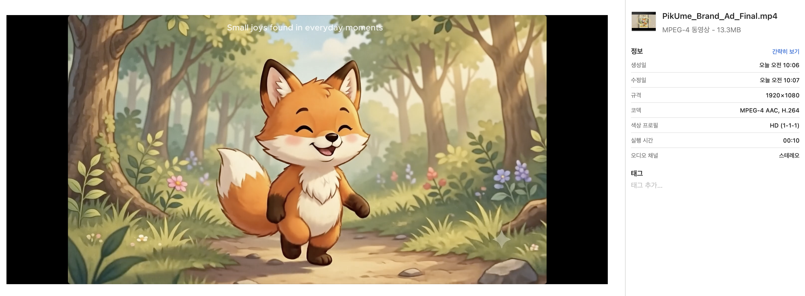

# PikUme 브랜드 광고 스토리보드 및 제작 기획서

## 1. 브랜드 아이덴티티 & 캠페인 정의

| 항목 | 내용 |
| --- | --- |
| **브랜드명** | PikUme (피쿠미) |
| **서비스 정의** | 일기와 텍스트 기록을 바탕으로 AI가 소중한 순간을 한 장의 감성적인 추억 이미지로 그려주는 AI 다이어리 서비스 |
| **주요 타겟** | 2030 세대, 일상을 소중히 기록하고 싶어 하는 사람, 힐링 및 따뜻한 감성 일러스트를 좋아하는 사용자 |
| **톤앤매너** | 따뜻함, 동화책 수채화 감성, 포근함, 파스텔 톤, 시네마틱 16:9 |
| **차별점 (USP)** | 단순 텍스트 기록을 넘어 그날의 분위기와 감정을 AI 추억 시각 자료로 재해석하여 간직하게 함 |
| **광고 목적** | 신규 브랜드 인지도 제고 및 '일기 작성 → AI 추억 생성' 핵심 서비스 경험(UX) 직관적 전달 |
| **핵심 메시지** | **"기억은 흐려져도, 그날의 감정은 다시 만날 수 있습니다."** |

---

## 2. 씬별 상세 스토리보드 (총 10초)

### Scene 1 - 행복했던 하루 (Intro)

| 항목 | 내용 |
| --- | --- |
| **Scene 번호** | Scene 1 |
| **Scene 길이** | 3초 |
| **목표 메시지** | 평범한 하루 속 작은 행복도 오래 기억하고 싶은 소중한 순간이 될 수 있음을 전달한다. |
| **화면 구성** | 따뜻한 아침 햇살이 나뭇잎 사이로 비치는 숲속 오솔길. PikUme 메인 여우 캐릭터(`assets/scene01/scene01_intro.webp` 스타일 고정)가 숲길을 걷다가 작은 보라색 들꽃을 발견한다. 꽃을 두 손으로 조심스럽게 들어 올리며 행복하게 미소 짓는다. 따뜻한 색감의 동화책 스타일, 16:9 시네마틱 구도. [텍스트 유무: 없음] |
| **화면 카피 / 내레이션** | (화면 카피) 마주치는 일상 속 작은 행복들. (Eng) Small joys found in everyday moments. |
| **사용 도구 & 목적** | - **이미지 생성**: GPT Image (기준 캐릭터 레퍼런스를 바탕으로 일관성 있는 키 비주얼 생성) - **비디오 변환**: Google Flow (정지 이미지를 부드러운 카메라 패닝 및 여우 캐릭터의 미소 모션으로 변환. 토큰 부족 시 Kling AI 대체 활용) - **오디오**: Google Flow 내장 오디오 (따뜻하고 잔잔한 어쿠스틱 피아노 멜로디 BGM 생성. 부재 시 대안으로 Suno AI 활용) |
| **입력 프롬프트 원문** | **[영문]** `[Reference Image: assets/scene01/scene01_intro.webp]` Maintain character consistency: Official main fox character of PikUme brand. Same face, same small body, same fluffy ears and tail, same watercolor fairy-tale art style, warm pastel colors. A cute fox walking on a sunlit forest trail in the morning, discovering a small purple wildflower. The fox delicately holds the flower with both hands and smiles with a blissful expression. Warm watercolor texture, soft lighting, fairy-tale book illustration style, 16:9 aspect ratio, cinematic composition.  **[한국어]** `[레퍼런스 이미지: assets/scene01/scene01_intro.webp]` 캐릭터 일관성 유지: PikUme 브랜드의 공식 메인 여우 캐릭터. 동일한 얼굴, 작고 둥근 체형, 복슬복슬한 귀와 꼬리, 동일한 수채화 동화책 스타일과 따뜻한 파스텔 색감을 유지할 것. 귀여운 여우가 아침 햇살이 비치는 숲속 오솔길을 걷다가 작은 보라색 들꽃을 발견한다. 여우는 두 손으로 꽃을 조심스럽게 들어 올리며 더없이 행복한 표정으로 미소 짓고 있다. 따뜻한 수채화 질감, 부드러운 조명, 동화책 일러스트 스타일, 16:9 비율, 시네마틱 구도. |
| **출력 결과 요약** | 여우 캐릭터가 숲속에서 작은 행복을 발견하는 순간을 포근한 동화책 감성으로 표현한 광고 도입 영상 |
| **생성 결과 파일명** | `assets/scene01/scene01_intro.webp`, `assets/scene01/scene01_intro.mp4` (음성 데이터 비디오 내장) |

---

### Scene 2 - PikUme로 기록하다 (Core UX)

| 항목 | 내용 |
| --- | --- |
| **Scene 번호** | Scene 2 |
| **Scene 길이** | 4초 |
| **목표 메시지** | PikUme에서 일기를 작성하고 AI 사진을 생성하는 과정을 자연스럽게 보여주어 서비스의 핵심 기능을 전달한다. |
| **화면 구성** | 모바일 앱 UI 내에서 4단계 플로우가 연속적으로 진행된다. 1) 일기 입력: 따뜻한 크림색 톤의 일기 입력 화면. 2) 버튼 클릭: 하단의 'AI 추억 생성' 버튼을 터치함. 3) 이미지 생성 중: AI가 생성한 여우 일러스트(Scene 1 이미지)가 화면에 크게 나타남. 4) 추억 완성: 생성된 이미지와 일기 텍스트가 함께 배치된 추억 카드 UI로 최종 완성됨. [텍스트 유무: 있음 (일기 텍스트 및 UI 글씨)] |
| **화면 카피 / 내레이션** | (화면 카피) 일기로 남기면, AI가 추억으로 그려드립니다. (Eng) Write your diary, and AI will paint it as a memory. |
| **사용 도구 & 목적** | - **이미지/UI 생성**: GPT Image (각 단계별 PikUme 앱 UI 화면 생성) - **통합 편집 & 모션**: CapCut (한글 텍스트 합성 및 화면 전환 편집) - **비디오 변환**: Google Flow (UI 화면 간 자연스러운 전환 모션 연출. 토큰 부족 시 Kling AI 대체 활용) - **오디오**: Google Flow 내장 음성 및 오디오 (비디오 내장 음성 및 사운드 효과 생성 기능 활용. 부재 시 대안으로 Suno AI 활용) |
| **입력 프롬프트 원문** | **[영문]** `[Reference Image: PikUme UI & assets/scene01/scene01_intro.webp]` A clean 4-step app UX demonstration in a warm cream-toned PikUme mobile app UI: 1) Diary Input: A clean diary input screen with a text area. 2) Button Click: A finger taps the 'Generate AI Memory' button at the bottom. 3) Image Generation: The AI-generated illustration of the fox holding the purple wildflower appears on screen, displayed large. (Maintain strict character consistency with assets/scene01/scene01_intro.webp: Same watercolor fairy-tale style fox). 4) Memory Complete: The generated image and a blank diary text area are neatly arranged together as a completed memory card UI. Clean, realistic app demo style, 16:9 cinematic horizontal layout.  **[한국어]** `[레퍼런스 이미지: PikUme 앱 UI & assets/scene01/scene01_intro.webp]` 따뜻한 크림색 톤의 PikUme 모바일 앱 UI에서 깔끔한 4단계 앱 UX 시연이 진행된다. 1) 일기 입력: 텍스트 영역이 있는 깔끔한 일기 입력 화면. 2) 버튼 클릭: 하단의 'AI 추억 생성' 버튼을 터치한다. 3) 이미지 생성: AI가 생성한 보라색 들꽃을 든 여우 일러스트가 화면에 크게 나타난다. (캐릭터 일관성 엄격 유지: assets/scene01/scene01_intro.webp와 동일한 수채화 동화책 스타일의 여우 캐릭터를 그대로 표현할 것). 4) 추억 완성: 생성된 이미지와 빈 일기 텍스트 영역이 추억 카드 UI로 깔끔하게 배치된다. 깔끔하고 사실적인 앱 데모 스타일, 16:9 시네마틱 가로 레이아웃. |
| **출력 결과 요약** | 일기 작성부터 AI 추억 생성까지의 직관적인 사용자 경험(UX) 흐름을 표현한 메인 기능 연출 영상 |
| **생성 결과 파일명** | `assets/scene02/scene02_ui.png`, `assets/scene02/scene02_pikume.mp4` (음성 데이터 비디오 내장) |

---

### Scene 3 - 기억은 추억이 되다 (Brand Ending)

| 항목 | 내용 |
| --- | --- |
| **Scene 번호** | Scene 3 |
| **Scene 길이** | 3초 |
| **목표 메시지** | PikUme는 하루를 기록하는 것을 넘어 감정을 오래 간직할 수 있는 추억으로 만들어주는 서비스임을 전달한다. |
| **화면 구성** | Scene 2의 추억 카드가 부드러운 블러와 함께 Warm Cream 톤의 미니멀 배경으로 패이드 아웃된다. 화면 중앙에 PikUme 심볼 로고와 심플한 텍스트 로고가 피어오르듯 나타난다. 로고 하단에 핵심 브랜드 슬로건과 다운로드 CTA 문구가 떠오르며 잔잔하게 마무리된다. [텍스트 유무: 있음 (브랜드 로고 및 광고 카피 자막)] |
| **화면 카피 / 내레이션** | (화면 카피 & 내레이션) 기억은 흐려져도, 그날의 감정은 다시 만날 수 있습니다. **PikUme** |
| **사용 도구 & 목적** | - **이미지 생성**: GPT Image (미니멀 브랜드 엔딩 텍스처 배경 생성) - **통합 편집 & 모션**: CapCut / Google Flow (로고 페이드인, 슬로건 텍스트 타이밍 및 모션 가공) - **오디오**: Google Flow 내장 오디오 및 음성 (내장 BGM의 자연스러운 페이드아웃 및 내장 음성을 활용한 여운 있는 브랜드 성우 내레이션. 부재 시 대안으로 Suno AI 활용) |
| **입력 프롬프트 원문** | **[영문]** Soft warm cream-colored textured background, subtle ambient golden sunlight particles gently moving. Minimalist, elegant, clean aesthetic for a brand ad outro video background. Ample negative space in the center for logo overlay. 16:9 aspect ratio, 4k resolution, smooth motion.  **[한국어]** 부드럽고 따뜻한 크림색 질감의 배경, 은은하고 따스한 금빛 햇살 파티클이 부드럽게 움직인다. 브랜드 광고 아웃트로 영상 배경을 위한 미니멀하고 우아하며 깔끔한 감성. 로고가 들어갈 수 있도록 중앙에 넉넉한 여백을 둘 것. 16:9 비율, 4K 해상도, 부드러운 모션. |
| **출력 결과 요약** | 로고 및 핵심 브랜드 슬로건을 각인시키는 여운 있는 미니멀 브랜드 엔딩 영상 |
| **생성 결과 파일명** | `assets/scene03/logo.png` (브랜드 로고) `assets/scene03/scene03_brand.mp4`|

---

## 3. 프롬프트 개선 로그 (수정 전/후 비교)

### Scene 1 프롬프트 개선 로그

- **의도**: PikUme 브랜드 여우 캐릭터(`assets/scene01/scene01_intro.webp`)의 모양과 그림체를 그대로 유지하면서, 숲속에서 들꽃을 발견하고 행복해하는 컷을 생성하고자 함.
- **수정 전 프롬프트**:
  > **[영문]** `A cute orange fox standing in a forest holding a small purple flower, watercolor style, warm sunlight.`
  > **[한국어]** `작은 보라색 꽃을 들고 숲에 서 있는 귀여운 주황색 여우, 수채화 스타일, 따뜻한 햇살.`
- **문제점**:
  - 단순 묘사만으로는 브랜드 캐릭터(`assets/scene01/scene01_intro.webp`) 특유의 얼굴 형태, 큰 귀, 둥근 체형, 특정 동화책 질감이 유지되지 않고 무작위 리얼한 여우나 일반 3D 여우로 생성됨.
- **수정 후 프롬프트**:
  > **[영문]** `[Reference Image: assets/scene01/scene01_intro.webp]` `Maintain strict character consistency: Official main fox character of PikUme brand. Same facial features, same fluffy ears and tail, same body proportion, same pastel watercolor fairy-tale book art style.` `A cute fox walking on a sunlit forest trail in the morning, discovering a small purple wildflower. The fox delicately holds the flower with both hands and smiles with a blissful expression.` `Warm watercolor texture, soft ambient light, 16:9 cinematic composition.`
  >  **[한국어]** `[레퍼런스 이미지: assets/scene01/scene01_intro.webp]` `엄격한 캐릭터 일관성 유지: PikUme 브랜드의 공식 메인 여우 캐릭터. 동일한 이목구비, 복슬복슬한 귀와 꼬리, 동일한 체형 비율, 동일한 파스텔 톤 수채화 동화책 일러스트 스타일을 유지할 것.` `귀여운 여우가 아침 햇살이 비치는 숲속 오솔길을 걷다가 작은 보라색 들꽃을 발견한다. 여우는 두 손으로 꽃을 조심스럽게 들어 올리며 더없이 행복한 표정으로 미소 짓고 있다.` `따뜻한 수채화 질감, 부드러운 주변 조명, 16:9 시네마틱 구도.`
- **결과 변화**:
  - 캐릭터 외형 및 그림체 일관성(Character Consistency)이 비약적으로 향상되어, 브랜드 고유 마스코트 캐릭터의 연속성이 유지됨.

---

## 4. 사용 AI 도구 및 대기열/플랜 제한 대응 전략

### 4.1 파이프라인 도구 선정 이유

1. **시각 (이미지/UI)**: `GPT Image`
   - **이유**: Gemini가 단일 캐릭터를 고퀄리티로 표현하는 데는 탁월하지만, GPT가 프롬프트 요구사항을 훨씬 명확하게 수행하고 여러 씬에서 캐릭터 일관성을 완벽히 유지하는 데 유리하므로 최종 이미지 생성 베이스로 GPT를 선정함.
2. **시각 (비디오 생성/변환)**: `Google Flow` (토큰 부족 시 `Kling AI`로 대체)
   - **이유**: 정지 이미지를 자연스러운 카메라 줌/패닝 및 수채화 느낌을 훼손하지 않는 모션 비디오로 변환하는 데 최적화됨. (크레딧/토큰 소진 시 Kling AI를 백업으로 사용)
3. **청각 (오디오/BGM/TTS)**: `Google Flow 내장 오디오 및 음성`
   - **이유**: 광고 전체의 BGM 및 성우 목소리를 별도의 외부 오디오 생성 도구 사용 없이 Google Flow 내의 자체 내장 오디오/음성 결합 생성 기능을 이용하여 제작함. 비디오 생성 시 오디오가 일체형으로 출력되므로 통합 편집 시 싱크 맞추기가 용이함. 해당 내장 오디오/음성 기능 사용이 불가능하거나 부재 시에는 Suno AI(BGM용) 및 기타 TTS 엔진을 백업 대안으로 계획함.
4. **통합 편집**: `CapCut`
   - **이유**: 컷 연결, 텍스트 슬로건 모션 애니메이션, 오디오 페이드 인/아웃 및 최대 권장 인코딩 스펙(1080p, H.264, 30fps)으로 내보내기에 적합함.

### 4.2 도구 접근성 및 대체 도구 (대기열/크레딧 대비)

| 구분 | 주 사용 도구 | 대체 도구 (Alternative Tools) |
| --- | --- | --- |
| **이미지 생성** | GPT Image | Gemini |
| **비디오 변환** | Google Flow | Kling AI |
| **오디오/BGM** | Google Flow 내장 오디오 | Suno AI |
| **음성/TTS** | Google Flow 내장 음성 | Suno AI, Naver Clova Voice |

---

## 5. 최종 완성 영상 스펙 정의

- **최종 파일명**: `assets/PikUme_Brand_Ad_Final.mp4`
- **전체 영상 길이**: 10초 (Scene 1: 3s + Scene 2: 4s + Scene 3: 3s)
- **해상도**: 1920x1080 (16:9 가로 시네마틱)
- **프레임레이트**: 30 fps
- **비디오 코덱**: H.264
- **오디오 코덱**: AAC (Stereo)

### 최종 영상 메타데이터 검증

### 최종 완성 광고 영상
<video src="assets/PikUme_Brand_Ad_Final.mp4" controls width="100%"></video>