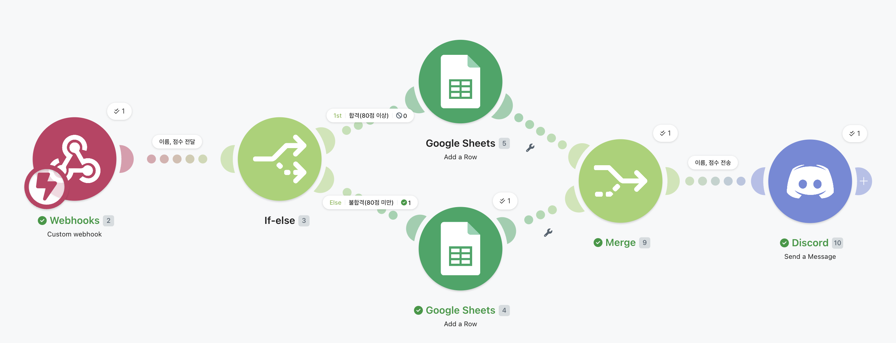
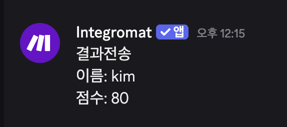
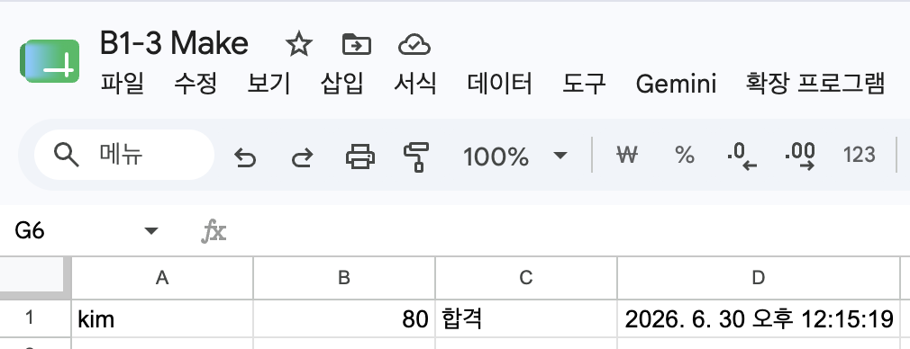
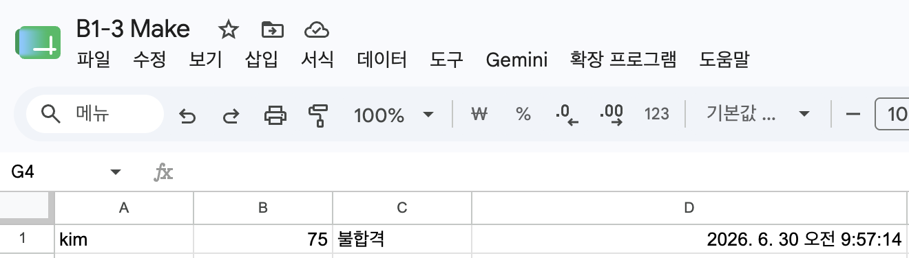
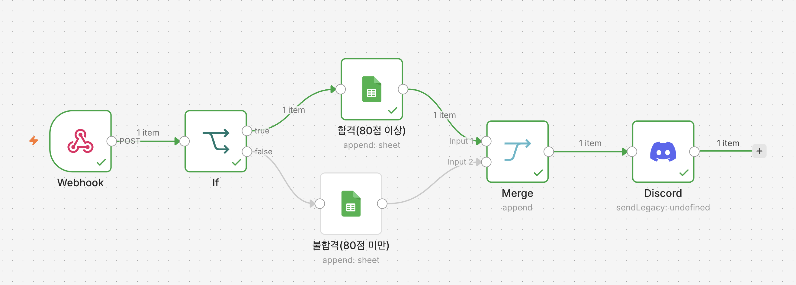
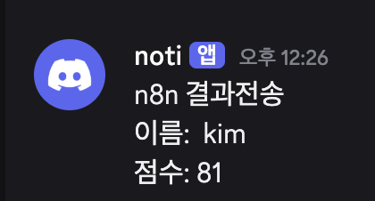
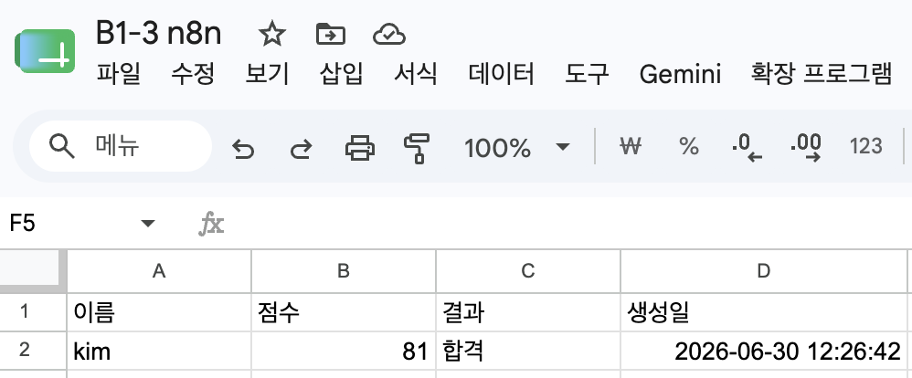
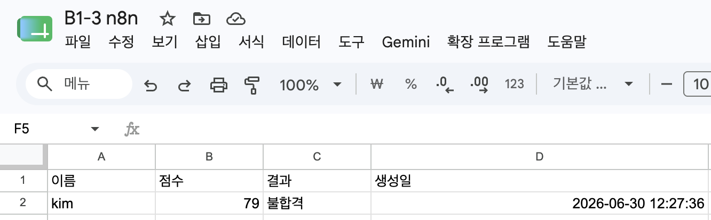

# 프로젝트 1. 자동화 도구 비교 분석 보고서

## 1. 사용한 도구

| 도구   | 버전 및 환경            |
| ---- | ------------------ |
| Make | Cloud Free Plan    |
| n8n  | Local(Self-hosted) |

---

## 2. 구현 과정 요약

두 도구 모두 동일한 자동화 워크플로우를 구현하였다.

```text
Webhook
    │
    ▼
IF (score >= 80)
   ├───────────────┐
   │               │
 True            False
   │               │
   ▼               ▼
Google Sheets   Google Sheets
   │               │
   └──────┬────────┘
          ▼
        Merge
          │
          ▼
       Discord
```

구현 순서는 다음과 같다.

1. Webhook을 통해 사용자 정보를 수신한다.
2. IF 노드에서 score >= 80 조건으로 합격(True)과 불합격(False)을 분기한다.
3. 각 분기에서 Google Sheets에 결과를 저장한다.
4. Merge 노드를 사용하여 두 분기의 실행 흐름을 하나로 합친다.
5. Merge 이후 Discord로 최종 결과 메시지를 전송한다.

---

## 3. 비교 분석

| 비교 항목               | Make                         | n8n                                                    |
| ------------------- | ---------------------------- | ------------------------------------------------------ |
| 비용                  | 무료 플랜 제공(월 1,000 Operations) | 로컬(Self-hosted)는 무료, Cloud는 유료 플랜 존재                   |
| UI/UX               | 시각적인 노드 기반으로 직관적             | 개발자 친화적인 UI로 설정 항목이 많음                                 |
| 설정 난이도              | 초기 설정이 매우 쉬움                 | OAuth, Credential 등 초기 설정이 비교적 복잡함                     |
| Google Sheets 연동    | Google 계정 연결만으로 대부분 자동 설정    | Google Cloud OAuth 설정 및 API 활성화가 필요함                   |
| Google Sheets 컬럼 매핑 | 시트 헤더를 자동으로 읽어 컬럼 생성         | Webhook 데이터가 없으면 컬럼을 자동 생성하지 못하고 전체 JSON을 매핑하는 문제가 발생함 |
| 조건 분기               | IF 또는 Router + Filter 지원     | IF 노드(True/False) 제공                                   |
| Discord 연동          | Webhook URL만으로 간단하게 가능       | Discord 노드 또는 HTTP Request 설정 필요                       |
| 실행 로그               | Scenario History에서 단계별 확인 가능 | Execution 화면에서 입력/출력 데이터를 상세 확인 가능                     |
| 확장성                 | 일반 업무 자동화에 적합                | JavaScript, Code Node, AI 연동 등 개발 친화적인 확장성 제공          |

---

## 4. Google Sheets 연동 시 차이점

이번 구현 과정에서 가장 큰 차이는 Google Sheets 매핑 방식이었다.

### Make

Google Sheets의 첫 번째 행(Header)을 자동으로 읽어 컬럼을 생성한다.

예를 들어 시트가 아래와 같이 구성되어 있으면

| name | score | result | createdAt |
| ---- | ----: | ------ | --------- |

자동으로

* name
* score
* result
* createdAt

입력 항목이 생성되며, Webhook 테스트를 한 번 수행하면 해당 값을 바로 매핑할 수 있었다.

설정 과정이 단순하여 별도의 데이터 가공 없이 사용할 수 있었다.

---

### n8n

n8n은 Webhook 입력 데이터(Input Item)를 기준으로 데이터를 처리한다.

Webhook을 실행하지 않은 상태에서는 입력 데이터 구조를 알 수 없기 때문에 `name`, `score`와 같은 개별 필드를 자동으로 인식하지 못했다.

또한 Google Sheets의 Auto Mapping 기능을 사용할 경우 Webhook의 Body뿐 아니라 Headers, Query, Params 등 전체 JSON 구조가 하나의 값으로 저장되는 문제가 발생하였다.

이를 해결하기 위해서는

* Webhook 테스트를 먼저 수행하거나
* Expression(`{{$json.body.name}}`)을 직접 작성하거나
* Edit Fields(Set) 노드로 데이터를 가공하는 과정이 필요하였다.

Make보다 설정 난이도가 높은 부분이었다.

---

## 5. 각 도구의 장단점

### Make

#### 장점

* 직관적인 UI
* Google 서비스 연동이 매우 간단
* 컬럼 자동 인식 기능 제공
* 비개발자도 쉽게 사용할 수 있음
* 학습 비용이 낮음

#### 단점

* 무료 플랜의 Operation 제한
* 복잡한 데이터 처리에는 한계
* JavaScript 활용 범위가 제한적

---

### n8n

#### 장점

* Self-hosted 환경에서 무료 사용 가능
* JavaScript(Code Node) 사용 가능
* HTTP API 연동이 자유로움
* AI 및 다양한 외부 서비스 확장성이 뛰어남
* 복잡한 Workflow 구현에 적합

#### 단점

* 초기 OAuth 설정이 복잡함
* Google Cloud 설정이 필요함
* Google Sheets 매핑 과정이 Make보다 복잡함
* 개발 지식이 어느 정도 요구됨

---

## 6. 어떤 상황에서 적합한가

### Make가 적합한 경우

* Google Workspace 중심의 업무 자동화
* 간단한 반복 업무 자동화
* 비개발자가 사용하는 환경
* 빠르게 Workflow를 구축해야 하는 경우

---

### n8n이 적합한 경우

* 다양한 API를 연동하는 프로젝트
* AI 서비스(OpenAI 등)와 함께 사용하는 Workflow
* JavaScript를 활용한 데이터 가공이 필요한 경우
* Self-hosted 환경에서 비용 없이 운영하려는 경우
* 복잡한 분기 및 데이터 처리가 필요한 경우

---

## 7. 최종 의견

두 도구 모두 동일한 자동화 워크플로우를 구현할 수 있었지만 사용 목적에는 차이가 있었다.

Make는 Google Sheets와 Discord 등 외부 서비스를 빠르게 연결할 수 있으며, UI가 직관적이어서 반복 업무 자동화를 처음 접하는 사용자에게 적합했다. 특히 Google Sheets의 컬럼을 자동으로 인식하여 별도의 설정 없이 매핑할 수 있었던 점이 큰 장점이었다.

반면 n8n은 초기 OAuth 설정과 Google Cloud API 활성화, Google Sheets 컬럼 매핑 등 준비 과정이 다소 복잡했다. 특히 Webhook 입력 데이터가 없는 상태에서는 Google Sheets 컬럼을 자동으로 인식하지 못해 Expression을 직접 작성하거나 데이터를 가공해야 하는 점이 있었다. 그러나 JavaScript 사용, 다양한 API 연동, Self-hosted 운영이 가능하다는 점에서 확장성과 유연성은 Make보다 우수했다.

단순한 반복 업무 자동화는 Make가 적합하며, 다양한 시스템과의 연동이나 복잡한 데이터 처리, AI 기반 자동화를 고려한다면 n8n이 더 적합한 도구라고 판단하였다.

---

## 8. 실행 결과 및 화면

### 8.1 Make 실행 화면

#### 전체 워크플로우
Webhook 수신 후 분기(Router)를 거쳐 Google Sheets에 각각 합격/불합격을 기록하고, 최종적으로 Discord 알림을 보내는 전체 워크플로우입니다.



#### Webhook 및 데이터 설정
수신하는 Webhook 데이터 구조를 파악하고, 각 노드에서 컬럼 및 필드 설정을 진행하는 화면입니다.



#### 실행 결과 (Discord 알림 및 Google Sheets 기록)
* **합격 (Score >= 80)**
  
* **불합격 (Score < 80)**
  

---

### 8.2 n8n 실행 화면

#### 전체 워크플로우
Webhook 노드로 데이터를 입력받아 IF 노드로 합격 여부를 분기하고, Google Sheets 기록 후 Merge 노드로 합쳐 Discord 알림을 전송하는 전체 워크플로우입니다.



#### Discord Bot 연동
Discord 노드를 통해 웹훅/봇을 활용한 메시지 전송을 구성하고 확인하는 화면입니다.



#### 실행 결과 (Discord 알림 및 Google Sheets 기록)
* **합격 (Score >= 80)**
  
* **불합격 (Score < 80)**
  
