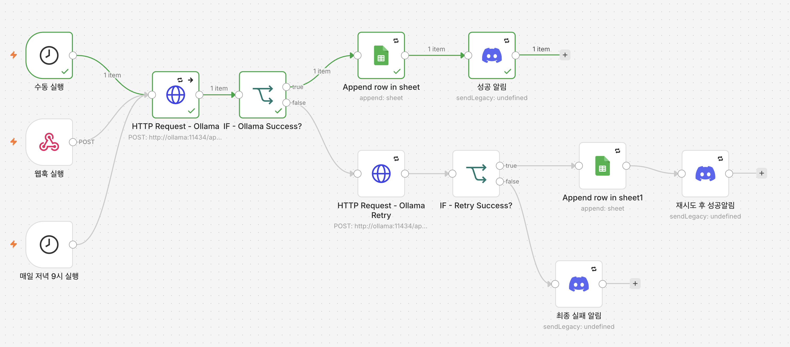
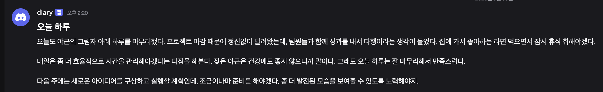

# 프로젝트 2. 자유 주제 자동화 설계 및 구현

## 1. 자동화할 반복 업무 정의

### 프로젝트 주제

**AI 3줄 일기 자동 생성 및 Discord 공유**

### 반복 업무

일기 어플의 활성화를 위해 매일 AI가 3줄 일기를 생성하고 Discord 채널에 공유하는 작업을 자동화하였다.

AI 응답이 실패하는 경우에는 한 번 재시도하며, 재시도 이후에도 실패하면 Discord를 통해 오류를 알리도록 구현하였다.

---

## 2. 자동화 도구 선정 및 선정 이유

### 선정 도구

**n8n (Local Self-hosted)**

### 선정 이유

비용적인 측면과 보안성, workflow 테스트 후 사용이 가능하여 선택하였다.
로컬 환경에서 무료 모델인 Ollama(gemma3:4b)을 사용할 수 있으므로 모델 비용을 아낄 수 있다.
다른 서비스의 인증정보(토큰 등)을 유출하지 않으므로 계정을 보호할 수 있다.
llm을 이용하여 workflow를 테스트 후 사용이 가능함으로 n8n을 선택하였다.

---

## 3. 워크플로우 설계

### 워크플로우

```text
Schedule Trigger
        │
        ▼
Set (페르소나, 시나리오)
        │
        ▼
HTTP Request
(Ollama gemma3:1b)
        │
        ▼
IF (응답 성공 여부)
   ├──────────────────┐
   │                  │
성공                  실패
   │                  │
Discord             Wait
(일기 전송)             │
                      ▼
                 HTTP Request
                   (재시도)
                     │
                     ▼
                    IF
              ├────────────┐
              │            │
            성공         실패
              │            │
              ▼            ▼
            Discord      Discord
            (일기 전송)   (실패 알림)
```

### 워크플로우 설명

1. Schedule Trigger가 지정된 시간에 실행된다.
2. Set 노드에서 페르소나와 시나리오를 생성한다.
3. HTTP Request를 통해 Ollama(gemma3:1b)에 일기 생성을 요청한다.
4. IF 노드에서 응답 성공 여부를 확인한다.
5. 성공하면 구글 시트에 저장 후 Discord에 생성된 일기를 전송한다.
6. 실패하면 일정 시간 대기 후 한 번 더 요청한다.
7. 재시도 이후에도 실패하면 Discord에 오류 메시지를 전송한다.

---

## 4. 구현 화면 캡처

* n8n 전체 워크플로우 화면



---

## 5. 실행 결과 화면 캡처

### 성공 결과

* Discord에 생성된 3줄 일기 전송 화면



### 실패 결과

* Discord 오류 알림 화면


