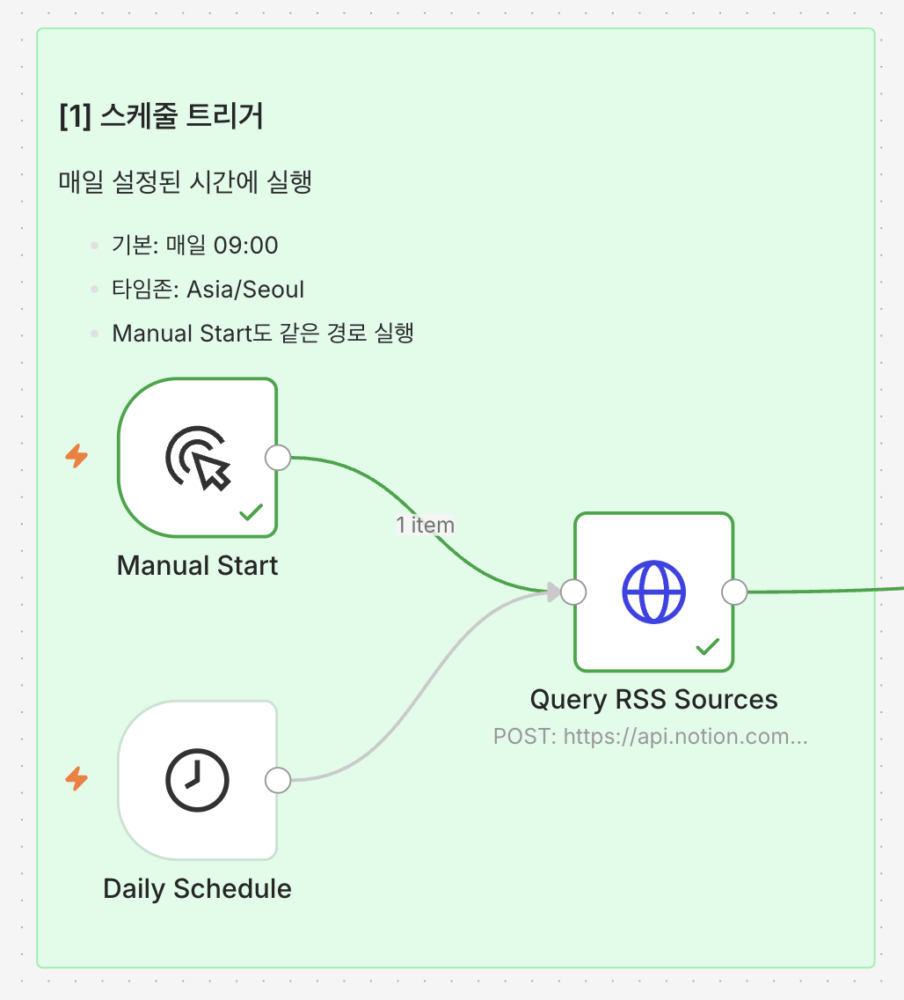
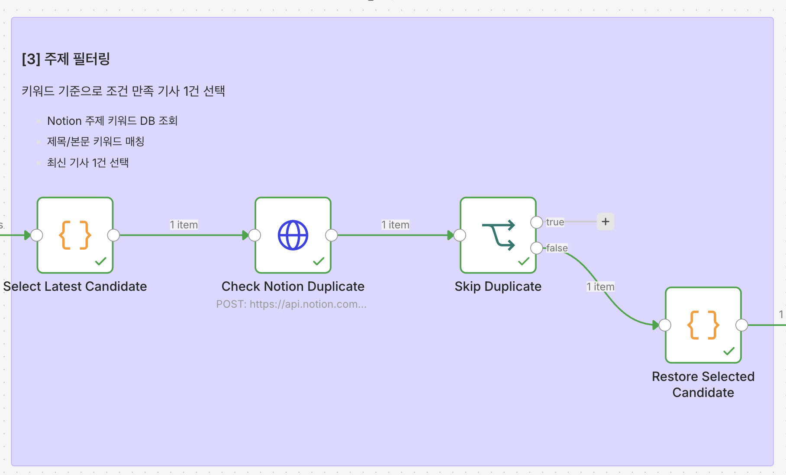
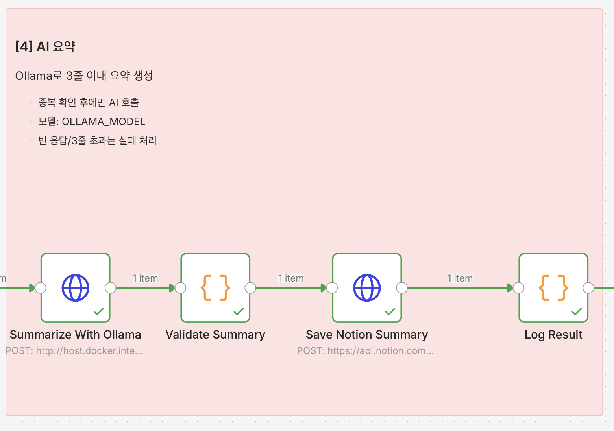
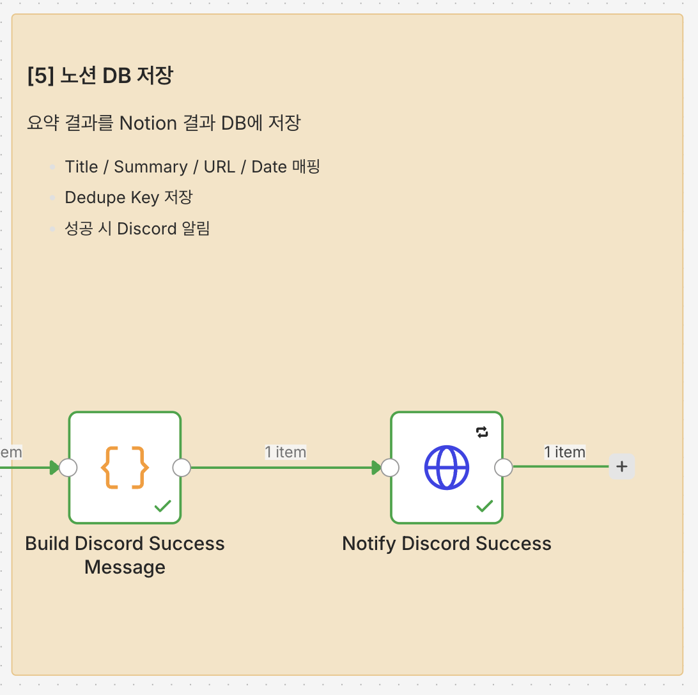

# n8n 워크플로우 설계

## 전체 흐름

메인 workflow 캔버스는 과제 예시 흐름에 맞춰 Sticky Note로 아래 6개 섹션을 시각적으로 구분한다.

```text
[1] 스케줄 트리거
    - Manual Start / Daily Schedule
        ↓
[2] RSS 수집
    - RSS 설정 조회, 피드 읽기, 기사 정규화
        ↓
[3] 주제 필터링
    - 키워드 조회, 매칭, 최신 1건 선택
        ↓
[4] AI 요약
    - 중복 확인 후 Ollama 3줄 요약
        ↓
[5] 노션 DB 저장
    - Title/Summary/URL/Date/Dedupe Key 매핑 저장
        ↓
[6] 예외 처리
    - 스킵 로그, Discord 성공 알림, Error Workflow 장애 알림
```

## 워크플로우 미리보기

아래 이미지는 n8n 캔버스를 Sticky Note 기준으로 나눈 1번부터 6번까지의 구간이다.

### 1. 스케줄 트리거



### 2. RSS 수집


### 3. 주제 필터링



### 4. AI 요약



### 5. 노션 DB 저장 및 Discord 알림




### 6. 예외 처리


```text
[0] Manual Start
    운영 경로를 수동으로 테스트
        |
[1] Schedule Trigger
    env: NEWS_CRON_EXPRESSION, NEWS_TIMEZONE
        |
[2] Query Notion RSS Sources DB
    Enabled = true 인 RSS 목록 조회
        |
        +-- 0건이면: log NO_RSS_SOURCES -> End
        |
[3] Query Notion Topic Keywords DB
    Enabled = true 인 키워드 조회
        |
        +-- 0건이면: log TOPIC_CONFIG_EMPTY -> End
        |
[4] Build RSS Source Items
    Notion RSS 설정 DB 결과를 feedUrl 아이템으로 변환
        |
[5] Read RSS Items
    Notion RSS 설정 DB에서 읽은 feedUrl로 각 피드 항목 수집
        |
        +-- RSS 항목 0건이면: log NO_RSS_ITEMS -> End
        |
[6] Normalize News Items
    title, link, guid, publishedAt, content, source 추출
        |
[7] Topic Filter
    제목/본문/category에서 활성 키워드 매칭
        |
        +-- 매칭 0건이면: log NO_TOPIC_MATCH -> End
        |
[8] Select One Candidate
    발행일 최신순 1건 선택
        |
[9] Query Notion News DB
    dedupeKey 또는 originalUrl 기준 중복 조회
        |
        +-- 이미 존재하면: log DUPLICATE_SKIPPED -> End
        |
[10] HTTP Request to Ollama
    3줄 이내 한국어 요약 생성
        |
[11] Validate Summary
    빈 응답, 3줄 초과, JSON 오류 검사
        |
[12] Create Notion News Page
    제목, 요약, 링크, 발행일시, dedupeKey 저장
        |
[13] Log Success
    SAVED_TO_NOTION execution log 기록
```

## 노드별 역할

Notion과 Discord 연동은 n8n native credential 노드보다 HTTP Request 또는 webhook 기반 구성을 우선한다.
이유는 `.env` 기반 secret 관리와 `npm run setup:docker` 재현성을 유지하기 위해서다.
자세한 기준은 [인증/credential 관리 전략](credential-strategy.md)에 정리한다.

### 1. Schedule Trigger

- 매일 지정 시간에 실행한다.
- 시간은 n8n 워크플로우 내부에 고정하지 않고 `NEWS_CRON_EXPRESSION` 환경변수를 사용한다.
- 타임존은 `NEWS_TIMEZONE=Asia/Seoul`을 기본값으로 둔다.
- 스케줄 변수 값을 바꾼 뒤에는 워크플로우를 다시 publish해서 Schedule Trigger가 새 값을 읽게 한다.

예시:

```text
NEWS_CRON_EXPRESSION=0 9 * * *
NEWS_TIMEZONE=Asia/Seoul
```

### 2. Manual Start

- 수동 시작은 Daily Schedule과 같은 운영 경로를 실행한다.
- 기본 RSS와 기본 주제 키워드 등록은 workflow 밖의 `npm run setup:docker`가 담당한다.
- 따라서 Manual Start와 Daily Schedule 모두 RSS 설정 DB가 0건이면 자동 재등록하지 않고 `NO_RSS_SOURCES` 로그 후 종료한다.

### 3. Query Notion RSS Sources DB

- RSS 목록은 워크플로우에 하드코딩하지 않는다.
- Notion RSS 설정 DB에서 `Enabled = true`인 행만 매 실행마다 조회한다.
- RSS URL이 실시간으로 추가/삭제되어도 다음 실행부터 자동 반영된다.
- 조회 결과가 0건이면 오류가 아니라 `NO_RSS_SOURCES` 로그를 남기고 정상 종료한다.

### 4. Query Notion Topic Keywords DB

- 주제 키워드는 워크플로우에 하드코딩하지 않는다.
- Notion 주제 설정 DB에서 `Enabled = true`인 키워드를 매 실행마다 조회한다.
- 활성 키워드가 0건이면 넓은 범위의 기사를 잘못 저장하지 않기 위해 `TOPIC_CONFIG_EMPTY` 로그를 남기고 종료한다.

### 5. Loop RSS Sources

- 활성 RSS URL을 Notion RSS 설정 DB 조회 결과에서 만든 뒤 RSS Feed Read 노드로 항목을 가져온다.
- 특정 RSS가 실패하면 해당 피드만 최대 2회 재시도한다.
- 재시도 후에도 실패한 피드는 `RSS_FETCH_FAILED`로 기록하고, 다른 피드는 계속 처리한다.
- 전체 RSS에서 수집된 항목이 0건이면 `NO_RSS_ITEMS` 로그를 남기고 종료한다.

### 6. Normalize News Items

- RSS마다 다른 필드명을 공통 구조로 정규화한다.

```json
{
  "title": "뉴스 제목",
  "originalUrl": "https://example.com/news/1",
  "guid": "rss-guid-or-null",
  "dedupeKey": "guid 우선, 없으면 originalUrl",
  "publishedAt": "2026-06-24T09:00:00+09:00",
  "content": "본문 또는 설명",
  "source": "RSS source name"
}
```

### 7. Topic Filter

- Notion 주제 설정 DB 조회 결과에서 활성 키워드를 만든다.
- 제목, 본문, RSS category를 소문자로 변환한 뒤 활성 키워드와 비교한다.
- 하나 이상의 키워드가 매칭된 기사만 후보로 남긴다.
- 후보가 없으면 `NO_TOPIC_MATCH` 로그를 남기고 종료한다.

### 8. Select One Candidate

- 과제 요구사항에 맞춰 1건만 선택한다.
- 기본 기준은 발행일시 최신순이다.
- 발행일시가 없는 경우 RSS 수집 순서를 보조 기준으로 사용한다.

### 9. Query Notion News DB

- AI 호출 전에 반드시 Notion 결과 DB를 먼저 조회한다.
- `Dedupe Key == candidate.dedupeKey` 또는 `Original URL == candidate.originalUrl` 조건으로 확인한다.
- 이미 존재하면 `DUPLICATE_SKIPPED` 로그만 남기고 종료한다.
- 이 단계가 실패하면 중복 여부를 알 수 없으므로 Ollama를 호출하지 않는다.

### 10. HTTP Request to Ollama

- 중복이 아닌 기사 1건만 Ollama로 보낸다.
- 엔드포인트는 `{{$env.OLLAMA_BASE_URL}}/api/generate`를 사용한다.
- 모델명은 `OLLAMA_MODEL` 환경변수로 관리한다.
- 최대 재시도는 `MAX_RETRY_COUNT=2`로 제한한다.

프롬프트 원칙:

```text
아래 뉴스 내용을 한국어로 3줄 이내로 요약해줘.
과장하지 말고 기사에 있는 사실만 사용해.
각 줄은 하나의 핵심 내용을 담아줘.

제목: {{title}}
본문: {{content}}
```

### 11. Validate Summary

- 응답이 비어 있으면 실패로 처리한다.
- 3줄을 초과하면 앞 3줄만 저장하지 않고 `SUMMARY_INVALID`로 실패 처리한다.
- 이유: 모델이 지시를 지키지 않은 상태를 그대로 저장하지 않기 위함이다.

### 12. Create Notion News Page

- Notion 결과 DB에 뉴스 페이지를 생성한다.
- 제목, 요약문, 원문 링크, 발행일시, 중복 키를 각각 별도 속성에 저장한다.
- 저장 실패 시 최대 2회 재시도한다.

### 13. Log Success

- 저장 성공 후 n8n execution log에 `SAVED_TO_NOTION`을 기록한다.
- Discord 성공 알림을 전송한다.
- 알림에는 기사 제목, 원문 링크, 발행일시, 사용 모델을 포함한다.
- Discord 알림 실패는 저장 성공 결과를 실패로 바꾸지 않고 로그로만 남긴다.

### 14. Notify Discord Success

- `DISCORD_WEBHOOK_URL` 환경변수로 Discord webhook에 HTTP POST를 보낸다.
- 요청 body는 `{ "content": "..." }` 형식이다.
- 알림 실패는 최대 2회 재시도하고, 그래도 실패하면 workflow 자체는 계속 성공으로 둔다.

## Error Workflow 연결

- n8n Error Trigger 워크플로우를 별도로 만든다.
- 오류 객체에서 실패 노드명, 오류 메시지, execution ID를 추출한다.
- Discord webhook으로 오류 알림을 보낸다.
- Discord 실패는 다시 오류 알림을 만들지 않고 n8n execution log에만 남긴다.
