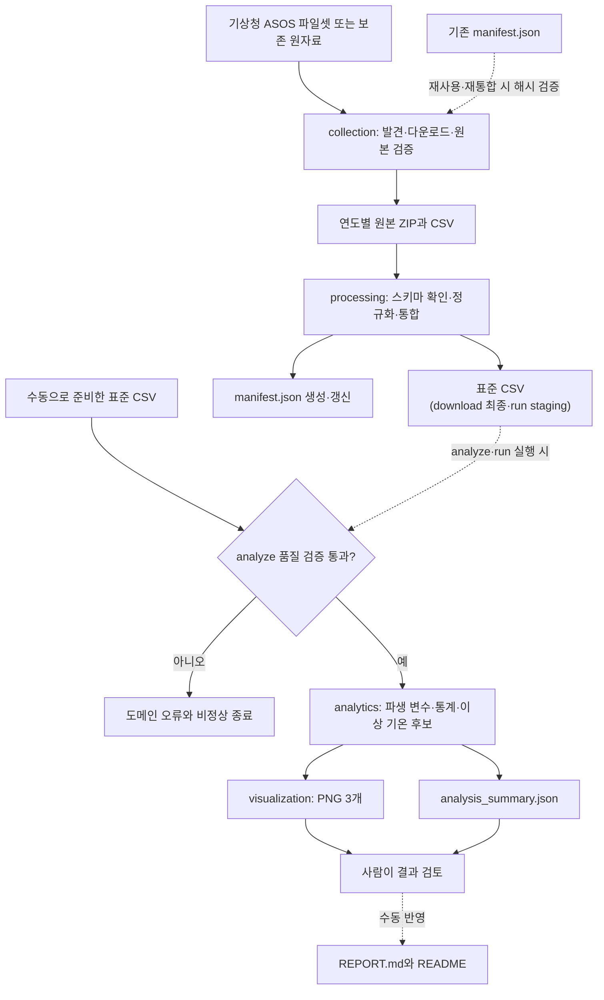

# 서울 1994~2024년 장기 기온 분석

기상청 서울 종관기상관측(ASOS) 지점 `108`의 31년 일자료를 정제해 장기 기온 추세, 월별·계절별 변화, 통계적 이상 기온 후보를 분석한 프로젝트다. 관찰 가능한 수치와 원인에 대한 가설을 분리하고, 원본 보존·해시 기록·자동 테스트로 결과를 재현할 수 있게 구성했다.

[전체 분석 리포트](REPORT.md)에서 분석 방법, 그래프 해석, 인사이트와 한계점을 확인할 수 있다.

## 분석 범위

이 프로젝트는 서울 ASOS 지점 `108`의 1994~2024년 일자료를 사용해 장기 기온 추세와 같은 달의 기온 분포를 분석한다.

같은 달의 1994~2024년 평균은 프로젝트 내부에서 비교를 위해 계산한 `분석용 기준선`이다. 기상청이 제공하는 공식 기후평년값과 같은 개념이 아니다. 공식 기후평년값의 산출·검증과 평년 편차 분석은 이 프로젝트의 범위에 포함하지 않는다. 두 개념의 차이는 [데이터 분석 개념 학습 가이드](docs/learning/guide.md#55-평년값과-분석용-기준선)에서 설명한다.

## 실제 분석 결과

| 항목 | 검증 결과 |
| --- | --- |
| 분석 기간 | 1994-01-01~2024-12-31 |
| 데이터 포인트 | 11,323일 |
| 누락 날짜 / 중복 날짜 | 0일 / 0일 |
| 평균기온 결측 | 0건 (0.0000%) |
| 최저기온 결측 | 1건 (0.0088%) |
| 최고기온 결측 | 1건 (0.0088%) |
| 강수량 공백 | 6,940건(61.29%), 0으로 대체하지 않음 |
| 연평균 선형 추세 | +0.302°C/10년, R²=0.187 |
| 초기 10년 / 최근 10년 평균 | 12.95°C / 13.62°C, 차이 +0.66°C |
| 가장 높은 연평균 | 2024년 14.88°C |
| 가장 낮은 연평균 | 2011년 12.08°C |
| 통계적 이상 기온 후보 | 고온 43일, 저온 98일 |

선형 추세는 서울 지점 `108`의 선택 기간에서 관찰된 통계적 경향이며, R²가 0.187이므로 연도만으로 연평균 변동 전체를 설명하지는 못한다.

### 1. 연평균 기온 추세

차트 유형: 다중 시계열 선 그래프(연평균 기온·5년 후행 이동평균·선형 추세)


연평균 기온, 5년 후행 이동평균과 선형 추세를 함께 표시했다. 최근 10년 평균은 초기 10년보다 0.66°C 높았고, 2024년 연평균 14.88°C가 분석기간 최고였다.

### 2. 연도·월별 평균기온 편차

차트 유형: 발산형 히트맵(연도×월 평균기온 편차)


최근 10년과 초기 10년의 차이는 3월 +1.48°C, 9월 +1.26°C, 8월 +1.23°C 순으로 컸다. 반면 12월은 -0.78°C였다. 모든 달이 같은 방향으로 변한 것은 아니다.

### 3. 통계적 이상 기온 후보

차트 유형: 시계열 선·산점도 결합 차트(z 점수 변화·고온 및 저온 후보)


각 날짜를 같은 달의 1994~2024년 평균과 모표준편차로 표준화했다. z 점수 `+2.5` 이상 고온 후보는 43일, `-2.5` 이하 저온 후보는 98일이었다. 이는 탐색 기준이며 관측 오류 삭제 기준이나 기상청의 공식 이상기후 판정이 아니다.

## 핵심 인사이트

- 장기 방향은 상승이지만 연도별 변동이 크다. 선형 추세는 +0.302°C/10년이고, 2024년은 14.88°C로 최고였지만 2011년은 12.08°C로 최저였다.
- 계절별 초기·최근 10년 차이는 여름 +1.03°C, 봄 +0.89°C, 가을 +0.83°C, 겨울 -0.09°C였다. 변화 폭은 계절과 월에 따라 달랐다.
- 가장 큰 고온 후보는 2002-01-15로 월 장기평균보다 +14.17°C, z=+3.236이었다. 가장 큰 저온 후보는 2008-06-05로 -8.03°C, z=-3.582였다.
- 평균기온과 날짜는 완전하지만 강수량 공백이 61.29%이므로, 이 데이터만으로 강수와 기온의 관계를 분석하지 않았다.

## 데이터

| 항목 | 내용 |
| --- | --- |
| 제공기관 | 기상청 국가기후데이터센터 |
| 원자료 | 종관기상관측(ASOS) 연도별 일자료 |
| 지점 | 서울 `108` |
| 현재 위치 | 서울특별시 종로구 송월길 52, 위도 37.57142·경도 126.9658 |
| 수집일 | 2026-08-21 |
| 이용조건 | 공공저작물 출처표시 제1유형 |

원자료는 [기상청 기상자료개방포털 ASOS 파일셋](https://data.kma.go.kr/data/grnd/selectAsosList.do?pgmNo=34)에서 받았다. 연도별 바깥 ZIP·안쪽 ZIP·CP949 CSV를 보존하고 `data/raw/asos/manifest.json`에 연도·지점·파일 크기·SHA-256과 중복 처리 진단을 기록했다. 실제 자료에서 제거된 동일 중복은 0건이다.

이용조건은 [공공데이터포털의 기상청 ASOS 일자료 서비스 메타데이터](https://www.data.go.kr/data/15059093/openapi.do)와 [기상자료개방포털 저작권 정책](https://data.kma.go.kr/cmmn/static/staticPage.do?page=pageCr)을 2026-08-23에 다시 확인했다. 재배포할 때는 기상청과 자료명을 구체적으로 표시하고 공공누리 표시와 이용 제한을 다시 확인해야 한다.

## 설치

Python 3.10 이상이 필요하다. 프로젝트를 editable 패키지로 설치하면 필요한 라이브러리와 `seoul-weather` 콘솔 명령이 함께 설치된다.

```bash
python3 -m venv .venv
source .venv/bin/activate
python -m pip install -e .
```

## 실행

수집 또는 보존 원자료 재통합과 분석을 한 번에 실행하는 기본 방법은 다음과 같다. 자동 수집은 과제 필수 조건이 아니라 편의를 위한 기능이며, 이미 검증된 원자료가 있으면 이를 재사용한다.

```bash
# 패키지 실행
python -m seoul_weather run

# 같은 기능의 콘솔 실행
seoul-weather run
```

보존된 원자료만 사용해 네트워크 없이 가공 데이터와 분석 결과를 다시 만들려면 다음과 같이 실행한다.

```bash
python -m seoul_weather run --rebuild-from-raw
seoul-weather run --rebuild-from-raw
```

단계를 나누어 실행할 수도 있다.

```bash
python -m seoul_weather download --rebuild-from-raw
python -m seoul_weather analyze

seoul-weather download --rebuild-from-raw
seoul-weather analyze
```

표준 CSV를 직접 준비했다면 다운로드 명령을 생략하고 [수동 데이터 입력 지침](docs/guides/manual-data-input.md)에 맞춰 배치한 뒤 `analyze`만 실행한다.

```bash
seoul-weather analyze
python -m pytest -q
```

전체 옵션은 `seoul-weather --help` 또는 `python -m seoul_weather --help`에서 확인할 수 있다.

## 데이터 흐름



`download`는 표준 CSV와 manifest를 준비한다. `analyze`는 자동 수집 결과나 수동으로 준비한 표준 CSV를 품질검사한 뒤 PNG와 요약 JSON을 생성한다. 통합 `run`은 가공 CSV와 분석 산출물을 staging에서 완성한 뒤 함께 최종 경로로 옮긴다. README와 REPORT에는 사람이 결과를 검토한 뒤 반영한다.

모듈별 책임, 개별 실행 경로와 실패 시 복구 방식은 [과제 아키텍처](docs/design/architecture.md#3-데이터-흐름)에서 확인할 수 있다.

## 프로젝트 구조

```text
M1-1/
├── data/
│   ├── raw/asos/              # 연도별 원본 3종과 manifest
│   └── processed/             # 통합 CSV와 분석 요약 JSON
├── docs/                      # 요구사항, 설계, 용어집, 검증 문서
├── images/                    # 검증된 PNG 시각화 3개
├── src/seoul_weather/
│   ├── collection/            # 원자료 발견·다운로드·manifest
│   ├── processing/            # 원자료 정규화·통합
│   ├── analytics/             # 품질검사·통계·이상 기온 후보
│   ├── visualization/         # 시각화 스타일·PNG 생성
│   ├── workflows/             # download·analyze·run 유스케이스
│   ├── cli.py                 # 패키지·콘솔 공용 CLI
│   └── __main__.py            # python -m seoul_weather 진입점
├── tests/                     # 도메인별 단위·통합·산출물 테스트
├── AGENTS.MD
├── pyproject.toml
├── REPORT.md
├── README.md
└── requirements.txt
```

## 문서

- [문서 목차](docs/README.md)
- [데이터 분석 개념 학습 가이드](docs/learning/guide.md)
- [과제 목표](docs/learning/objectives.md)
- [요구사항](docs/requirements/README.md)
- [데이터 출처와 수집 정책](docs/design/data-source.md)
- [수동 데이터 입력 지침](docs/guides/manual-data-input.md)
- [분석 설계](docs/design/analysis-design.md)
- [과제 아키텍처](docs/design/architecture.md)
- [구현 설계와 실행 계획](docs/design/implementation-plan.md)
- [검증 계획](docs/guides/verification-plan.md)
- [데이터 분석 용어집](docs/learning/glossary.md)

공식 기후평년값의 산출·비교, 미래 예측, 시계열 분해, 웹 대시보드, 서울 외 지역 비교와 머신러닝 모델은 이 프로젝트의 범위에 포함하지 않았다.
