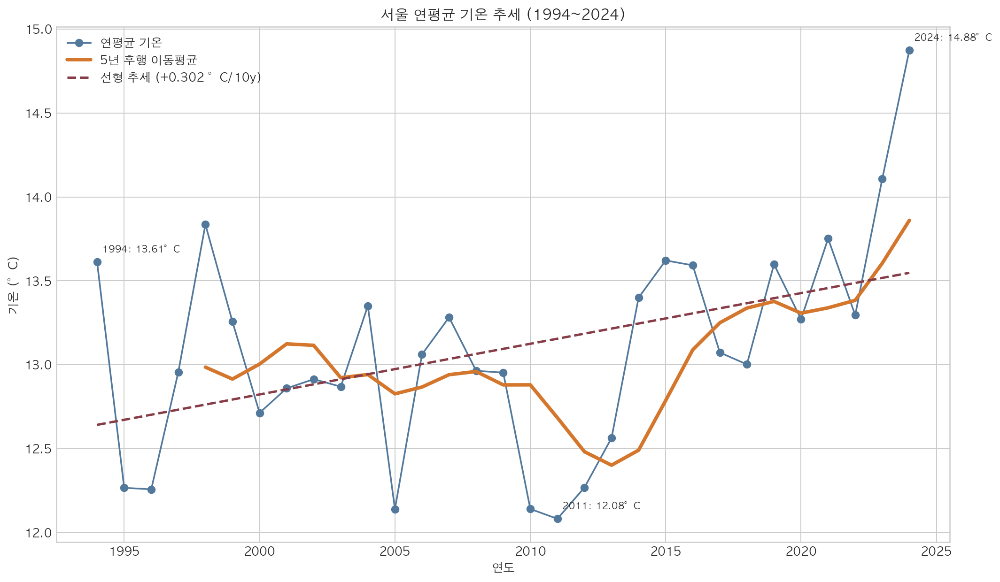
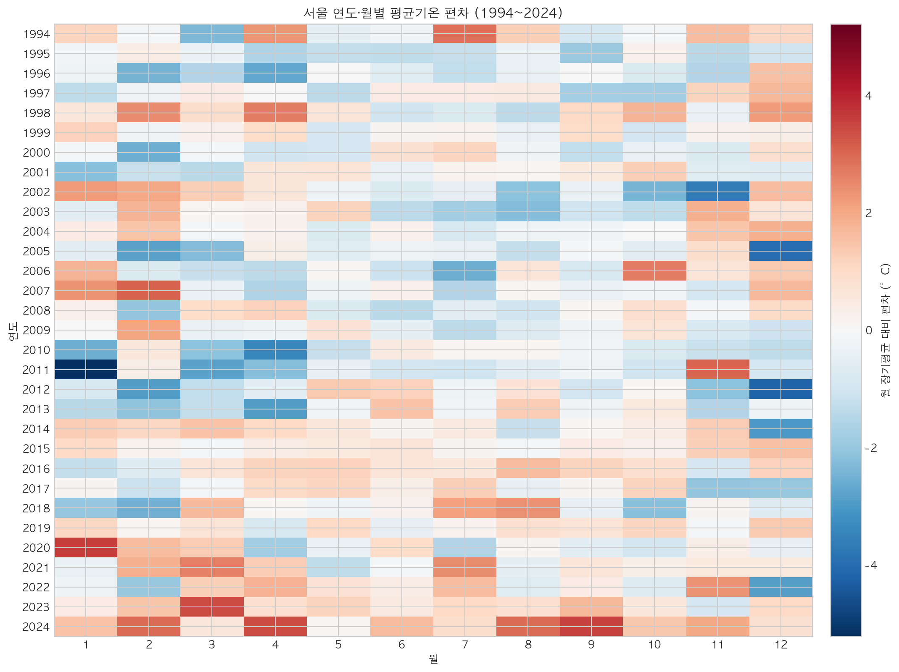
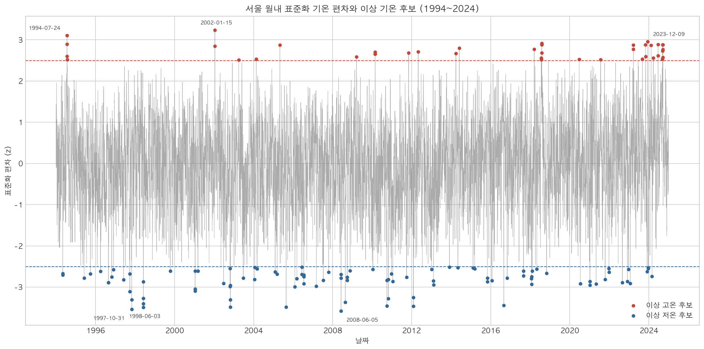

# 서울 1994~2024년 장기 기온 추세와 이상 기온 분석

## 1. 분석 주제 및 선정 이유

시간에 따라 변하는 데이터는 그래프의 모양만으로 의미를 확정할 수 없다. 서울의 장기 일별 기온을 대상으로 데이터 품질을 먼저 확인하고, 연평균 추세·월별 패턴·통계적 이상 기온 후보를 서로 다른 시간 단위에서 비교했다.

분석 대상은 서울 전체의 모든 미세기후가 아니라 기상청 종관기상관측(ASOS) 서울 지점 `108`의 1994~2024년 관측이다. 데이터에서 직접 확인한 사실과 그 사실을 설명할 수 있는 가설을 분리하는 데 초점을 뒀다.

## 2. 분석 질문

1. 1994~2024년 서울 지점 `108`의 연평균 기온은 어떤 방향과 크기로 변했는가?
2. 월별·계절별 패턴은 어떻게 나타나며, 초기 10년(1994~2003)과 최근 10년(2015~2024)은 얼마나 다른가?
3. 같은 달의 일반적인 분포에서 크게 벗어난 고온·저온 날짜는 언제인가?
4. 이 자료와 분석 방법만으로 설명할 수 있는 범위와 설명할 수 없는 범위는 무엇인가?

## 3. 데이터 설명

### 3.1 출처와 관측 지점

| 항목 | 내용 |
| --- | --- |
| 제공기관 | 기상청 국가기후데이터센터 |
| 자료 | 종관기상관측(ASOS) 연도별 일자료 |
| 지점 | 서울 `108` |
| 분석 기간 | 1994-01-01~2024-12-31 |
| 데이터 포인트 | 11,323일 |
| 수집일 | 2026-08-21 |
| 원본 형식 | 연도별 중첩 ZIP 안의 CP949 CSV |
| 이용조건 | 공공저작물 출처표시 제1유형 |

원자료는 [기상청 기상자료개방포털의 ASOS 연도별 파일셋](https://data.kma.go.kr/data/grnd/selectAsosList.do?pgmNo=34)에서 수집했다. [서울 지점 상세 정보](https://data.kma.go.kr/tmeta/stn/selectStnDetail.do?isSelectStn=Y&pgmNo=82&stdStnNo=108)에 따르면 관측개시일은 1907-10-01이고 현재 위치는 서울특별시 종로구 송월길 52, 위도 37.57142·경도 126.9658, 해발고도 85.67m다. [기상청의 서울 100년 관측소 연혁](https://www.kma.go.kr/metropolitan/html/info/business04.jsp)은 1932-11-01에 현재 송월동 위치로 이전해 현재까지 관측한다고 설명한다. 따라서 알려진 지점 이전 시점은 이번 분석기간보다 앞선다.

이용조건은 [공공데이터포털의 기상청 ASOS 일자료 서비스 메타데이터](https://www.data.go.kr/data/15059093/openapi.do)와 [기상자료개방포털 저작권 정책](https://data.kma.go.kr/cmmn/static/staticPage.do?page=pageCr)을 2026-08-23에 다시 확인했다. 재배포할 때는 기상청과 자료명을 구체적으로 표시하고 개별 자료의 최신 공공누리 표시와 이용 제한을 다시 확인해야 한다.

`data/raw/asos/manifest.json`에는 31개 연도별로 바깥 ZIP, 안쪽 ZIP, CSV의 파일명·크기·SHA-256·접근시각과 중복 처리 진단을 기록했다. 실제 동일 중복 제거는 0건이다. 가공 CSV의 SHA-256은 `682793de38503fbf8d1d54c7421197f2128ccfce7ee4f9c8d365dc7dba6bd29f`이며, 원본만으로 다시 통합한 뒤에도 같았다.

### 3.2 가공 데이터 컬럼

| 컬럼 | 의미 | 단위 |
| --- | --- | --- |
| `station_id` | 관측 지점번호 | 없음 |
| `station_name` | 지점번호 검증 후 부여한 지점명 | 없음 |
| `date` | 관측일 | 일 |
| `avg_temp_c` | 일평균기온 | °C |
| `min_temp_c` | 일최저기온 | °C |
| `max_temp_c` | 일최고기온 | °C |
| `precipitation_mm` | 일강수량 | mm |
| `avg_humidity_pct` | 평균 상대습도 | % |

원본 연도별 CSV에는 지점명 컬럼이 없다. 모든 행의 지점번호가 `108`인지 검증한 뒤 가공 데이터에 `서울`을 파생 메타데이터로 넣었다.

### 3.3 데이터 품질

| 검사 | 결과 | 처리 |
| --- | --- | --- |
| 실제 기간 | 1994-01-01~2024-12-31 | 분석 범위와 일치 |
| 전체 행 / 고유 날짜 | 11,323 / 11,323 | 전 기간 달력 일수와 일치 |
| 누락 날짜 / 중복 날짜 | 0 / 0 | 제거·추가 없음 |
| 평균기온 결측 | 0건 (0.0000%) | 전 관측 사용, 연·월 평균 집계 제외 0건 |
| 최저기온 결측 | 1건 (0.0088%), 2022-08-08 | 보간하지 않음 |
| 최고기온 결측 | 1건 (0.0088%), 2017-10-12 | 보간하지 않음 |
| 강수량 공백 | 6,940건, 61.29% | 무강수로 단정하지 않고 NaN 유지 |
| 평균 상대습도 결측 | 0건 | 전 관측 사용 |
| `최저≤평균≤최고` 위반 | 0건 | 의심 행 없음 |
| 습도 범위·음수 강수 위반 | 0건 | 의심 행 없음 |
| 기온 `-50~50°C` 품질검사선 위반 | 0건 | 자동 삭제 없음 |

연평균과 월평균의 기준 변수인 평균기온에는 결측이 없어서 31개 연도와 372개 연-월이 모두 최소 관측률 기준을 통과했다.

#### 3.3.1 최저·최고기온 결측 상세

| 관측일 | 결측 항목 | 함께 기록된 기온 | 처리 및 분석 영향 |
| --- | --- | --- | --- |
| 2017-10-12 | 최고기온 | 평균기온 11.4°C, 최저기온 8.8°C | 최고기온은 보간하지 않았다. 평균기온 분석에는 이 날짜를 포함하고, 일교차와 2017년 평균 최고기온 계산에서는 최고기온만 제외했다. |
| 2022-08-08 | 최저기온 | 평균기온 26.8°C, 최고기온 28.4°C | 최저기온은 보간하지 않았다. 평균기온 분석에는 이 날짜를 포함하고, 일교차와 2022년 평균 최저기온 계산에서는 최저기온만 제외했다. |

두 결측은 원자료에서도 비어 있어 숫자 변환 과정에서 생긴 결측이 아니다. 2017년 유효 최고기온과 2022년 유효 최저기온은 각각 364일로 관측률 99.73%이며, 연평균 유효 기준인 95%를 충족한다. 핵심 분석 변수인 평균기온은 두 날짜 모두 기록되어 있어 연·월 평균, 이동평균과 통계적 이상 기온 후보 계산에는 영향을 주지 않았다.

## 4. 데이터 정제

1. 연도별 바깥 ZIP, 안쪽 ZIP과 CP949 CSV를 수정하지 않고 `data/raw/asos/{year}/`에 보존했다.
2. HTTP 응답의 상태만 믿지 않고 ZIP 매직 바이트와 압축 구조를 검사해 오류 HTML을 배제했다.
3. 원본의 `지점`, `일시`, 평균·최저·최고기온, 일강수량, 평균 상대습도를 표준 영문 컬럼으로 변환했다.
4. 날짜와 숫자로 해석할 수 없는 비어 있지 않은 값은 오류로 중단하도록 했다.
5. 평균·최저·최고기온의 결측을 0이나 보간값으로 대체하지 않았다.
6. 강수량 공백도 공식적으로 무강수임을 구분할 정보가 없으므로 0으로 바꾸지 않았다.
7. 정확히 같은 중복 행만 하나로 합치고 원본 파일·CSV 행·제거 수를 manifest에 남기며, 같은 날짜의 값이 충돌하면 양쪽 위치와 함께 중단하게 했다. 실제 자료에는 중복이 없었다.
8. 월평균은 예상 일수의 80% 이상, 연평균은 95% 이상 평균기온이 있을 때만 유효하도록 했다.

## 5. 분석 방법

### 5.1 이동평균과 연도별 변화

- 일평균기온의 30일 후행 이동평균은 30일 창에서 관측값이 24개 이상일 때만 계산했다.
- 연평균 기온은 각 연도의 일평균기온 평균이다.
- 5년 이동평균은 현재 연도와 과거 4개 연도의 유효 연평균이 모두 있을 때만 계산했다.
- 전년 대비 변화량은 현재 연평균에서 전년 연평균을 뺐다.

### 5.2 선형 추세

연도를 설명변수, 연평균 기온을 반응변수로 단순 선형회귀했다. 기울기는 `°C/10년`으로 변환하고 결정계수 R²를 함께 제시했다. 이는 선택 기간의 평균적인 방향을 요약하며 미래 예측이나 원인 추정에 사용하지 않았다.

### 5.3 월별·계절별 집계

각 연-월 평균에서 같은 달의 1994~2024년 장기 평균을 빼 히트맵 편차를 계산했다. 계절은 봄 3~5월, 여름 6~8월, 가을 9~11월, 겨울 12~2월이며 12월이 속한 달력연도로 단순 집계했다. 초기 10년과 최근 10년의 월별·계절별 평균 차이를 비교했다.

### 5.4 통계적 이상 기온 후보

각 일평균기온을 같은 달의 전체 자료와 비교했다.

```text
월내 기온 편차 = 일평균기온 - 같은 달의 1994~2024년 평균
z 점수 = 월내 기온 편차 / 같은 달의 모표준편차(ddof=0)
```

- `z >= +2.5`: 통계적 이상 고온 후보
- `z <= -2.5`: 통계적 이상 저온 후보

이 분류는 기상청의 공식 이상기후 정의나 관측 오류 판정이 아니라 이 프로젝트의 탐색 기준이다.

## 6. 분석 결과 및 시각화

### 6.1 연평균 기온 추세



- 선형 추세: +0.302°C/10년
- 결정계수: R²=0.187
- 초기 10년 평균: 12.95°C
- 최근 10년 평균: 13.62°C
- 두 기간 차이: +0.66°C
- 최고 연평균: 2024년 14.88°C
- 최저 연평균: 2011년 12.08°C

### 6.2 연도·월별 평균기온 편차



초기·최근 10년 차이가 가장 큰 달은 3월 +1.48°C였고, 9월 +1.26°C, 8월 +1.23°C가 뒤를 이었다. 12월은 -0.78°C였다. 계절 차이는 여름 +1.03°C, 봄 +0.89°C, 가을 +0.83°C, 겨울 -0.09°C였다.

### 6.3 통계적 이상 기온 후보



고온 후보는 43일, 저온 후보는 98일이었다. 가장 큰 고온 후보는 2002-01-15로 일평균 12.2°C, 같은 1월 장기평균 대비 +14.17°C, z=+3.236이었다. 가장 큰 저온 후보는 2008-06-05로 일평균 14.9°C, 같은 6월 장기평균 대비 -8.03°C, z=-3.582였다.

## 7. 인사이트

### 인사이트 1. 장기 상승 방향과 큰 연도별 변동이 함께 나타났다

- 관찰(Fact): 연평균 기온의 선형 추세는 +0.302°C/10년이고 최근 10년 평균은 초기 10년보다 0.66°C 높다. 동시에 R²는 0.187이며 분석기간 최고 2024년 14.88°C와 최저 2011년 12.08°C 사이에는 2.80°C 차이가 있다.
- 해석(Interpretation): 장기 상승 경향과 큰 연도별 변동이 함께 나타났으며, 선형 추세만으로 개별 연도의 기온 변화를 충분히 설명하기는 어렵다.
- 가설(Hypothesis): 해마다 달라지는 대기순환과 계절별 기상 조건이 연도별 변동에 영향을 줬을 수 있다. 이 주장을 검증하려면 외부 기후 지수가 필요하다.
- 한계(Limit): 이 분석은 도시화, 온실가스, 해수면 온도나 대기순환 지수를 모델에 넣지 않았으므로 상승 원인의 기여도를 구분할 수 없다. 낮은 R²는 추세가 없다는 뜻이 아니라 연도 하나만으로 변동 대부분을 설명하지 못한다는 뜻이다.
- 행동(Action): 서울 지점 메타데이터, 수도권 도시화 지표와 광역·전지구 기온 자료를 별도로 결합해 원인 후보별 설명력을 비교한다.

### 인사이트 2. 초기·최근 차이는 모든 달과 계절에서 같지 않았다

- 관찰(Fact): 최근 10년은 초기 10년보다 3월 +1.48°C, 9월 +1.26°C, 8월 +1.23°C 높았지만 12월은 -0.78°C였다. 계절 차이는 여름 +1.03°C가 가장 컸고 겨울은 -0.09°C였다.
- 해석(Interpretation): 초기·최근 10년의 차이는 연중 균일하지 않았고, 이 비교에서는 전환기와 여름의 차이가 상대적으로 컸다.
- 한계(Limit): 두 개의 10년 구간만 비교하면 구간 선택과 개별 극단 연도의 영향을 받는다. 겨울도 12월을 같은 달력연도로 묶은 단순 정의이므로 하나의 연속된 겨울 사건을 표현하지 않는다.
- 행동(Action): 10년 창을 한 해씩 이동시키는 민감도 분석과 월별 신뢰구간을 추가해 구간 선택에 따른 차이를 확인한다.

### 인사이트 3. 통계적 후보는 한여름·한겨울의 절대 극값과 다른 개념이다

- 관찰(Fact): 고온 후보 43일 중 z 점수가 가장 큰 날은 1월의 2002-01-15였고, 저온 후보 98일 중 가장 작은 날은 6월의 2008-06-05였다. 두 날짜의 절대기온은 각각 12.2°C와 14.9°C지만 해당 월 평균과의 차이는 +14.17°C와 -8.03°C였다.
- 해석(Interpretation): 같은 달과 비교하는 표준화는 계절의 절대 온도보다 “그 달답지 않은 정도”를 찾는 데 적합하다.
- 한계(Limit): 월 단위 기준은 월초·월말의 자연스러운 계절 진행을 제거하지 못하며, 후보 수의 고온·저온 비대칭을 발생 빈도 차이로 바로 해석할 수 없다.
- 행동(Action): 날짜 전후 15일 같은 이동 기준기간이나 일별 평년값으로 다시 계산해 월 경계 효과를 비교한다.

### 인사이트 4. 평균기온 분석은 완전하지만 보조 변수 활용에는 제약이 있다

- 관찰(Fact): 11,323개 날짜와 평균기온에는 결측이 없고 기온 순서 위반도 0건이다. 최저기온은 2022-08-08, 최고기온은 2017-10-12에 각각 1건 결측이며 두 날짜의 평균기온은 기록되어 있다. 강수량은 6,940건(61.29%)이 비어 있다.
- 해석(Interpretation): 평균기온 중심의 연·월 집계는 결측으로 인한 제외 없이 수행할 수 있지만, 강수량과 기온의 관계는 공백 의미를 확인하지 않고 분석하면 왜곡될 수 있다.
- 한계(Limit): 강수 공백이 무강수인지 미관측인지 현재 파일만으로 분리하지 않았다.
- 행동(Action): 기상청 요소별 결측 코드와 강수 관측 정의를 별도로 확인한 뒤 보조 분석을 설계한다.

## 8. 결론 및 한계점

서울 ASOS 지점 `108`의 1994~2024년 연평균 기온은 선택 기간에서 10년당 +0.302°C의 상승 경향을 보였고, 최근 10년 평균은 초기 10년보다 0.66°C 높았다. 그러나 R²는 0.187로 연도별 변동이 크며, 월·계절별 변화도 균일하지 않았다. 따라서 “장기 상승 방향이 관찰됐다”는 결론과 “그 원인이 무엇이다”라는 주장은 구분해야 한다.

주요 한계는 다음과 같다.

- 단일 관측소 결과를 서울 모든 지역의 동일한 변화로 일반화할 수 없다.
- 공식 연혁상 분석기간과 겹치는 지점 이전은 확인되지 않았지만, 장비·주변 환경의 세부 변화까지 모델링하지 않았다.
- 선형 추세는 비선형 변화와 미래를 설명하지 않는다.
- 초기·최근 10년 비교는 구간 선택의 영향을 받는다.
- 월내 z 점수는 월 안의 계절 진행을 완전히 제거하지 못한다.
- 외부 기후·도시 변수 없이 관찰 원인을 확정할 수 없다.

## 9. 재현 방법

Python 3.10 이상이 필요하며, Python 3.10.18의 새 가상환경에서 패키지 설치, 원자료 재통합, 분석, PNG 생성과 95개 자동 테스트를 검증했다.

`download` 명령은 원자료 확보와 통합을 돕는 선택적 편의 기능이다. 분석 입력 CSV를 직접 제공하려면 [수동 데이터 입력 지침](docs/guides/manual-data-input.md)에 맞춰 배치한 뒤 `analyze`만 실행한다.

```bash
python3 -m venv .venv
source .venv/bin/activate
python -m pip install -e .
seoul-weather run
python -m pytest -q
```

보존된 원본만으로 가공 CSV를 다시 만들려면 다음을 실행한다.

```bash
seoul-weather run --rebuild-from-raw
python -m pytest -q
```

동일한 기능을 `python -m seoul_weather run`과 `python -m seoul_weather run --rebuild-from-raw`로도 실행할 수 있다. 표준 CSV를 직접 준비한 경우에는 `seoul-weather analyze`만 실행한다.

핵심 산출물:

- `data/raw/asos/manifest.json`: 출처·접근일·파일 크기·SHA-256
- `data/processed/seoul_weather_daily.csv`: UTF-8 표준 가공 데이터
- `data/processed/analysis_summary.json`: README·REPORT 수치의 기계 판독 근거
- `images/*.png`: 시각화 3개

공개 파일셋 화면의 다운로드 요청 구조는 공식 OpenAPI 계약이 아니므로 포털 개편 시 바뀔 수 있다. 이때는 기상자료개방포털의 수동 파일 다운로드나 공공데이터포털 ASOS OpenAPI로 수집 방식을 갱신해야 한다.

## 10. AI 사용 로그

| 항목 | 내용 |
| --- | --- |
| 사용 작업 | 요구사항 구조화, 수집·정규화·분석 코드 작성, 테스트 사례 제안, 시각화 구성, 리포트 문장 초안 작성 |
| 사용 이유 | 반복 구현 시간을 줄이고 경계 사례와 대안 분석 방법을 빠르게 탐색하기 위해 사용 |
| 검증 방법 | 네트워크 없는 fixture 단위 테스트, 기상청 31개 연도 실다운로드, 93개 원본 파일의 manifest 해시 검사, 원자료 재통합 CSV 해시 비교, 손계산 fixture 통계 비교, Python 3.10 새 환경의 95개 테스트, 패키지·콘솔 실행, 다중 산출물 승격 실패 rollback·잘못된 출력 경로 오류·필수 용어·영문 병기·학습 문서 연결·Markdown 호환성·함수 역할 주석 검사, PNG 육안 검수로 확인 |
| 사람의 최종 판단 | 서울 `108`·1994~2024 범위, 기상청 공식 자료 채택, 결측 미보간, z=±2.5 탐색 기준, 보너스 제외, 관찰과 해석의 최종 구분은 사용자가 승인한 요구사항에 따라 결정 |

AI가 제안한 해석은 데이터에서 직접 계산한 관찰로 취급하지 않았다. 최종 결론은 `analysis_summary.json`, 원본 manifest, 공식 지점 메타데이터와 재실행 결과로 확인 가능한 범위에 한정했다.
