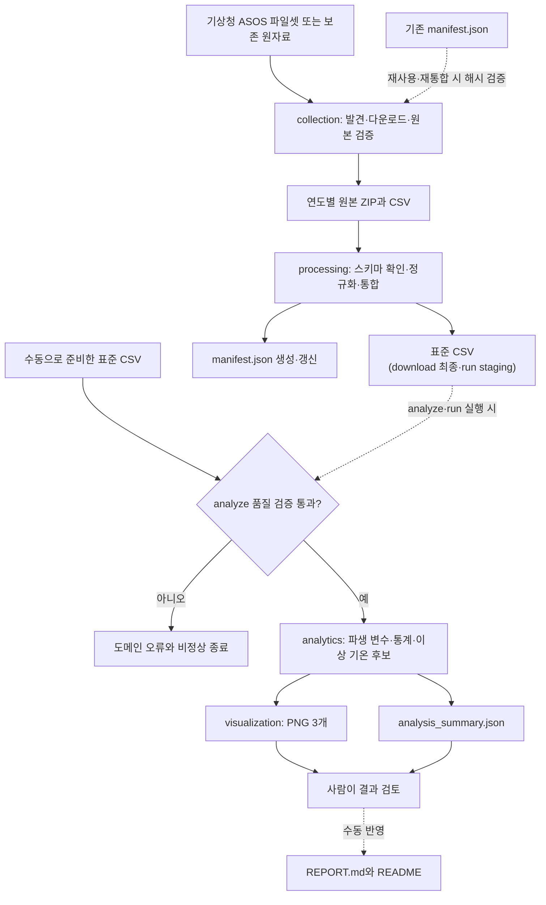

# 과제 아키텍처

## 1. 설계 목표

데이터 수집, 원본 보존, 정규화, 분석, 시각화와 실행 흐름을 `src` 패키지 안의 책임별 모듈로 분리한다. 각 단계는 명시적인 입력과 출력을 가지며, 검증 실패 시 후속 산출물을 만들지 않는다. 패키지 실행과 콘솔 실행은 같은 CLI와 workflow를 공유한다.

### 1.1 구현 형식 선택

과제에서 허용하는 노트북과 Python 스크립트 중 자동 검증과 재현 실행에 유리한 Python 패키지 방식을 선택했다. 노트북 셀의 실행 순서에 의존하지 않고 같은 함수를 CLI와 테스트에서 호출할 수 있으며, 수집·분석을 한 명령으로 재실행하고 실패 종료 코드까지 검증할 수 있기 때문이다. 탐색용 노트북은 필수 산출물로 두지 않는다.

## 2. 전체 구조

```text
M1-1/
├── data/
│   ├── raw/asos/
│   │   ├── manifest.json
│   │   └── {year}/
│   └── processed/
│       ├── seoul_weather_daily.csv
│       └── analysis_summary.json
├── docs/
├── images/
│   ├── 01_annual_temperature_trend.png
│   ├── 02_monthly_temperature_heatmap.png
│   └── 03_temperature_anomalies.png
├── src/seoul_weather/
│   ├── collection/
│   │   ├── portal.py
│   │   ├── archives.py
│   │   ├── manifest.py
│   │   └── pipeline.py
│   ├── processing/
│   │   ├── schema.py
│   │   ├── normalize.py
│   │   └── dataset.py
│   ├── analytics/
│   │   ├── validation.py
│   │   ├── features.py
│   │   ├── statistics.py
│   │   ├── anomalies.py
│   │   └── summary.py
│   ├── visualization/
│   │   ├── style.py
│   │   └── plots.py
│   ├── workflows/
│   │   ├── download.py
│   │   ├── analyze.py
│   │   ├── outputs.py
│   │   └── run.py
│   ├── cli.py
│   ├── config.py
│   ├── errors.py
│   └── __main__.py
├── tests/
│   ├── collection/
│   ├── analytics/
│   ├── visualization/
│   ├── workflows/
│   ├── deliverables/
│   └── fixtures/
├── AGENTS.MD
├── pyproject.toml
├── REPORT.md
├── README.md
└── requirements.txt
```

## 3. 데이터 흐름



`download`는 원자료를 정규화·통합해 표준 CSV와 manifest를 준비한다. 기존 원자료를 재사용하거나 `--rebuild-from-raw`를 실행할 때는 manifest의 범위·파일 크기·SHA-256을 먼저 검증한다. 신규 수집에서는 수집 항목으로 표준 CSV를 만든 뒤 처리 진단과 함께 manifest를 기록한다.

`analyze`는 `download`가 만든 표준 CSV 또는 수동으로 준비한 표준 CSV에서 시작한다. 전체 기간·지점·날짜·결측·값 범위를 검사한 뒤 통계, 이상 기온 후보, PNG와 요약 JSON을 생성한다. README와 REPORT는 자동으로 수정하지 않으며, 사람이 생성 결과를 검토한 뒤 근거를 반영한다.

`seoul_weather.workflows.run.run_pipeline()`은 `download`와 `analyze` workflow를 순서대로 호출한다. `src/seoul_weather/cli.py`는 이 workflow를 패키지 명령과 콘솔 명령 양쪽에 제공한다.

분석 workflow는 요약 JSON과 PNG 3개를 staging 경로에 모두 완성한다. 최종 승격 직전에 기존 파일을 임시 backup으로 옮기고, 승격 도중 하나라도 실패하면 이미 교체한 파일을 제거한 뒤 backup을 복구한다. 통합 `run`은 가공 CSV도 staging에서 분석하고, 가공 CSV·요약 JSON·PNG 3개를 같은 승격·복구 계층으로 처리한다. 생성·분석·최종 승격이 실패하면 기존 최종 산출물을 유지하고 도메인 오류로 중단한다.

## 4. 패키지 책임

### 4.1 `collection`

- `portal.py`: 파일 검색 요청, 응답 HTML 파싱, HTTP 세션과 다운로드
- `archives.py`: ZIP 형식 검사, 중첩 압축 해제, SHA-256 계산
- `manifest.py`: manifest 저장, 연도·지점·항목 수 완전성, 원본 파일 해시 검증
- `pipeline.py`: 연도별 수집, 기존 원본 재사용, 전체 수집 조정

자동 수집은 분석에 필수인 기능이 아니라 원자료 준비를 돕는 편의 계층이다. 표준 CSV를 직접 제공하면 `collection`을 거치지 않고 분석할 수 있다.

### 4.2 `processing`

- `schema.py`: 원본·가공 데이터 컬럼 계약
- `normalize.py`: CP949 원본 CSV를 표준 컬럼과 자료형으로 변환
- `dataset.py`: manifest에 기록된 CSV만 통합, 동일 중복의 원본 위치 진단, 충돌 중복 검사, 가공 CSV 입출력

원본 파일은 수정하지 않는다. UTF-8 변환과 영문 컬럼명 적용은 `data/processed/` 출력에만 수행한다.

### 4.3 `analytics`

- `validation.py`: 기간, 지점, 날짜, 결측, 기온 `-50~50°C` 품질검사선과 기온 순서 검사
- `features.py`: 연·월·계절·일교차·30일 후행 이동평균 파생 변수
- `statistics.py`: 연·월·계절 집계, 전년 차이, 5년 이동평균, 선형 추세
- `anomalies.py`: 같은 달 기준 편차와 z 점수, 고온·저온 후보
- `summary.py`: 문서와 테스트가 공유하는 JSON 요약

계산 함수는 파일 입출력과 분리해 작은 DataFrame fixture로 검증할 수 있다.

### 4.4 `visualization`

- `style.py`: 비대화형 렌더러, 한글 글꼴과 쓰기 가능한 캐시 경로 설정
- `plots.py`: 고정 이름의 PNG 3개 생성

### 4.5 `workflows`와 CLI

| workflow | 역할 | 기본 출력 |
| --- | --- | --- |
| `download` | 원자료 수집 또는 보존 원자료 재통합 | 표준 CSV |
| `analyze` | 표준 CSV 검증·분석·시각화 | 요약 JSON, PNG 3개 |
| `run` | `download` 후 `analyze` 순차 실행 | 위 산출물 전체 |

`outputs.py`는 여러 staging 파일의 기존 최종본 backup, 일괄 승격, 중간 실패 rollback을 담당한다. `analyze`와 `run`이 같은 구현을 사용한다.

CLI는 상대 경로를 `--project-root` 기준으로 해석하고, 도메인 오류를 사용자 메시지와 종료 코드 `1`로 변환한다. `--project-root`는 하위 명령 앞에 둔다.

## 5. 실행 인터페이스

두 실행 방식은 동일한 인자와 결과를 제공한다.

```bash
# 패키지 실행
python -m seoul_weather download --rebuild-from-raw
python -m seoul_weather analyze
python -m seoul_weather run --rebuild-from-raw

# 콘솔 실행
seoul-weather download --rebuild-from-raw
seoul-weather analyze
seoul-weather run --rebuild-from-raw
```

주요 옵션:

- 기본 수집: manifest 해시가 맞는 기존 원자료를 재사용하고 누락분만 수집
- `--rebuild-from-raw`: 네트워크 없이 보존 CSV에서 표준 CSV 재생성
- `--project-root PATH`: 기본 입출력 경로의 기준 변경
- `analyze --input PATH`: 수동으로 준비한 표준 CSV 분석
- `run --processed PATH --output-dir PATH --summary PATH`: 통합 실행 출력 변경

## 6. 오류 처리 원칙

| 오류 | 처리 |
| --- | --- |
| 기상청 접속 실패 | 제한 횟수 재시도 후 연도와 원인 출력 |
| 검색 결과 0건·복수건 | 파일명을 추측하지 않고 중단 |
| HTML 또는 손상 응답 | ZIP으로 저장하지 않고 중단 |
| manifest 해시 불일치 | 기존 원본을 덮어쓰지 않고 중단 |
| manifest 연도·지점·항목 수 불일치 | 기록되지 않은 파일을 사용하지 않고 중단 |
| 필수 컬럼·연도·날짜 누락 | 조용히 건너뛰지 않고 개수와 예시를 제시한 뒤 중단 |
| 동일 중복 날짜 | 한 행만 유지하고 원본 파일·CSV 행·제거 수를 manifest에 기록 |
| 충돌하는 중복 날짜 | 양쪽 원본 위치를 제시하고 중단 |
| 결측·통계적 이상 기온 | 0 대체나 자동 삭제 없이 현황 기록 |
| 이미지 생성 실패 | 분석 전체를 실패로 처리 |
| 출력 경로 권한·형식 오류 | traceback 대신 단계가 포함된 도메인 오류로 중단 |
| 다중 산출물 최종 승격 실패 | 기존 최종본을 모두 복구하고 도메인 오류로 중단 |

## 7. 의존성 방향

```text
cli
  -> workflows
      -> collection -> processing
      -> analytics -> visualization

analytics -X-> collection
collection -X-> visualization
```

분석 모듈은 포털 HTML 구조를 알지 못하고, 수집 모듈은 통계 계산이나 그래프 생성 방식을 알지 못한다.

## 8. 확장하지 않는 항목

- 데이터베이스, 웹 서버, 대시보드
- 미래 예측과 머신러닝 모델
- 시계열 분해
- 스케줄러와 클라우드 배포
- 서울 외 지역 비교
